# Suricata Rule Generator for AWS Network Firewall

**Current Version: 1.25.0**

A GUI application for creating, editing, and managing Suricata rules - specifically designed for AWS Network Firewall deployments using strict rule ordering.

## Screenshot

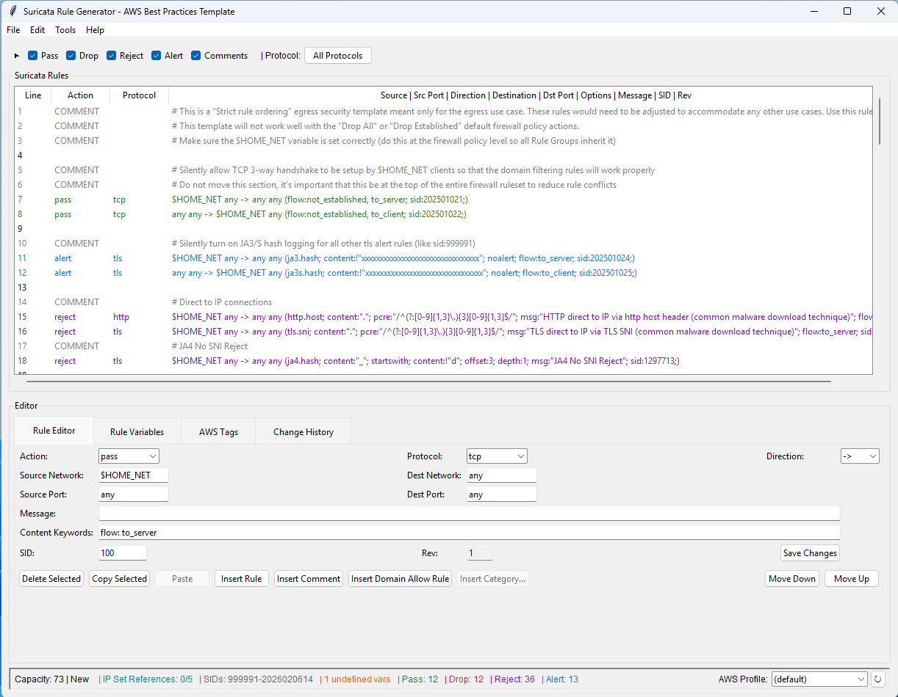

*The main interface showing the color-coded rules table, tabbed editor with Rule Editor and Rule Variables tabs, and comprehensive rule management controls.*

---

## Table of Contents

### 🚀 Getting Started
- [Quick Start](#quick-start)
- [Installation](#installation)
- [Troubleshooting](#troubleshooting)

### 📚 Core Concepts
- [Rule Format](#rule-format)
- [SID Numbers](#sid-numbers)
- [Variables Overview](#variables-overview)
- [Network Field Validation](#network-field-validation)
- [File Format](#file-format)

### 💼 Basic Workflows
- [Creating and Editing Rules](#creating-and-editing-rules)
- [File Operations](#file-operations)
- [Managing Variables](#managing-variables)
- [Copy and Paste](#copy-and-paste)
- [Keyboard Shortcuts](#keyboard-shortcuts)

### 🎯 Advanced Features
- [Rule Templates](#rule-templates)
- [Bulk Domain Import](#bulk-domain-import)
- [AWS Rule Group Import](#aws-rule-group-import)
- [Rule Filtering](#rule-filtering)
- [Bulk SID Management](#bulk-sid-management)
- [Advanced Editor](#advanced-editor)
- [Rule Conflict Analysis](#rule-conflict-analysis)
- [Infrastructure Export](#infrastructure-export)
- [Change Tracking](#change-tracking)
- [SIG Type Classification](#sig-type-classification)

### 📖 Reference
- [Features List](#features-list)
- [Content Keywords JSON](#content-keywords-json)
- [Common Ports JSON](#common-ports-json)
- [Technical Architecture](#technical-architecture)
- [Tips and Best Practices](#tips-and-best-practices)
- [Support](#support)

---

# 🚀 Getting Started

## Quick Start

> 💡 **New to the application?** Choose your path:

### Path 1: For Experienced Python Users

```bash
# 1. Verify Python 3.6+ is installed
python3 --version

# 2. Clone the repository
git clone https://github.com/aws-samples/sample-suricata-generator
cd sample-suricata-generator

# 3. Run the application
python3 suricata_generator.py
```

### Path 2: First Time Setup (Step-by-Step)

1. ✅ **Install Python 3.6+** - See [Installation](#installation) below
2. ✅ **Verify tkinter** - Run: `python3 -c "import tkinter; print('tkinter is available')"`
3. ✅ **Download** - Clone repository or download ZIP
4. ✅ **Run** - Execute: `python3 suricata_generator.py`

### Path 3: Your First Rule (Complete Beginner)

1. 📝 Launch the application (it opens with a blank canvas)
2. 🖱️ Click in the empty area below the table
3. 🎯 Fill in the fields:
   - Action: pass
   - Protocol: tcp
   - Source Network: $HOME_NET
   - Destination: any / any
   - Message: "My first rule"
   - SID: 100 (auto-suggested)
4. 💾 Click "Save Changes"
5. 🎉 Your rule appears in the table!

---

## Installation

### System Requirements

**Required:**
- Python 3.6 or higher
- tkinter (GUI library)

**Optional:**
- wxPython (for Advanced Editor with code folding)

### Step 1: Install Python

**Windows:**
1. Check if installed: `python --version` or `python3 --version`
2. If needed, download from [python.org](https://www.python.org/downloads/)
3. **Important:** Check "Add Python to PATH" during installation
4. Verify: `python --version`

**macOS:**
```bash
# Check current version
python3 --version

# Install via Homebrew (recommended)
brew install python3

# Or download from python.org
```

**Linux (Ubuntu/Debian):**
```bash
# Check current version
python3 --version

# Install if needed
sudo apt update
sudo apt install python3 python3-pip
```

**Linux (CentOS/RHEL/Fedora):**
```bash
# CentOS/RHEL
sudo yum install python3 python3-pip

# Fedora
sudo dnf install python3 python3-pip
```

### Step 2: Install tkinter (GUI Library)

**Verify tkinter is installed:**
```bash
python3 -c "import tkinter; print('tkinter is available')"
```

If successful, skip to Step 3. Otherwise:

**macOS:**
```bash
# Method 1: Reinstall Python from python.org (includes tkinter)
# Download from https://www.python.org/downloads/

# Method 2: Install via Homebrew
brew install python-tk@3.12  # Replace with your Python version
```

**Ubuntu/Debian:**
```bash
sudo apt update
sudo apt install python3-tk
```

**CentOS/RHEL/Fedora:**
```bash
# CentOS/RHEL
sudo yum install python3-tkinter

# Fedora
sudo dnf install python3-tkinter
```

**Windows:**
- Reinstall Python from python.org
- Ensure "tcl/tk and IDLE" component is selected

### Step 3: Download the Application

**Option A - Clone Repository:**
```bash
git clone https://github.com/aws-samples/sample-suricata-generator
cd sample-suricata-generator
```

**Option B - Download ZIP:**
1. Download ZIP from [GitHub repository](https://github.com/aws-samples/sample-suricata-generator)
2. Extract to your preferred location
3. Navigate to folder in terminal

### Step 4: Run the Application

```bash
python3 suricata_generator.py
```

**Windows users:**
```cmd
python suricata_generator.py
```

### Optional: Install Advanced Editor Support

The Advanced Editor requires wxPython (optional - main app works without it):

```bash
# Install wxPython
pip install wxPython

# Or pip3 on some systems
pip3 install wxPython

# Verify installation
python3 -c "import wx; print('wxPython version:', wx.version())"
```

**Platform-Specific Notes:**
- **Windows**: May take several minutes to install
- **macOS**: May take 10-15 minutes (compiles native components). If build fails, install Xcode Command Line Tools: `xcode-select --install`
- **Linux**: Install system dependencies first (see platform-specific instructions below)

**Linux Dependencies:**
```bash
# Ubuntu/Debian
sudo apt install libgtk-3-dev libwebkit2gtk-4.0-dev
pip3 install wxPython

# Or use system package
sudo apt install python3-wxgtk4.0

# Fedora
sudo dnf install python3-wxpython4
```

> 💡 **Don't worry!** All core features work without wxPython. It's only needed for the Advanced Editor (Tools > Advanced Editor).

### Optional: Create Standalone Executable

Use PyInstaller to create an executable that runs without Python installation:

```bash
# Install PyInstaller
pip3 install pyinstaller

# Create executable (macOS/Linux)
pyinstaller --onefile --windowed --name "Suricata Rule Generator" \
  --add-data "screenshot.png:." \
  --add-data "README.md:." \
  --add-data "RELEASE_NOTES.md:." \
  suricata_generator.py

# Windows (use semicolon instead of colon)
pyinstaller --onefile --windowed --name "Suricata Rule Generator" ^
  --add-data "screenshot.png;." ^
  --add-data "README.md;." ^
  --add-data "RELEASE_NOTES.md;." ^
  suricata_generator.py

# Executable created in dist/ directory
```

**PyInstaller Notes:**
- Executables are platform-specific (build on target OS)
- Single-file executables are 40-60MB (include Python runtime)
- macOS may show Gatekeeper warnings (right-click > Open to bypass)

---

## Troubleshooting

### Common Installation Issues

**"python: command not found"**
- Try `python3` instead of `python`
- Windows: Ensure Python was added to PATH during installation
- Restart terminal after Python installation

**"No module named 'tkinter'"**
- Install tkinter using platform-specific commands above
- macOS: May need to reinstall Python from python.org
- Verify: `python3 -c "import tkinter"`

**Permission errors (Linux/macOS):**
- Use `python3` instead of `python`
- Don't use `sudo` to run the application
- Ensure script has execute permissions: `chmod +x suricata_generator.py`

**Application doesn't start:**
- Verify you're in the correct directory
- Check Python version: `python3 --version` (must be 3.6+)
- Ensure all files are present
- Run from command line to see error messages

### Common Usage Issues

**🔴 SID Conflicts**
- Application prevents duplicate SIDs
- Use SID Management to bulk renumber if needed

**🌐 Network Validation Errors**
- Use proper CIDR format (e.g., 192.168.1.0/24)
- Or use variables like $HOME_NET

**🔤 Variables Not Persisting**
- Check for companion .var files in same directory
- Variables automatically save/load with .suricata files

**📦 Export Capacity Errors**
- AWS Network Firewall max capacity: 30,000
- Use analysis to check rule count
- Consider splitting into multiple rule groups

**🔍 Search Not Finding Results**
- Check search scope (field-specific vs all fields)
- Verify action filters aren't hiding results
- Try clearing filters (Edit > Clear All Filters)

**⚠️ Orange Warning Icons**
- Protocol/port combination warnings are informational only
- Review if unusual combinations are intentional

---

# 📚 Core Concepts

## Rule Format

Suricata rules follow this standard format:
```
action protocol src_net src_port direction dst_net dst_port (options)
```

**Components:**
- **action**: pass, drop, reject, alert
- **protocol**: tcp, udp, http, tls, dns, etc. (26 protocols supported)
- **src_net**: Source network (CIDR, "any", or variable)
- **src_port**: Source port (number, range, "any", or variable)
- **direction**: -> (unidirectional) or <> (bidirectional)
- **dst_net**: Destination network
- **dst_port**: Destination port
- **options**: Keywords in parentheses: msg, content, sid, rev, etc.

**Example:**
```
pass tls $HOME_NET any -> any any (tls.sni; content:".example.com"; endswith; nocase; msg:"Allow example.com"; sid:100; rev:1;)
```

**Supported Protocols:**
dcerpc, dhcp, dns, ftp, http, http2, icmp, ikev2, imap, ip, krb5, msn, ntp, quic, smb, smtp, ssh, tcp, tftp, tls, udp

---

## SID Numbers

> 🔢 **SIDs** (Signature IDs) uniquely identify each rule in your rule group.

**Key Facts:**
- ✅ **Valid Range**: 1-999999999
- 🚫 **Must Be Unique**: No duplicate SIDs allowed in a rule group
- 🤖 **Auto-Generation**: Application suggests next available SID for new rules
- 📋 **Preservation**: Copy/paste within app auto-renumbers to prevent conflicts

**Best Practices:**
- Start at 100 for custom rules
- Reserve 999991-999999 for default deny rules
- Use SID Management for bulk renumbering

---

## Variables Overview

> 💡 **Variables** are reusable definitions for networks and ports, making rules more maintainable.

### Variable Types

**IP Sets ($)** - Network definitions
```
$HOME_NET = [10.0.0.0/8,172.16.0.0/12,192.168.0.0/16]
$EXTERNAL_NET = [!10.0.0.0/8,!172.16.0.0/12,!192.168.0.0/16]
```

**Port Sets ($)** - Port definitions
```
$WEB_PORTS = [80,443,8080,8443]
$HIGH_PORTS = [1024:65535]
```

**Reference Sets (@)** - AWS VPC Managed Prefix Lists
```
@CORPORATE_NETWORKS = arn:aws:ec2:region:account:managed-prefix-list/pl-id
```

### Variable Benefits
- 📝 **Maintainability**: Update definition once, affects all rules
- 🔄 **Reusability**: Use same variable across multiple rules
- 📊 **Readability**: Semantic names more meaningful than raw IPs
- 🔒 **AWS Integration**: Reference Sets sync with AWS managed lists

---

## Network Field Validation

Source and destination network fields accept:

**"any"** - Matches all networks
```
any
```

**CIDR Notation** - Single or multiple networks
```
192.168.1.0/24
10.0.0.1/32
[10.0.0.0/8,172.16.0.0/12,192.168.0.0/16]
```

**Variables** - Reusable definitions
```
$HOME_NET
@CORPORATE_NETWORKS
```

**Negation** - Exclude specific networks
```
!192.168.1.0/24
[192.168.0.0/16,!192.168.1.0/24]
```

**Port Validation:**
- Single port: `80`
- Port range: `[8080:8090]`
- Multiple ports: `[80,443,8080]`
- Complex: `[80:100,!85]`
- Variables: `$WEB_PORTS` (only $ prefix allowed for ports)

> ⚠️ **AWS Requirement**: Port ranges and lists MUST use brackets. Port variables must use $ prefix (not @).

---

## File Format

Rules are saved as text files with `.suricata` extension:

**Main File (.suricata):**
- Contains all Suricata rules
- Supports comments (lines starting with #)
- Preserves blank lines for organization
- UTF-8 encoding with Unix line endings (LF)

**Companion File (.var):**
- Automatically created alongside .suricata files
- Stores variable definitions (IP sets, port sets, reference sets)
- JSON format for easy parsing
- Automatically loaded when opening .suricata files

**Example Files:**
```
my_rules.suricata  → Contains rules
my_rules.var       → Contains variable definitions
```

> 💡 Variables are persistent - they automatically save and load with your rule files!

---

# 💼 Basic Workflows

## Creating and Editing Rules

### Creating Individual Rules

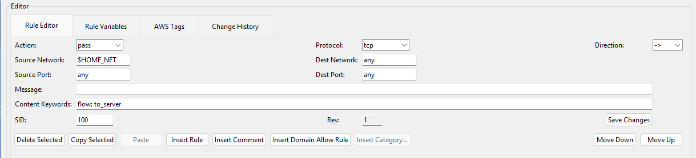

1. **Click to Add**: Click in empty area below existing rules
2. **Fill Fields**: Enter action, protocol, networks, ports, message, SID
3. **Protocol-Aware Content**: Content keywords auto-populate based on protocol
4. **Save**: Click "Save Changes" to add rule to table

> 💡 **Auto-Generated SIDs**: Application suggests next available SID automatically.

### Editing Existing Rules

**Method 1: Inline Editing**
1. Select a rule from the table
2. Modify fields in bottom editor panel
3. Click "Save Changes"

**Method 2: Double-Click**
- Double-click any rule to open edit dialog
- Edit all fields in one window
- OK to save or Cancel to discard

**Method 3: Advanced Editor**
- Press Ctrl+E or Tools > Advanced Editor
- Edit rules as text with code folding
- Real-time validation and auto-complete

### Managing Comments

💬 **Comments** help document and organize your rules:
- Click "Insert Comment" to add documentation
- Double-click comments to edit text
- Comments preserved in exports and analysis

### Rev Keyword Support *(v1.9.0+)*

The application automatically manages rule versioning:
- **Auto-Incrementing**: Rev increments when rule fields change (except message)
- **New Rules**: Start with rev=1
- **Message Exception**: Message changes don't increment rev
- **Read-Only Display**: Rev field appears next to SID (auto-managed)

**Example:**
```
pass tcp any any -> any 80 (msg:"Allow HTTP"; sid:100; rev:2;)
```

### Rule Management Operations

- 🗑️ **Delete**: Select rules and press Delete key
- ⬆️⬇️ **Move**: Use arrows to reorder rules
- ➕ **Insert**: Add rules at specific positions
- 💬 **Comment**: Add documentation lines
- 🔄 **Toggle**: Press Space to enable/disable rules (converts to comments)
- ↩️ **Undo**: Ctrl+Z to revert changes

---

## File Operations

### New File
- **File > New** or Ctrl+N
- Starts with blank canvas
- Prompts to save current file if modified

### Open File
- **File > Open** or Ctrl+O
- Opens .suricata files
- Automatically loads companion .var file for variables
- Auto-enables change tracking if .history file exists

### Save Operations
- **Save**: Ctrl+S (saves to current file)
- **Save As**: Save with new filename
- **Auto-Save Variables**: Companion .var file created automatically
- **Change History**: Pending history saved to .history file (if tracking enabled)

### Color Coding in Table

Rules are color-coded by action type:
- 🟢 **Green**: pass actions
- 🔵 **Blue**: alert actions
- 🔴 **Red**: drop actions
- 🟣 **Purple**: reject actions
- ⚫ **Grey**: comments
- 🟡 **Yellow**: search result highlights

---

## Managing Variables

### The Variables Tab

The Rule Variables tab provides comprehensive variable management with auto-detection and persistence.

### Adding Variables

**Method 1: Auto-Detection**
- Variables automatically detected when used in rules
- Switch to Variables tab to see detected variables
- Fill in definitions for empty variables

**Method 2: Manual Addition**
1. Switch to Variables tab
2. Click "Add Variable"
3. Enter name (e.g., $WEB_SERVERS)
4. Select type (IP Set, Port Set, or IP Set Reference)
5. Enter definition and optional description

**Method 3: Add Common Ports** *(New in v1.24.1)*

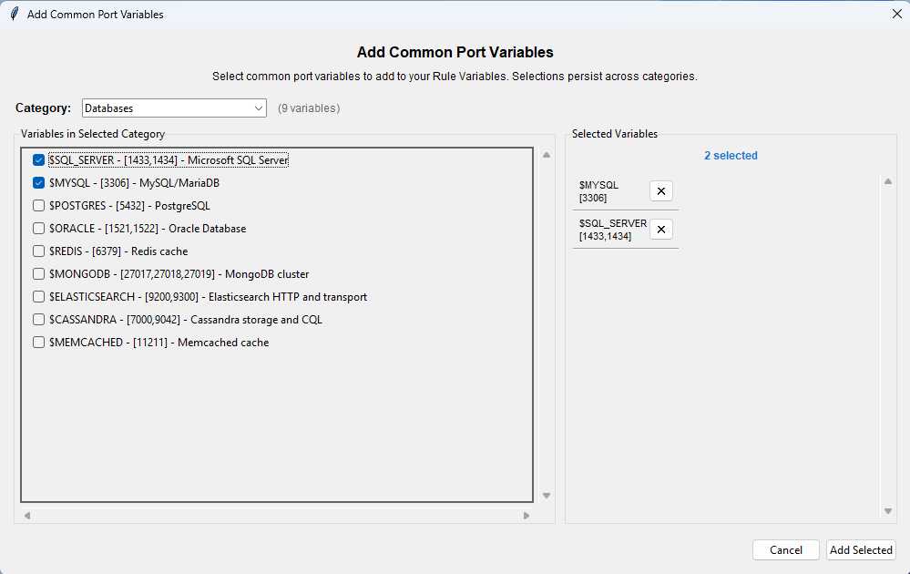

1. Click "Add Common Ports" button
2. Browse 22 pre-configured port variables across 7 categories:
   - Infrastructure Services (DNS, DHCP, NTP, SNMP)
   - Windows/Active Directory (SMB, RPC, Kerberos)
   - Web Services (HTTP, HTTPS, proxy ports)
   - Databases (MySQL, PostgreSQL, MongoDB, Redis)
   - Email (SMTP, IMAP, POP3)
   - Security/Threat Detection (malware C2, crypto mining)
   - Remote Access (SSH, RDP, Telnet)
3. Select desired variables
4. Click "Apply"

### Variable Naming Rules

- **IP Sets**: Must start with $ (e.g., $HOME_NET)
- **Port Sets**: Must start with $ (e.g., $WEB_PORTS)
- **Reference Sets**: Must start with @ (e.g., @ALLOW_LIST)
- **Characters**: Alphanumeric and underscores only
- **Case**: Typically uppercase by convention

### Variable Formats

**CIDR Lists:**
```
Single: 192.168.1.0/24
Multiple: [192.168.1.0/24,10.0.0.0/8]
Negated: [192.168.1.0/24,!192.168.1.5]
```

**Port Lists:**
```
Single: 80
Multiple: [80,443,8080]
Range: [1024:65535]
Complex: [80:100,!85,443,8080]
```

**Reference ARNs:**
```
arn:aws:ec2:region:account:managed-prefix-list/pl-id
```

### Variable Operations

- ✏️ **Edit**: Double-click variable to modify definition
- 🗑️ **Delete**: Select and click "Delete Variable"
- 🔄 **Auto-Cleanup**: Unused variables automatically removed
- 📝 **Descriptions**: Add optional descriptions for documentation

### Special Variables

**$HOME_NET:**
- Auto-detected and defaults to RFC1918 private address space
- Represents your internal network
- Used in most egress rules

**$EXTERNAL_NET:**
- Automatically defined as negation of $HOME_NET
- Managed by AWS Network Firewall
- Shows as grey/read-only in Variables tab

---

## Copy and Paste

> 📋 **Efficient rule management** with intelligent clipboard operations.

### The Dual-Clipboard System

The application uses two clipboards simultaneously for optimal workflow:

**Internal Clipboard** (Copy/Paste Within Program)
- Auto-renumbers SIDs to prevent conflicts
- Safe to paste multiple times
- Perfect for duplicating rules as templates

**System Clipboard** (Copy to External Programs)
- Preserves original SID numbers
- Use for sharing rules via email/chat
- Use for moving rules between files

### Copy Operations

**Copy Rules:**
1. Select one or more rules
2. Press Ctrl+C or right-click > Copy
3. Both clipboards populated automatically

**What Gets Copied:**
- Regular rules with all fields
- Comments and blank lines
- Structure and formatting

### Paste Operations

**Paste Rules:**
1. Select position (or paste at end)
2. Press Ctrl+V or right-click > Paste
3. Application auto-detects source and assigns SIDs appropriately

**Smart Detection:**
- Detects if clipboard content is from this program or external source
- Internal: Uses pre-calculated SIDs (conflict-free)
- External: Parses text and assigns new SIDs

### Use Cases

**Within Program:**
- ✅ Duplicate rules for variations
- ✅ Copy rule templates
- ✅ Reorganize rules

**External Sharing:**
- ✅ Email rules to colleagues with original SIDs
- ✅ Copy rules to documentation
- ✅ Move rules between different .suricata files
- ✅ Edit in external text editor

> 💡 **Pro Tip**: Toggle selection by clicking selected rules again - deselect before pasting elsewhere to avoid confusion.

---

## Keyboard Shortcuts

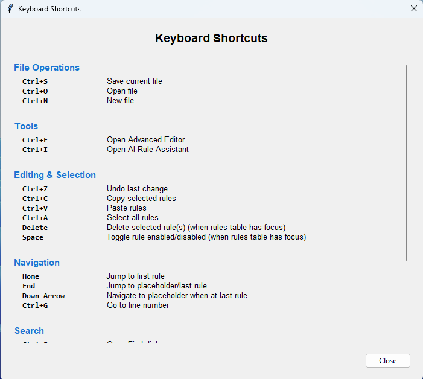

> ⌨️ **Work faster** with these keyboard shortcuts:

### File Operations
- **Ctrl+N**: New file
- **Ctrl+O**: Open file
- **Ctrl+S**: Save file

### Editing
- **Ctrl+Z**: Undo last change
- **Ctrl+C**: Copy selected rules
- **Ctrl+V**: Paste rules
- **Delete**: Delete selected rules
- **Space**: Toggle selected rules (enable/disable)

### Navigation
- **Down Arrow**: Navigate to placeholder (when at last rule)
- **End**: Jump to placeholder row
- **Home**: Jump to first rule
- **Ctrl+G**: Go to line number

### Search
- **Ctrl+F**: Open find dialog
- **F3**: Find next
- **Shift+F3**: Find previous
- **Escape**: Close search

### Advanced Features
- **Ctrl+E**: Open advanced editor
- **Ctrl+A**: Select all rules (when table has focus)

> 💡 **Context-Sensitive**: Some shortcuts only work when the rules table has focus (not text fields).

---

# 🎯 Advanced Features

## Rule Templates

> 🎯 **Quick rule generation** from pre-built security patterns - new in v1.24.0!

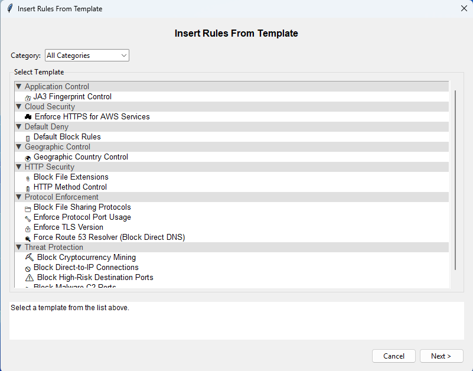

Rule Templates provide pre-configured security patterns that generate complete Suricata rules with minimal input. Templates range from simple one-click policies to complex parameterized patterns.

### Accessing Templates
- **File > Insert Rules From Template**
- **Organized by Category**: Protocol Enforcement, Cloud Security, Threat Protection, Geographic Control, Application Control, HTTP Security, Default Deny
- **Complexity Indicators**: Beginner, Intermediate, Advanced labels
- **14 Built-in Templates**: Ready to use immediately

### Available Templates

**Protocol Enforcement:**
- 🔍 Force Route 53 Resolver (Block Direct DNS)
- 🔒 Enforce TLS Version (parameterized)
- 🔧 Enforce Protocol Port Usage (parameterized)
- 📁 Block File Sharing Protocols (parameterized)

**Cloud Security:**
- ☁️ Enforce HTTPS for AWS Services

**Threat Protection:**
- ⛏️ Block Cryptocurrency Mining
- 🦠 Block Malware C2 Ports
- 🚫 Block Direct-to-IP Connections
- ⚠️ Block High-Risk Destination Ports (parameterized)

**Geographic Control:**
- 🌍 Geographic Country Control (parameterized - 180+ countries)

**Application Control:**
- 🔐 JA3 Fingerprint Control (parameterized)

**HTTP Security:**
- 📎 Block File Extensions (parameterized)
- 🚦 HTTP Method Control (parameterized)

**Default Deny:**
- 🚪 Default Block Rules (comprehensive egress/ingress deny)

### Using Templates

**Basic Workflow:**
1. **Select**: Browse templates by category
2. **Configure**: Fill in parameters (if required)
3. **Preview**: Review generated rules with SID suggestions
4. **Test Mode**: Optional - converts all actions to 'alert'
5. **Apply**: Rules inserted with automatic variable detection

**Parameter Types:**
- **Radio Buttons**: Select one option (e.g., TLS version, geographic mode)
- **Checkboxes**: Boolean options (e.g., bidirectional enforcement)
- **Text Input**: Free-form with validation (e.g., JA3 hash)
- **Multi-Select Port**: Choose multiple ports from list
- **Multi-Select Protocol**: Choose multiple protocols
- **Multi-Select Country**: Regional country selection (180+ countries)

### Template Features

**Smart SID Assignment:**
- Auto-suggests next available SID
- Default Block rules use predefined high SIDs (999991-9999915)
- Conflict detection with automatic resolution

**Test Mode:**
- Available for all templates
- Converts actions to 'alert' for safe testing
- Adds [TEST] prefix to messages

**Special Templates:**

**Default Block Rules** - Comprehensive deny ruleset
- **Dual Insertion**: Rules inserted at both TOP and BOTTOM of file
- **Top Rules**: Allow TCP handshake setup (critical for established connections)
- **Bottom Rules**: Default deny for all protocols (egress and ingress)
- **Predefined SIDs**: Uses specific SIDs (202501021-25, 999991-997, 999999, 9999910-15)
- **Flowbits Coordination**: Advanced Suricata features for efficient processing

**Geographic Country Control** - GeoIP filtering
- **Block Mode**: Deny-list selected countries (1 rule per country)
- **Allow Mode**: Allow-list selected countries (1 combined rule)
- **Direction Control**: Egress, ingress, or both
- **Regional Selection**: Browse countries by region (Asia, Americas, Africa, Middle East, Europe, Oceania)

### Benefits
- ⚡ **Rapid Deployment**: Generate multiple rules in seconds
- 📚 **Best Practices**: Templates embody security standards
- 🎯 **Consistency**: Standardized patterns across teams
- 🔧 **Customizable**: Parameters adapt to specific needs
- 📖 **Educational**: Learn from working examples

---

## Bulk Domain Import

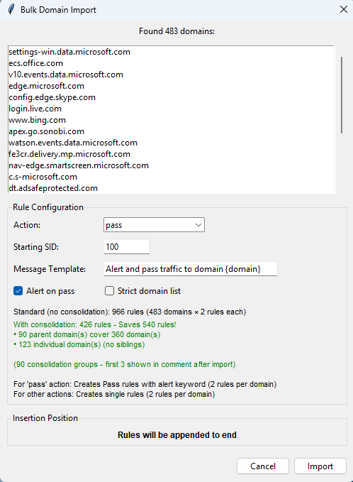

> 📦 **Import hundreds of domains** and automatically generate rules for each one.

### Basic Usage
1. **File > Import Domain List**
2. Select text file (one domain per line)
3. Configure settings:
   - **Action**: pass, drop, or reject
   - **Starting SID**: First SID to use
   - **Message Template**: Use {domain} as placeholder
   - **Alert on Pass**: Control logging for pass rules
   - **Strict Domain List**: Exact match vs wildcard matching
4. **Import**: Click to generate rules

### Domain Consolidation *(Automatic)*

> ⚡ **Smart grouping** reduces rule count by finding optimal parent domains.

**How It Works:**
- Analyzes domain relationships
- Finds most specific common parents
- Groups related subdomains automatically

**Example:**
```
Input domains:
- mail.server.com
- web.server.com  
- api.server.com
- server.com

Result: 1 rule for *.server.com (instead of 4 rules)
Savings: 8 rules → 2 rules (75% reduction)
```

**Benefits:**
- 📊 Significantly reduced rule count
- 🎯 Automatic optimization
- 👁️ Real-time preview shows savings
- 🔧 Enabled by default (disable with "Strict domain list")

### Rule Generation Logic

**All Actions:**
- Creates 2 rules per domain (TLS + HTTP)
- Matches both encrypted and unencrypted traffic

**Pass Action with Alert on Pass** *(default)*:
- 2 rules with embedded alert keyword
- Provides logging without separate alert rules

**Pass Action without Alert on Pass:**
- 2 pass rules + 2 alert rules = 4 rules per domain
- Separate rules for pass and alert actions

---

## AWS Rule Group Import

> 📥 **Import existing AWS Network Firewall rule groups** for editing and enhancement - new in v1.18.7!

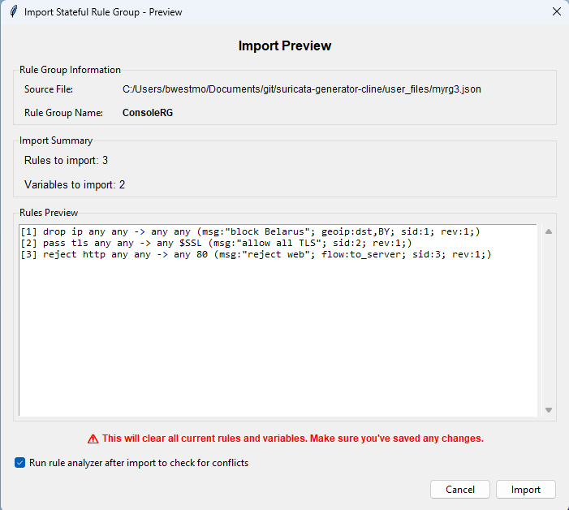

### Generating the JSON Export

Use AWS CLI to export your rule group:

```bash
# Using ARN
aws network-firewall describe-rule-group \
  --rule-group-arn arn:aws:network-firewall:us-east-1:123456789012:stateful-rulegroup/MyRuleGroup \
  > my_rule_group.json

# Or using name
aws network-firewall describe-rule-group \
  --rule-group-name MyRuleGroup \
  --type STATEFUL \
  > my_rule_group.json
```

### Importing the Rule Group

1. **File > Import Stateful Rule Group**
2. Select the JSON file from AWS CLI
3. Review preview showing:
   - Rule group metadata
   - Rule and variable counts
   - First 10 rules preview
   - Any SID conflicts detected
4. Click "Import"

### Import Features

**Complete Data Import:**
- ✅ Rules converted from AWS 5-tuple to Suricata format
- ✅ IPSets imported as IP Set variables ($HOME_NET)
- ✅ PortSets imported as Port Set variables ($WEB_PORTS)
- ✅ Metadata preserved in comment header

**Smart Processing:**
- Auto-renumbers duplicate SIDs within JSON
- Forces new file (prompts to save current work first)
- Type validation (only STATEFUL rule groups)
- Variable prefix conversion (HOME_NET → $HOME_NET)

### Use Cases
- 🔧 Edit existing AWS rules in GUI
- 🔄 Round-trip workflow (AWS → Edit → AWS)
- 📝 Add organization and comments
- 🎯 Quickly begin using Suricata-formatted rules
- 🔨 Apply bulk modifications to AWS rule groups

---

## Rule Filtering

> 🎯 **Focus on relevant rules** by temporarily hiding others - essential for large rule sets!

The rule filtering feature provides non-destructive filtering to temporarily hide rules from view based on multiple criteria. Filtered rules remain in the file and are saved/exported normally.

### Accessing Filters
- **Filter Bar**: Appears above rules table (collapsed by default)
- **Click to Expand**: Access all filtering controls
- **Instant Updates**: Most filters apply immediately

### Filter Options

**By Action:**
- Individual checkboxes for Pass, Drop, Reject, Alert, Comments
- Toggle to show/hide specific action types
- Instant filtering as checkboxes change

**By Protocol:**
- Multi-select dropdown with all 26 protocols
- Select multiple protocols to display
- Shows count when multiple selected

**By SID Range:**
- Enter "From" and "To" SID values
- **Exclude Mode**: Invert filter to hide range
- Click "Apply" to activate

**By Variable:**
- Dropdown shows variables used in current file
- Filter rules using specific variables
- Click "Apply" to activate

### Filter Status

- **Status Bar**: Shows "Showing X of Y rules" when active
- **Filter Description**: Displays active criteria
- **Original Line Numbers**: Preserved for reference
- **Clear All**: Reset all filters to show all rules

### Smart Features

- **Auto-Clear on Edit**: Filters clear when edited rules don't match criteria
- **Visual Feedback**: Filter bar highlighted when active
- **Non-Destructive**: Filtered rules remain in file

### Use Cases
- 📊 Manage large rule sets (100+ rules)
- 🎯 Focus on specific rule types
- 🔍 Troubleshoot issues by isolation
- 💡 Review specific sections

---

## Bulk SID Management

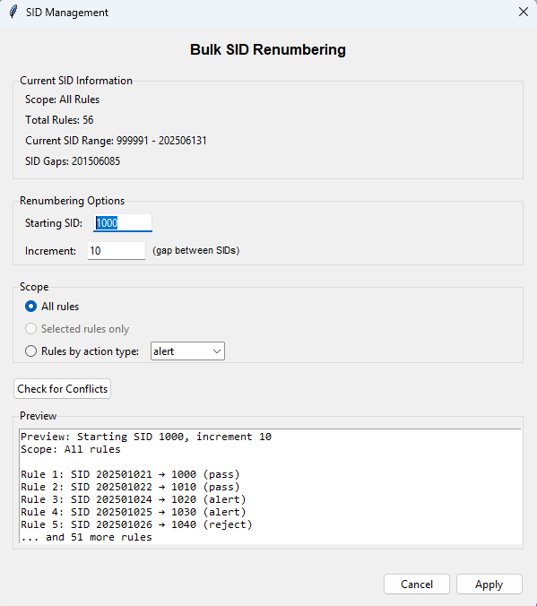

> 🔢 **Bulk renumber SIDs** for better organization and conflict resolution.

### Accessing SID Management
- **Tools > SID Management**
- Available when rules exist
- Works on all rules or selected rules

### Features

**Scope Options:**
- All rules in file
- Selected rules only
- Rules by action type (pass, drop, reject, alert)

**Renumbering Controls:**
- **Starting SID**: First SID to use
- **Increment**: Gap between SIDs (default: 10)
- **Preview**: See changes before applying

**Conflict Detection:**
- Check for SID conflicts before applying
- Visual conflict report with line numbers
- Resolution strategies available

**Resolution Strategies:**
1. **Skip Conflicts**: Find next available SID
2. **Restart with Safe SID**: Begin at max SID + 10
3. **Overwrite**: Replace conflicting SIDs (⚠️ modifies other rules)

### Use Cases
- 🔄 Reorganize SIDs by rule type
- 🔧 Fix SID gaps and inconsistencies
- 📦 Prepare rules for merging with other files
- 🎯 Group rules by SID range

> ↩️ **Undo Support**: All SID changes can be reverted with Ctrl+Z.

---

## Advanced Editor

> 💻 **Professional code editing** with IDE-like features - new in v1.19.0, enhanced with Scintilla in v1.23.0!

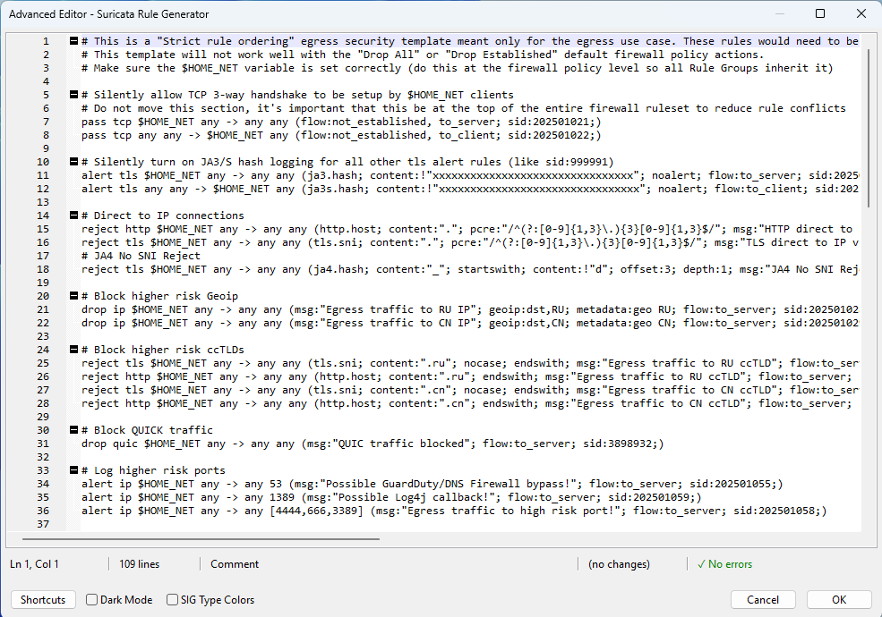

The Advanced Editor provides a powerful text-based interface with native code folding, auto-complete, and real-time validation.

### Accessing Advanced Editor
- **Tools > Advanced Editor** or Ctrl+E
- **Requirements**: wxPython (optional - prompts to install if missing)
- **Modal Window**: 1000x700 resizable with professional layout

### Code Folding *(Scintilla Feature)*

**Fold by Blank Lines:**
- Blank lines separate rules into collapsible groups
- Click +/- icons in fold margin
- Essential for organizing large rule sets

**Comment Blocks:**
- Consecutive comments (2+) fold together
- Keep related documentation collapsed
- Expand when needed

**Box-Style Markers:**
- Visual +/- icons in left margin
- Intuitive expand/collapse interface
- Standard editor convention

### Real-Time Validation

**Error Detection (Red Underlines):**
- Invalid actions, protocols, networks, ports
- Malformed syntax and missing required fields
- Direction indicator errors

**Warning Detection (Orange Underlines):**
- Unknown keywords (forward compatibility)
- Undefined variables (prompts to define)
- Duplicate SIDs within file

**Hover Tooltips:**
- Detailed error information
- Suggestions for fixes
- Shows expected values

**Status Bar:**
- Error and warning counts
- Line and column position
- Current rule number
- Modification status

### Smart Auto-Complete

**Context-Aware Suggestions:**
- **Actions**: alert, pass, drop, reject, # (comment)
- **Protocols**: All 26 supported protocols
- **Networks/Ports**: "any", CIDRs, port ranges, variables
- **Content Keywords**: 50+ Suricata keywords from content_keywords.json

**Trigger Methods:**
- Auto-appears while typing
- Manual trigger with Ctrl+Space
- Navigate with Up/Down arrows
- Accept with Tab or Enter

### Advanced Editing Features

**Smart Typing:**
- **Auto-Close**: `(` `[` `"` auto-insert matching closing character
- **Smart Tab**: Jump to next semicolon in options
- **Smart Backspace**: Delete matching bracket/quote pairs

**Code Manipulation:**
- **Comment Toggle**: Ctrl+/ to comment/uncomment lines
- **Clipboard**: Ctrl+X/C/V with system integration
- **Undo/Redo**: Multi-level Ctrl+Z and Ctrl+Y
- **Go to Line**: Ctrl+G for quick navigation

### Find and Replace

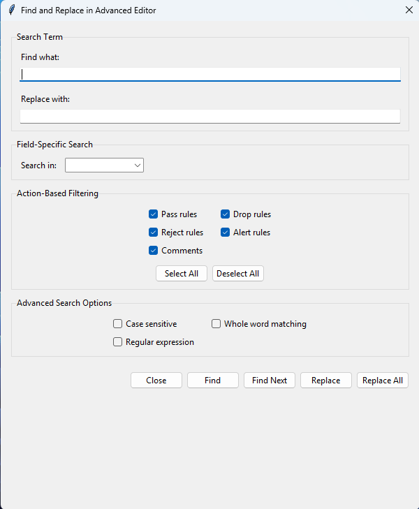

**Unified Dialog:**
- Ctrl+F opens comprehensive find/replace
- Field-specific search (message, content, networks, ports, SID, protocol, all)
- Action filtering (include/exclude by action type)
- Replace current or Replace All with confirmation

**Search Options:**
- Case-sensitive matching
- Whole word only
- Regular expression support

**Visual Highlights:**
- Current match in yellow
- Other matches in gray
- F3 for next, Shift+F3 for previous

### Save and Validation

**Comprehensive Validation:**
- All rules validated on save
- Errors auto-commented with `# [SYNTAX ERROR]` prefix
- Warnings preserved (unknown keywords allowed)
- Confirmation dialog with detailed summary

**Auto-Create Variables:**
- Undefined variables automatically created
- Added to Variables tab with empty definitions
- Prompts to define before analysis/export

### Benefits
- 💼 **Professional Workflow**: Text-based editing for power users
- 📁 **Code Folding**: Essential for large files
- ✅ **Real-Time Validation**: Catch errors as you type
- 🚀 **Fast Editing**: Auto-complete and smart typing
- 🔒 **Safety Net**: Comprehensive validation prevents invalid rules

> 💡 **Optional Feature**: Main application works fully without wxPython. Install only if you want the Advanced Editor.

---

## Rule Conflict Analysis

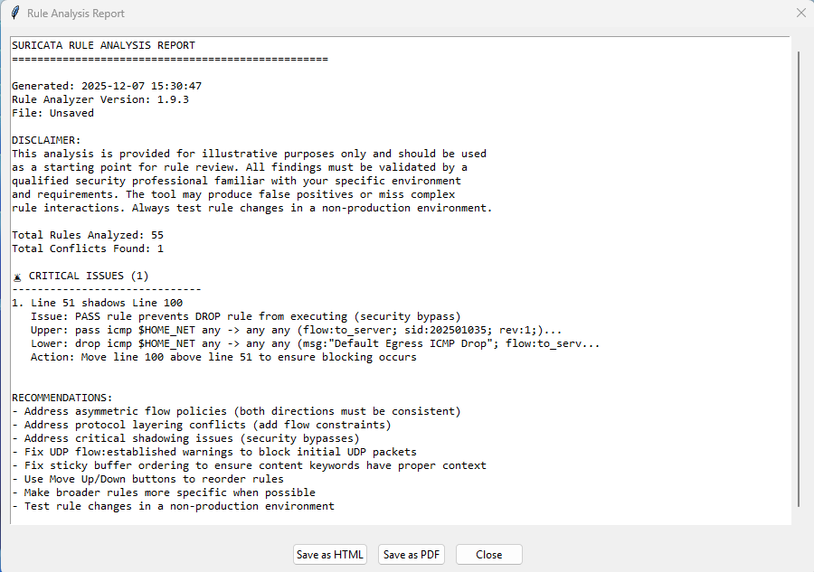

> 🔍 **Detect shadowing and conflicts** before deployment to AWS.

The analysis engine detects common rule issues that can cause unexpected behavior in production.

### Running Analysis
- **Tools > Review Rules**
- Define variable CIDRs if prompted
- Progress dialog shows analysis status
- Comprehensive report when complete

### Analysis Features

**Complete Shadow Detection:**
- Identifies when upper rules ALWAYS prevent lower rule execution
- Protocol layering awareness
- Flow state analysis
- Geographic specificity recognition

**Conflict Categories:**
- 🔴 **Critical**: Security bypasses (pass shadowing drop/reject)
- 🟠 **Warning**: Missing alerts, unreachable rules
- 🔵 **Informational**: Redundant rules with same actions

**AWS Compliance:**
- Validates rule structure for AWS Network Firewall
- Checks variable usage and formats
- Verifies protocol/port combinations

### Report Features

**Detailed Findings:**
- Line numbers for both conflicting rules
- Conflict type and severity
- Recommendations for resolution
- Example corrections

**Export Options:**
- 📄 **HTML**: Professional formatted report
- 📑 **PDF**: Browser-based PDF generation
- 📋 **Copy**: Right-click to copy results

### Benefits
- 🛡️ **Prevent Security Gaps**: Find bypasses before deployment
- 📊 **Understand Rule Interaction**: Learn why rules conflict
- 🎓 **Educational**: Detailed explanations of each issue
- 💾 **Documentation**: Export reports for team review

---

## Infrastructure Export

> 🏗️ **Deploy to AWS** with infrastructure as code templates.

Generate AWS Network Firewall resources for deployment:

### Export Formats
- **Terraform (.tf)**: Complete resource definition
- **CloudFormation (.cft)**: JSON template

### Export Features

**File > Export As...**
- Select format and save location
- Generates complete infrastructure code

**What's Included:**
- ⚙️ **Dynamic Capacity**: Auto-calculated from rule count
- 🔗 **Variable Integration**: IP sets, port sets, reference sets
- 📋 **STRICT_ORDER**: Configured automatically
- 📝 **Version Info**: Generator version in descriptions
- 🔒 **Proper Escaping**: Handles special characters

**CloudFormation Validation:**
- **51.2 KB Limit**: Warns if requires S3 upload
- **1 MB Limit**: Blocks if exceeds absolute maximum
- **Size Guidance**: Shows remaining capacity

**Terraform Example:**
```hcl
resource "aws_networkfirewall_rule_group" "suricata_rules" {
  capacity = 150
  type     = "STATEFUL"
  name     = "suricata-generator-rg"
  
  rule_group {
    stateful_rule_options {
      rule_order = "STRICT_ORDER"
    }
    rules_source {
      rules_string = <<-EOT
        pass tcp any any -> any 80 (msg:"Allow HTTP"; sid:100; rev:1;)
      EOT
    }
  }
}
```

### Deployment Workflow
1. Generate rules in GUI
2. Define variables in Variables tab
3. Export as Terraform or CloudFormation
4. Deploy to AWS using your IaC pipeline
5. Re-import from AWS for future edits

---

## Change Tracking

> 📝 **Comprehensive audit trail with per-rule rollback** - new in v1.16.0, enhanced with rollback in v1.25.0!

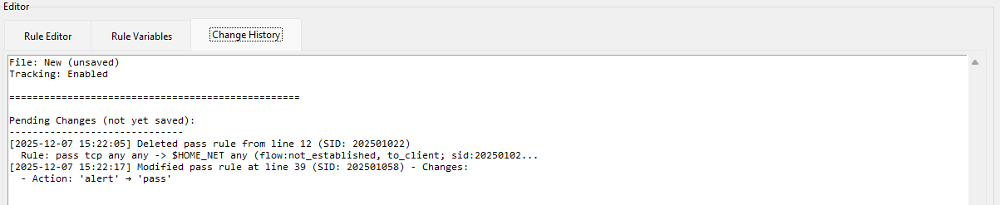

### Enabling Tracking
- **Tools > Enable Change Tracking**
- Toggles tracking on/off
- Adds header to file when enabled
- Auto-enables when opening files with existing history

### What Gets Tracked

**File Operations:**
- File creation with timestamp
- File saves with modification info

**Rule Operations:**
- Rules added, modified, deleted
- Bulk operations (paste, template application)
- SID renumbering operations
- **Rule rollbacks** *(v1.25.0)* - Rollback to previous revisions

**Advanced Operations:**
- Advanced Editor changes (with summary)
- Template applications with details
- Domain import operations

### Per-Rule Revision History & Rollback *(New in v1.25.0)*

**Rev Dropdown for Rollback:**
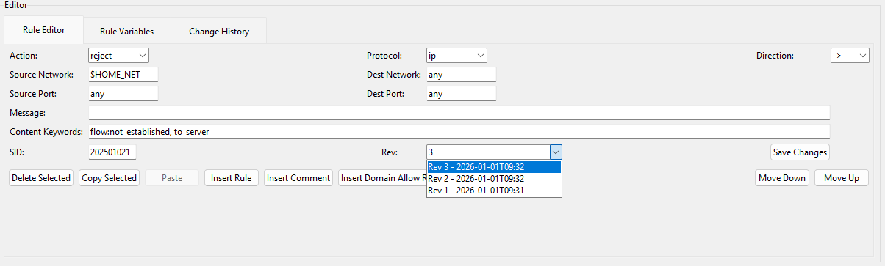
- When change tracking is enabled, the Rev field becomes an interactive dropdown
- Shows complete revision history for each rule (by SID)
- Displays timestamps for each revision: "Rev 3 - 2026-01-01 01T09:32"
- Click to select any previous revision to review or rollback

**Side-by-Side Comparison:**
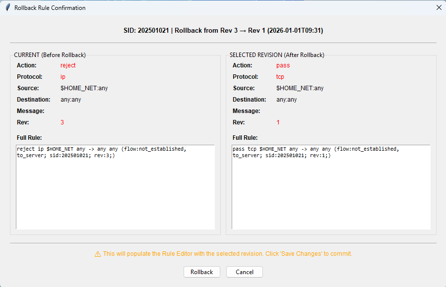
- Before rolling back, view detailed comparison of current vs selected revision
- Compare all rule fields with changed fields highlighted in red
- Review full rule syntax for both versions
- Make informed decision before proceeding

**Non-Destructive Rollback:**
- Selecting a revision populates the Rule Editor (doesn't immediately change the rule)
- Review rolled-back values before committing
- Click "Save Changes" to commit the rollback
- Cancel by selecting another rule or closing editor without saving
- Full Ctrl+Z undo support for all rollback operations (undos not tracked in history)

**Linear History:**
- All revisions preserved permanently - old versions never deleted
- E.g. Rolling back to Rev 2 creates a new Rev value (with Rev 2's content)
- Complete audit trail maintained for compliance
- Can rollback to any previous revision at any time

**Automatic Snapshots:**
- Rule snapshots automatically saved during all rule modifications (except message field)
- Works with rule edits, new rules, rule templates, and bulk operations
- Optimized storage (snapshots embedded inline with change entries)
- Typical file size: ~500KB for 100 rules × 10 revisions each

**Snapshots not supported for Advanced Editor changes:**
- Modifying a rule in the advanced editor does not create new rule snapshot
- Rule changes made in the advanced editor are summarized in Change History tab

**Legacy File Upgrade:**
- Existing .history files (v1.0) continue to work normally
- Optional upgrade prompt to enable rollback for current rules (v1.0 history)
- Upgrade creates baseline snapshots for all rules at current revision number
- Rollback capability enabled from upgrade point forward

### History Display

**History Tab:**
- Chronological list of all changes including rollbacks
- Timestamps in ISO format
- Version numbers for each operation
- Detailed change information
- Rollback entries show source and target revisions

### Storage

**Companion .history File:**
- JSON format for machine readability (v2.0 format with snapshots)
- Saves along with .suricata file
- Automatically loads on file open
- Backward compatible with legacy v1.0 format

### Benefits
- 📋 **Audit Trail**: Complete record of changes with revision snapshots
- 🔍 **Troubleshooting**: Track when issues were introduced and rollback if needed
- 📊 **Team Collaboration**: See who changed what and restore previous versions
- 🔄 **Safety Net**: Roll back individual rules that were modified incorrectly
- 🧪 **Experimentation**: Try changes knowing you can easily revert
- 📚 **Learning**: Review how specific rules evolved over time

---

## SIG Type Classification

> 🎓 **Understanding Rule Processing** - Learn how Suricata classifies rules - new in v1.20.0!

The application shows how Suricata internally classifies each rule into one of 10 SIG types, which determines processing order and performance characteristics.

### What are SIG Types?

Suricata internally classifies rules by their keywords and protocol:
- **Processing Order**: Rules process in type order (not just file order)
- **Performance**: Different types have different performance impacts  
- **Protocol Layering**: Explains why some rules shadow others unexpectedly

### Accessing SIG Type Information

**Main Application:**
- **Tools > Show SIG Type Classification**: Toggle SIG Type column
- **Abbreviated Labels**: IPONLY, PKT, APP_TX, etc.
- **Hidden by Default**: Column appears between Line and Action

**Advanced Editor:**
- **Status Bar**: Shows full SIG type name
- **Format**: "Rule 5/42 | SIG_TYPE_APP_TX | Modified"
- **Real-Time**: Updates as you move between rules
- **Always Visible**: Displayed automatically

**Educational Help:**
- **Help > About SIG Types**: Complete guide to all 10 types
- Processing order explanation
- Real-world examples
- Link to Suricata documentation

### The 10 SIG Types

1. **SIG_TYPE_DEONLY** - Decoder events (decode-event keyword)
2. **SIG_TYPE_IPONLY** - Basic IP/protocol rules
3. **SIG_TYPE_LIKE_IPONLY** - IP rules with negated addresses
4. **SIG_TYPE_PDONLY** - Protocol detection (app-layer-protocol)
5. **SIG_TYPE_PKT** - Flow keywords (flow:established, flowbits)
6. **SIG_TYPE_PKT_STREAM** - Anchored content (startswith, depth)
7. **SIG_TYPE_STREAM** - Unanchored content
8. **SIG_TYPE_APPLAYER** - Application protocol fields
9. **SIG_TYPE_APP_TX** - Sticky buffers (http.host, tls.sni, ja3.hash)
10. **SIG_TYPE_NOT_SET** - Error/unknown state

### Why It Matters

**Protocol Layering:**
- IP-only rules process before app-layer rules
- Can cause unexpected shadowing
- Understanding types helps diagnose conflicts

**Performance:**
- Sticky buffer rules (APP_TX) are most efficient
- IP-only rules are least specific
- Choose appropriate keywords for optimization

**Rule Development:**
- See how Suricata will process your rules
- Understand which keywords elevate rules
- Make informed keyword choices

---

# 📖 Reference

## Features List

### Core Features
- ✅ Visual rule management with color-coded table display
- ✅ Tabbed interface (Rule Editor and Rule Variables)
- ✅ Inline editing with bottom panel editor
- ✅ Variable auto-detection and management
- ✅ Copy/paste with intelligent dual-clipboard system
- ✅ File operations (new, open, save, save as)
- ✅ Comment support with formatting
- ✅ Undo functionality (Ctrl+Z)
- ✅ Rule movement (up/down controls)
- ✅ Click-to-insert workflow
- ✅ Keyboard navigation and shortcuts
- ✅ Toggle selection for workflow flexibility

### Advanced Features
- ✅ **Rule Templates** *(v1.24.0)*: 14 pre-built security patterns
- ✅ **Rule Filtering** *(v1.22.0)*: Non-destructive rule hiding
- ✅ **Advanced Editor** *(v1.19.0, Scintilla v1.23.0)*: Code folding and IDE features
- ✅ **SIG Type Classification** *(v1.20.0)*: Educational rule type display
- ✅ **Common Ports Library** *(v1.24.1)*: 22 pre-configured port variables
- ✅ **AWS Rule Group Import** *(v1.18.7)*: Import from AWS CLI JSON
- ✅ **Change Tracking** *(v1.16.0)*: Comprehensive audit trail
- ✅ **Enhanced Search** *(v1.21.0)*: Field-specific search with find/replace
- ✅ **Rev Keyword Support** *(v1.9.0)*: Automatic rule versioning

### Analysis and Validation
- ✅ Rule conflict analysis with shadow detection
- ✅ AWS Network Firewall compliance validation
- ✅ Protocol layering detection
- ✅ Network field validation
- ✅ SID uniqueness checking
- ✅ Variable definition validation
- ✅ HTML/PDF report export

### Import and Export
- ✅ Infrastructure as code export (Terraform, CloudFormation)
- ✅ Bulk domain import with consolidation
- ✅ AWS rule group import from CLI JSON
- ✅ AWS best practices template loading
- ✅ Change history export

### User Interface
- ✅ Real-time statistics (action counts, SID ranges)
- ✅ Status bar with capacity and warnings
- ✅ Undefined variables detection
- ✅ IP Set References counter (AWS quota tracking)
- ✅ Protocol/port combination warnings
- ✅ Placeholder row for new rule insertion
- ✅ Double-click editing
- ✅ Right-click context menus

---

## Content Keywords JSON

> 🔧 **Customize auto-complete** by editing content_keywords.json.

The `content_keywords.json` file defines all Suricata keywords for the Advanced Editor's auto-complete feature.

### File Structure

```json
{
  "version": "1.0",
  "description": "AWS Network Firewall Suricata Content Keywords",
  "keywords": [
    {
      "name": "keyword_name",
      "syntax": "keyword_name:<value>",
      "values": ["optional", "valid", "values"],
      "description": "Human-readable description",
      "category": "general|flow|http|tls|dns|protocol"
    }
  ]
}
```

### Adding Keywords

1. Open `content_keywords.json` in text editor
2. Add new keyword object to `keywords` array
3. Save file
4. Reopen Advanced Editor (auto-reloads JSON)

### Hot Reload
- File loaded each time Advanced Editor opens
- Edit JSON while main app is running
- No application restart needed
- Changes appear immediately

### Validation
- Unknown keywords generate warnings (not errors)
- Allows use of new Suricata features
- Forward compatibility maintained

> 📖 **Full Documentation**: See `docs/content_keywords_json.md` for complete reference.

---

## Common Ports JSON

> 🔧 **Extend the port library** by editing common_ports.json - new in v1.24.1!

The `common_ports.json` file defines pre-configured port variables for the Add Common Ports feature.

### File Structure

```json
{
  "version": "1.0.0",
  "description": "Common port definitions for Suricata rules",
  "categories": {
    "Category Name": [
      {
        "name": "$VARIABLE_NAME",
        "definition": "[80,443,8080]",
        "description": "Service description"
      }
    ]
  }
}
```

### Current Library

**7 Categories:**
- Infrastructure Services (7 variables)
- Windows/Active Directory (5 variables)
- Web Services (3 variables)
- Databases (7 variables)
- Email (3 variables)
- Security/Threat Detection (3 variables)
- Remote Access (4 variables)

**22 Pre-Configured Variables:**
- $DNS_PORTS, $DHCP_PORTS, $NTP_PORTS
- $ACTIVE_DIRECTORY_PORTS, $SMB_PORTS
- $WEB_PORTS, $DATABASE_PORTS
- And many more...

### Adding Custom Variables

1. Open `common_ports.json` in text editor
2. Add variable to existing category or create new category
3. Save file
4. Changes appear immediately in Add Common Ports dialog

### Benefits
- 📚 Team-standard port definitions
- 🔧 No code changes needed
- 🔄 Instant updates
- 📝 Documentation included

> 📖 **Full Documentation**: See `docs/common_ports_json.md` for complete reference and customization guide.

---

## Technical Architecture

The application follows a modular architecture with specialized managers:

### Core Modules
- **suricata_generator.py**: Main application and manager coordination
- **suricata_rule.py**: Rule parsing, validation, and formatting
- **constants.py**: Application constants and validation patterns
- **version.py**: Centralized version management
- **security_validator.py**: Input validation and security protection

### Manager Modules
- **ui_manager.py**: Complete user interface management
- **template_manager.py**: Rule template system *(v1.24.0)*
- **file_manager.py**: File operations and exports
- **search_manager.py**: Search functionality
- **rule_filter.py**: Rule filtering system *(v1.22.0)*
- **domain_importer.py**: Bulk domain processing
- **stateful_rule_importer.py**: AWS rule group imports *(v1.18.7)*
- **rule_analyzer.py**: Conflict detection and reporting
- **flow_tester.py**: Network traffic simulation
- **advanced_editor.py**: IDE-style text editor *(v1.19.0)*
- **revision_manager.py**: Per-rule revision history and rollback *(v1.25.0)*

### Configuration Files
- **content_keywords.json**: Auto-complete keyword definitions *(v1.19.0)*
- **rule_templates.json**: Pre-built security templates *(v1.24.0)*
- **common_ports.json**: Port variable library *(v1.24.1)*

### Security Features
- **Injection Protection**: Filters dangerous patterns
- **Path Traversal Prevention**: Validates file operations
- **Input Validation**: Length limits and character restrictions
- **File Security**: Size and permission checks
- **Domain Validation**: Format and safety checks

---

## Tips and Best Practices

> 💡 **Get the most** out of the Suricata Rule Generator.

### Getting Started
1. 🎯 **Start Simple**: Begin with basic pass/drop rules
2. 📚 **Use Templates**: Leverage Rule Templates for common patterns
3. 📝 **Organize Early**: Use comments to document sections

### Working with Rules
4. 🔤 **Define Variables**: Use Variables tab for reusable definitions
5. 🔢 **Smart SID Strategy**: Start at 100, reserve high SIDs for default deny
6. 📋 **Copy/Paste Workflow**: Use toggle selection for efficient copying
7. 🔍 **Filter Large Sets**: Use filtering for files with 100+ rules

### Quality Assurance
8. ✅ **Validate Early**: Run analysis before deploying
9. 🧪 **Test Mode**: Use template Test Mode for safe validation
10. 📊 **Monitor Status**: Watch status bar for warnings and statistics
11. ⚠️ **Check Warnings**: Review orange protocol/port warnings

### Advanced Techniques
12. 🏗️ **Export Early**: Generate infrastructure templates to validate requirements
13. 📈 **Enable Tracking**: Use change tracking for audit trails
14. 💻 **Power User**: Learn Advanced Editor for bulk operations
15. 🌍 **Geographic Control**: Use GeoIP templates for country-based filtering

### File Management
16. 💾 **Backup Files**: Save frequently and use version control
17. 📁 **Organize Files**: Use consistent naming for .suricata/.var pairs
18. 🔐 **Persistent Variables**: Variables automatically save with files

### AWS Integration
19. 🚀 **Import from AWS**: Use AWS Rule Group Import to edit existing rules
20. 🔄 **Round-Trip**: Import from AWS → Edit → Export → Deploy
21. 📦 **Capacity Planning**: Monitor capacity for AWS limits (30,000 max)

---

## Support

For issues, questions, or to contribute to the project:

- 📚 **GitHub Repository**: [https://github.com/aws-samples/sample-suricata-generator](https://github.com/aws-samples/sample-suricata-generator)
- 🐛 **Issues**: Report bugs or request features via GitHub Issues
- 💬 **Help**: Use Help > About in application for version information
- 📖 **Documentation**: Review source code comments for implementation details
- 📝 **Release Notes**: See RELEASE_NOTES.md for complete version history

---

**Repository**: [aws-samples/sample-suricata-generator](https://github.com/aws-samples/sample-suricata-generator)
