# Suricata Rule Generator for AWS Network Firewall

> ⚠️ **Disclaimer:** This is a sample tool provided to assist with the Suricata rule writing process. All rules generated by this tool are the customer's responsibility to properly vet, test, and validate before use. This tool does not assume responsibility for any rules generated. We strongly recommend testing all new rules in a DEV/TEST environment before deploying them to a production environment.

**Current Version: 2.2.2**

A GUI application for creating, editing, and managing Suricata rules - specifically designed for AWS Network Firewall deployments using strict rule ordering.

## Screenshot

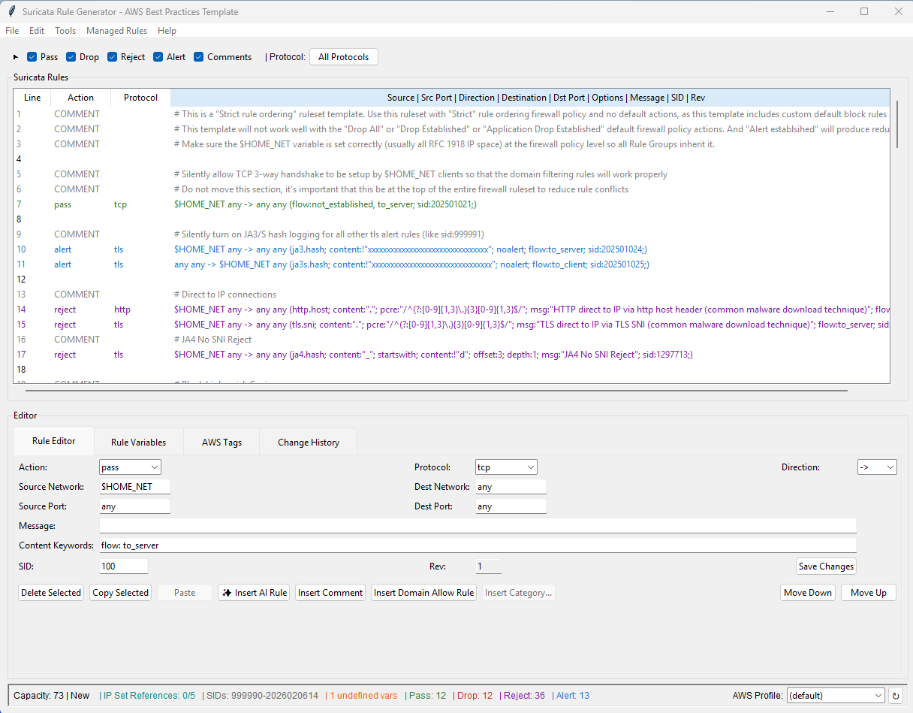

*The main interface showing the color-coded rules table, tabbed editor with Rule Editor and Rule Variables tabs, and comprehensive rule management controls.*

---

## Table of Contents

### 🚀 Getting Started
- [Quick Start](#quick-start)
- [Installation](#installation)
- [Troubleshooting](#troubleshooting)

### 📚 Core Concepts
- [Rule Format](#rule-format)
- [SID Numbers](#sid-numbers)
- [Variables Overview](#variables-overview)
- [Network Field Validation](#network-field-validation)
- [File Format](#file-format)

### 💼 Basic Workflows
- [Creating and Editing Rules](#creating-and-editing-rules)
- [File Operations](#file-operations)
- [Managing Variables](#managing-variables)
- [Copy and Paste](#copy-and-paste)
- [Keyboard Shortcuts](#keyboard-shortcuts)

### 🎯 Advanced Features
- [AI Rule Assistant - ⭐ New](#ai-rule-assistant)
- [Rule Templates](#rule-templates)
- [URL and Domain Category Filtering](#url-and-domain-category-filtering)
- [AWS Profile Support](#aws-profile-support)
- [Category-Based Domain Analysis](#category-based-domain-analysis)
- [Bulk Domain Import](#bulk-domain-import)
- [Palo Alto Configuration Import](#palo-alto-configuration-import)
- [AWS Rule Group Import](#aws-rule-group-import)
- [Rule Filtering](#rule-filtering)
- [Bulk SID Management](#bulk-sid-management)
- [Advanced Editor](#advanced-editor)
- [Rule Conflict Analysis](#rule-conflict-analysis)
- [CloudWatch Rule Usage Analysis](#cloudwatch-rule-usage-analysis)
- [Analyze Traffic Costs](#analyze-traffic-costs)
- [Infrastructure Export](#infrastructure-export)
- [Change Tracking](#change-tracking)
- [SIG Type Classification](#sig-type-classification)
- [Test Rules with PCAP - ⭐ New](#test-rules-with-pcap)

### 📖 Reference
- [Features List](#features-list)
- [Content Keywords JSON](#content-keywords-json)
- [Common Ports JSON](#common-ports-json)
- [Technical Architecture](#technical-architecture)
- [Tips and Best Practices](#tips-and-best-practices)
- [Support](#support)

---

# 🚀 Getting Started

## Quick Start

> 💡 **New to the application?** Choose your path:

### Path 1: For Experienced Python Users

```bash
# 1. Verify Python 3.6+ is installed
python3 --version

# 2. Clone the repository
git clone https://github.com/aws-samples/sample-suricata-generator
cd sample-suricata-generator

# 3. Run the application
python3 suricata_generator.py
```

### Path 2: First Time Setup (Step-by-Step)

1. ✅ **Install Python 3.6+** - See [Installation](#installation) below
2. ✅ **Verify tkinter** - Run: `python3 -c "import tkinter; print('tkinter is available')"`
3. ✅ **Download** - Clone repository or download ZIP
4. ✅ **Run** - Execute: `python3 suricata_generator.py`

### Path 3: Your First Rule (Complete Beginner)

1. 📝 Launch the application (it opens with a blank canvas)
2. 🖱️ Click in the empty area below the table
3. 🎯 Fill in the fields:
   - Action: pass
   - Protocol: tcp
   - Source Network: $HOME_NET
   - Destination: any / any
   - Message: "My first rule"
   - SID: 100 (auto-suggested)
4. 💾 Click "Save Changes"
5. 🎉 Your rule appears in the table!

---

## Installation

### System Requirements

**Required:**
- Python 3.6 or higher
- tkinter (GUI library)

**Optional:**
- wxPython (for Advanced Editor with code folding)

### Step 1: Install Python

**Windows:**
1. Check if installed: `python --version` or `python3 --version`
2. If needed, download from [python.org](https://www.python.org/downloads/)
3. **Important:** Check "Add Python to PATH" during installation
4. Verify: `python --version`

**macOS:**
```bash
# Check current version
python3 --version

# Install via Homebrew (recommended)
brew install python3

# Or download from python.org
```

**Linux (Ubuntu/Debian):**
```bash
# Check current version
python3 --version

# Install if needed
sudo apt update
sudo apt install python3 python3-pip
```

**Linux (CentOS/RHEL/Fedora):**
```bash
# CentOS/RHEL
sudo yum install python3 python3-pip

# Fedora
sudo dnf install python3 python3-pip
```

### Step 2: Install tkinter (GUI Library)

**Verify tkinter is installed:**
```bash
python3 -c "import tkinter; print('tkinter is available')"
```

If successful, skip to Step 3. Otherwise:

**macOS:**
```bash
# Method 1: Reinstall Python from python.org (includes tkinter)
# Download from https://www.python.org/downloads/

# Method 2: Install via Homebrew
brew install python-tk@3.12  # Replace with your Python version
```

**Ubuntu/Debian:**
```bash
sudo apt update
sudo apt install python3-tk
```

**CentOS/RHEL/Fedora:**
```bash
# CentOS/RHEL
sudo yum install python3-tkinter

# Fedora
sudo dnf install python3-tkinter
```

**Windows:**
- Reinstall Python from python.org
- Ensure "tcl/tk and IDLE" component is selected

### Step 3: Download the Application

**Option A - Clone Repository:**
```bash
git clone https://github.com/aws-samples/sample-suricata-generator
cd sample-suricata-generator
```

**Option B - Download ZIP:**
1. Download ZIP from [GitHub repository](https://github.com/aws-samples/sample-suricata-generator)
2. Extract to your preferred location
3. Navigate to folder in terminal

### Step 4: Run the Application

```bash
python3 suricata_generator.py
```

**Windows users:**
```cmd
python suricata_generator.py
```

### Optional: Install Advanced Editor Support

The Advanced Editor requires wxPython (optional - main app works without it):

```bash
# Install wxPython
pip install wxPython

# Or pip3 on some systems
pip3 install wxPython

# Verify installation
python3 -c "import wx; print('wxPython version:', wx.version())"
```

**Platform-Specific Notes:**
- **Windows**: May take several minutes to install
- **macOS**: May take 10-15 minutes (compiles native components). If build fails, install Xcode Command Line Tools: `xcode-select --install`
- **Linux**: Install system dependencies first (see platform-specific instructions below)

**Linux Dependencies:**
```bash
# Ubuntu/Debian
sudo apt install libgtk-3-dev libwebkit2gtk-4.0-dev
pip3 install wxPython

# Or use system package
sudo apt install python3-wxgtk4.0

# Fedora
sudo dnf install python3-wxpython4
```

> 💡 **Don't worry!** All core features work without wxPython. It's only needed for the Advanced Editor (Tools > Advanced Editor).

### Optional: Create Standalone Executable

Use PyInstaller to create an executable that runs without Python installation:

```bash
# Install PyInstaller
pip3 install pyinstaller

# Create executable (macOS/Linux)
pyinstaller --onefile --windowed --name "Suricata Rule Generator" \
  --add-data "screenshot.png:." \
  --add-data "README.md:." \
  --add-data "RELEASE_NOTES.md:." \
  suricata_generator.py

# Windows (use semicolon instead of colon)
pyinstaller --onefile --windowed --name "Suricata Rule Generator" ^
  --add-data "screenshot.png;." ^
  --add-data "README.md;." ^
  --add-data "RELEASE_NOTES.md;." ^
  suricata_generator.py

# Executable created in dist/ directory
```

**PyInstaller Notes:**
- Executables are platform-specific (build on target OS)
- Single-file executables are 40-60MB (include Python runtime)
- macOS may show Gatekeeper warnings (right-click > Open to bypass)

---

## Troubleshooting

### Common Installation Issues

**"python: command not found"**
- Try `python3` instead of `python`
- Windows: Ensure Python was added to PATH during installation
- Restart terminal after Python installation

**"No module named 'tkinter'"**
- Install tkinter using platform-specific commands above
- macOS: May need to reinstall Python from python.org
- Verify: `python3 -c "import tkinter"`

**Permission errors (Linux/macOS):**
- Use `python3` instead of `python`
- Don't use `sudo` to run the application
- Ensure script has execute permissions: `chmod +x suricata_generator.py`

**Application doesn't start:**
- Verify you're in the correct directory
- Check Python version: `python3 --version` (must be 3.6+)
- Ensure all files are present
- Run from command line to see error messages

### Common Usage Issues

**🔴 SID Conflicts**
- Application prevents duplicate SIDs
- Use SID Management to bulk renumber if needed

**🌐 Network Validation Errors**
- Use proper CIDR format (e.g., 192.168.1.0/24)
- Or use variables like $HOME_NET

**🔤 Variables Not Persisting**
- Check for companion .var files in same directory
- Variables automatically save/load with .suricata files

**📦 Export Capacity Errors**
- AWS Network Firewall max capacity: 30,000
- Use analysis to check rule count
- Consider splitting into multiple rule groups

**🔍 Search Not Finding Results**
- Check search scope (field-specific vs all fields)
- Verify action filters aren't hiding results
- Try clearing filters (Edit > Clear All Filters)

**⚠️ Orange Warning Icons**
- Protocol/port combination warnings are informational only
- Review if unusual combinations are intentional

---

# 📚 Core Concepts

## Rule Format

Suricata rules follow this standard format:
```
action protocol src_net src_port direction dst_net dst_port (options)
```

**Components:**
- **action**: pass, drop, reject, alert
- **protocol**: tcp, udp, http, tls, dns, etc. (26 protocols supported)
- **src_net**: Source network (CIDR, "any", or variable)
- **src_port**: Source port (number, range, "any", or variable)
- **direction**: -> (unidirectional) or <> (bidirectional)
- **dst_net**: Destination network
- **dst_port**: Destination port
- **options**: Keywords in parentheses: msg, content, sid, rev, etc.

**Example:**
```
pass tls $HOME_NET any -> any any (tls.sni; content:".example.com"; endswith; nocase; msg:"Allow example.com"; sid:100; rev:1;)
```

**Supported Protocols:**
dcerpc, dhcp, dns, ftp, http, http2, icmp, ikev2, imap, ip, krb5, msn, ntp, quic, smb, smtp, ssh, tcp, tftp, tls, udp

---

## SID Numbers

> 🔢 **SIDs** (Signature IDs) uniquely identify each rule in your rule group.

**Key Facts:**
- ✅ **Valid Range**: 1-999999999
- 🚫 **Must Be Unique**: No duplicate SIDs allowed in a rule group
- 🤖 **Auto-Generation**: Application suggests next available SID for new rules
- 📋 **Preservation**: Copy/paste within app auto-renumbers to prevent conflicts

**Best Practices:**
- Start at 100 for custom rules
- Reserve 999991-999999 for default deny rules
- Use SID Management for bulk renumbering

---

## Variables Overview

> 💡 **Variables** are reusable definitions for networks and ports, making rules more maintainable.

### Variable Types

**IP Sets ($)** - Network definitions
```
$HOME_NET = [10.0.0.0/8,172.16.0.0/12,192.168.0.0/16]
$EXTERNAL_NET = [!10.0.0.0/8,!172.16.0.0/12,!192.168.0.0/16]
```

**Port Sets ($)** - Port definitions
```
$WEB_PORTS = [80,443,8080,8443]
$HIGH_PORTS = [1024:65535]
```

**Reference Sets (@)** - AWS VPC Managed Prefix Lists
```
@CORPORATE_NETWORKS = arn:aws:ec2:region:account:managed-prefix-list/pl-id
```

### Variable Benefits
- 📝 **Maintainability**: Update definition once, affects all rules
- 🔄 **Reusability**: Use same variable across multiple rules
- 📊 **Readability**: Semantic names more meaningful than raw IPs
- 🔒 **AWS Integration**: Reference Sets sync with AWS managed lists

---

## Network Field Validation

Source and destination network fields accept:

**"any"** - Matches all networks
```
any
```

**CIDR Notation** - Single or multiple networks
```
192.168.1.0/24
10.0.0.1/32
[10.0.0.0/8,172.16.0.0/12,192.168.0.0/16]
```

**Variables** - Reusable definitions
```
$HOME_NET
@CORPORATE_NETWORKS
```

**Negation** - Exclude specific networks
```
!192.168.1.0/24
[192.168.0.0/16,!192.168.1.0/24]
```

**Port Validation:**
- Single port: `80`
- Port range: `[8080:8090]`
- Multiple ports: `[80,443,8080]`
- Complex: `[80:100,!85]`
- Variables: `$WEB_PORTS` (only $ prefix allowed for ports)

> ⚠️ **AWS Requirement**: Port ranges and lists MUST use brackets. Port variables must use $ prefix (not @).

---

## File Format

Rules are saved as text files with `.suricata` extension:

**Main File (.suricata):**
- Contains all Suricata rules
- Supports comments (lines starting with #)
- Preserves blank lines for organization
- UTF-8 encoding with Unix line endings (LF)

**Companion File (.var):**
- Automatically created alongside .suricata files
- Stores variable definitions (IP sets, port sets, reference sets)
- JSON format for easy parsing
- Automatically loaded when opening .suricata files

**Change History File (.history):**
- Created when change tracking is enabled
- Stores complete revision history with snapshots
- JSON format for audit trails
- Automatically loaded when opening .suricata files

**CloudWatch Statistics File (.stats):**
- Saved manually from Rule Usage Analysis Results window
- Stores CloudWatch analysis results for offline access
- JSON format with usage metrics and timestamps
- Automatically loaded when opening .suricata files

**Example Files:**
```
my_rules.suricata  → Contains rules
my_rules.var       → Contains variable definitions
my_rules.history   → Contains change history (if tracking enabled)
my_rules.stats     → Contains CloudWatch statistics (if saved)
```

> 💡 All companion files are automatically saved and loaded with your rule files!

---

# 💼 Basic Workflows

## Creating and Editing Rules

### Creating Individual Rules

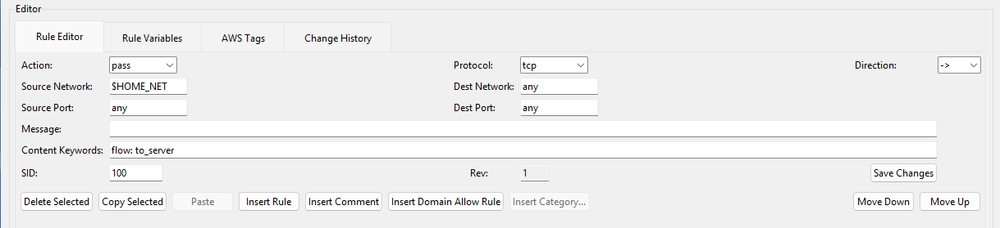

1. **Click to Add**: Click in empty area below existing rules
2. **Fill Fields**: Enter action, protocol, networks, ports, message, SID
3. **Protocol-Aware Content**: Content keywords auto-populate based on protocol
4. **Save**: Click "Save Changes" to add rule to table

> 💡 **Auto-Generated SIDs**: Application suggests next available SID automatically.

### Editing Existing Rules

**Method 1: Inline Editing**
1. Select a rule from the table
2. Modify fields in bottom editor panel
3. Click "Save Changes"

**Method 2: Double-Click**
- Double-click any rule to open edit dialog
- Edit all fields in one window
- OK to save or Cancel to discard

**Method 3: Advanced Editor**
- Press Ctrl+E or Tools > Advanced Editor
- Edit rules as text with code folding
- Real-time validation and auto-complete

### Managing Comments

💬 **Comments** help document and organize your rules:
- Click "Insert Comment" to add documentation
- Double-click comments to edit text
- Comments preserved in exports and analysis

### Rev Keyword Support *(v1.9.0+)*

The application automatically manages rule versioning:
- **Auto-Incrementing**: Rev increments when rule fields change (except message)
- **New Rules**: Start with rev=1
- **Message Exception**: Message changes don't increment rev
- **Read-Only Display**: Rev field appears next to SID (auto-managed)

**Example:**
```
pass tcp any any -> any 80 (msg:"Allow HTTP"; sid:100; rev:2;)
```

### Rule Management Operations

- 🗑️ **Delete**: Select rules and press Delete key
- ⬆️⬇️ **Move**: Use arrows to reorder rules
- ➕ **Insert**: Add rules at specific positions
- 💬 **Comment**: Add documentation lines
- 🔄 **Toggle**: Press Space to enable/disable rules (converts to comments)
- ↩️ **Undo**: Ctrl+Z to revert changes

---

## File Operations

### New File
- **File > New** or Ctrl+N
- Starts with blank canvas
- Prompts to save current file if modified

### Open File
- **File > Open** or Ctrl+O
- Opens .suricata files
- Automatically loads companion .var file for variables
- Auto-enables change tracking if .history file exists

### Save Operations
- **Save**: Ctrl+S (saves to current file)
- **Save As**: Save with new filename
- **Auto-Save Variables**: Companion .var file created automatically
- **Change History**: Pending history saved to .history file (if tracking enabled)

### Color Coding in Table

Rules are color-coded by action type:
- 🟢 **Green**: pass actions
- 🔵 **Blue**: alert actions
- 🔴 **Red**: drop actions
- 🟣 **Purple**: reject actions
- ⚫ **Grey**: comments
- 🟡 **Yellow**: search result highlights

---

## Managing Variables

### The Variables Tab

The Rule Variables tab provides comprehensive variable management with auto-detection and persistence.

### Adding Variables

**Method 1: Auto-Detection**
- Variables automatically detected when used in rules
- Switch to Variables tab to see detected variables
- Fill in definitions for empty variables

**Method 2: Manual Addition**
1. Switch to Variables tab
2. Click "Add Variable"
3. Enter name (e.g., $WEB_SERVERS)
4. Select type (IP Set, Port Set, or IP Set Reference)
5. Enter definition and optional description

**Method 3: Add Common Ports** *(New in v1.24.1)*

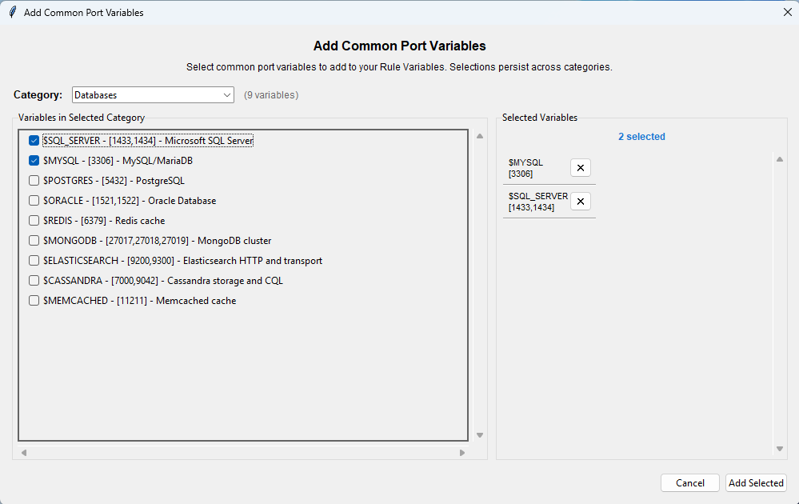

1. Click "Add Common Ports" button
2. Browse 22 pre-configured port variables across 7 categories:
   - Infrastructure Services (DNS, DHCP, NTP, SNMP)
   - Windows/Active Directory (SMB, RPC, Kerberos)
   - Web Services (HTTP, HTTPS, proxy ports)
   - Databases (MySQL, PostgreSQL, MongoDB, Redis)
   - Email (SMTP, IMAP, POP3)
   - Security/Threat Detection (malware C2, crypto mining)
   - Remote Access (SSH, RDP, Telnet)
3. Select desired variables
4. Click "Apply"

### Variable Naming Rules

- **IP Sets**: Must start with $ (e.g., $HOME_NET)
- **Port Sets**: Must start with $ (e.g., $WEB_PORTS)
- **Reference Sets**: Must start with @ (e.g., @ALLOW_LIST)
- **Characters**: Alphanumeric and underscores only
- **Case**: Typically uppercase by convention

### Variable Formats

**CIDR Lists:**
```
Single: 192.168.1.0/24
Multiple: [192.168.1.0/24,10.0.0.0/8]
Negated: [192.168.1.0/24,!192.168.1.5]
```

**Port Lists:**
```
Single: 80
Multiple: [80,443,8080]
Range: [1024:65535]
Complex: [80:100,!85,443,8080]
```

**Reference ARNs:**
```
arn:aws:ec2:region:account:managed-prefix-list/pl-id
```

### Variable Operations

- ✏️ **Edit**: Double-click variable to modify definition
- 🗑️ **Delete**: Select and click "Delete Variable"
- 🔄 **Auto-Cleanup**: Unused variables automatically removed
- 📝 **Descriptions**: Add optional descriptions for documentation

### Special Variables

**$HOME_NET:**
- Auto-detected and defaults to RFC1918 private address space
- Represents your internal network
- Used in most egress rules

**$EXTERNAL_NET:**
- Automatically defined as negation of $HOME_NET
- Managed by AWS Network Firewall
- Shows as grey/read-only in Variables tab

---

## Managing AWS Tags

> 🏷️ **Tag your rule groups** for better AWS resource organization, cost allocation, and compliance tracking.

The AWS Tags tab provides management of tags that will be applied to your rule group during export to AWS.

### The AWS Tags Tab

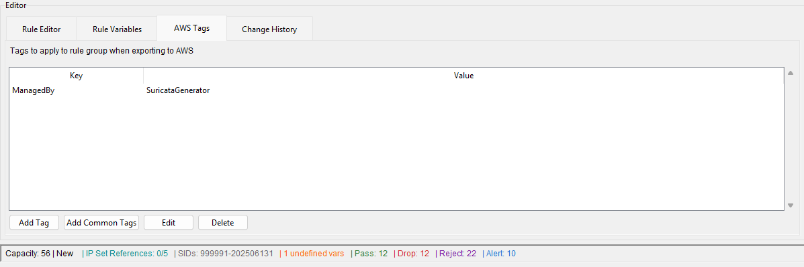

Located between Rule Variables and Change History tabs, the AWS Tags tab displays all tags as key-value pairs in a two-column table.

### Adding Tags

**Method 1: Add Individual Tag**
1. Switch to AWS Tags tab
2. Click "Add Tag"
3. Enter tag key (1-128 characters)
4. Enter tag value (0-256 characters, empty allowed)
5. Click "Save"

**Tag Requirements:**
- **Key**: 1-128 characters
- **Value**: 0-256 characters (empty allowed)
- **Valid Characters**: a-z, A-Z, 0-9, space, + - = . _ : / @
- **Reserved Prefix**: Cannot start with aws: (case-insensitive)
- **Uniqueness**: Keys must be unique within a rule group

### Tag Operations

- ✏️ **Edit**: Double-click tag to modify value (keys are immutable)
- 🗑️ **Delete**: Select tag and click "Delete Tag"
- 📝 **Change Tracking**: All tag operations logged when tracking enabled

### Default Tag

**ManagedBy Tag:**
- Automatically added when program starts or new files created
- Value: "SuricataGenerator"
- Identifies tool-managed resources in AWS
- Can be edited or deleted if desired
- Added to v1.0 format files when first opened

### Common Tag Examples

**Cost Allocation:**
```
Environment: Production
CostCenter: IT-Security
Project: NetworkFirewall
```

**Resource Organization:**
```
Owner: SecurityTeam
Team: CloudOps
Application: CoreNetworking
```

**Compliance:**
```
Compliance: PCI-DSS
DataClassification: Internal
CreatedBy: automation
```

### Export Integration

Tags are **automatically applied** during all export operations:
- **Terraform Export**: Tags added to resource tags block
- **CloudFormation Export**: Tags added to Tags array in template
- **AWS Direct Deploy**: Tags included in API call to Network Firewall

**Example Terraform Output:**
```hcl
resource "aws_networkfirewall_rule_group" "suricata_rule_group" {
  capacity = 150
  name     = "suricata-generator-rg"
  
  tags = {
    Name        = "suricata-generator-rg"
    Environment = "Production"
    ManagedBy   = "SuricataGenerator"
    Owner       = "SecurityTeam"
  }
}
```

### Import Integration

When importing rule groups from AWS:
- User-defined tags automatically imported
- AWS-managed tags (aws: prefix) filtered out
- Tags loaded into AWS Tags tab for editing

### Storage

**Persistent in .var File:**
- Tags saved in enhanced v2.0 .var file format
- Stored alongside variables in same companion file
- Format: `{"format_version": "2.0", "variables": {...}, "tags": {...}}`
- Backward compatible with v1.0 format (auto-upgrades on save)

### Benefits

**AWS Console:**
- 🔍 **Filtering**: Filter rule groups by tag in AWS Console
- 🔎 **Search**: Search for resources using tags
- 📊 **Organization**: Group related resources together

**Cost Management:**
- 💰 **Cost Explorer**: Track costs by CostCenter or Project tags
- 📈 **Billing Reports**: Allocate rule group costs to teams
- 💳 **Chargeback**: Enable showback/chargeback by tag

**Compliance:**
- 📋 **Ownership**: Document resource ownership
- 🔒 **Security**: Tag-based IAM policies for access control
- 📝 **Auditing**: Track compliance requirements

**Automation:**
- 🤖 **Policy Enforcement**: Identify tool-managed resources
- 🔄 **Lifecycle Management**: Automate based on tags
- 📦 **Inventory**: Track resource metadata programmatically

### AWS Tag Limits

- **Maximum tags per resource**: 200
- **Tag key length**: 1-128 characters
- **Tag value length**: 0-256 characters
- **Reserved prefix**: aws: (case-insensitive)

> 💡 **Zero Extra Steps**: Tags automatically included in exports - no additional configuration needed!

---

## Copy and Paste

> 📋 **Efficient rule management** with intelligent clipboard operations.

### The Dual-Clipboard System

The application uses two clipboards simultaneously for optimal workflow:

**Internal Clipboard** (Copy/Paste Within Program)
- Auto-renumbers SIDs to prevent conflicts
- Safe to paste multiple times
- Perfect for duplicating rules as templates

**System Clipboard** (Copy to External Programs)
- Preserves original SID numbers
- Use for sharing rules via email/chat
- Use for moving rules between files

### Copy Operations

**Copy Rules:**
1. Select one or more rules
2. Press Ctrl+C or right-click > Copy
3. Both clipboards populated automatically

**What Gets Copied:**
- Regular rules with all fields
- Comments and blank lines
- Structure and formatting

### Paste Operations

**Paste Rules:**
1. Select position (or paste at end)
2. Press Ctrl+V or right-click > Paste
3. Application auto-detects source and assigns SIDs appropriately

**Smart Detection:**
- Detects if clipboard content is from this program or external source
- Internal: Uses pre-calculated SIDs (conflict-free)
- External: Parses text and assigns new SIDs

### Use Cases

**Within Program:**
- ✅ Duplicate rules for variations
- ✅ Copy rule templates
- ✅ Reorganize rules

**External Sharing:**
- ✅ Email rules to colleagues with original SIDs
- ✅ Copy rules to documentation
- ✅ Move rules between different .suricata files
- ✅ Edit in external text editor

> 💡 **Pro Tip**: Toggle selection by clicking selected rules again - deselect before pasting elsewhere to avoid confusion.

---

## Keyboard Shortcuts

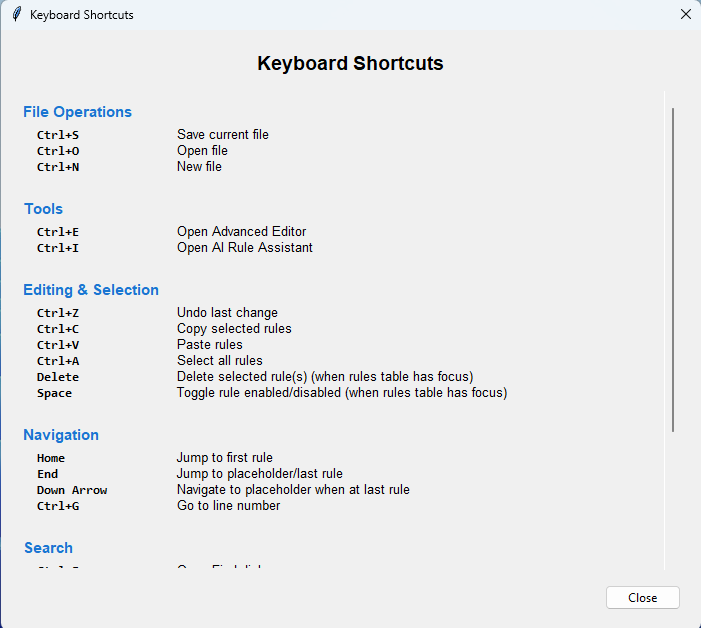

> ⌨️ **Work faster** with these keyboard shortcuts:

### File Operations
- **Ctrl+N**: New file
- **Ctrl+O**: Open file
- **Ctrl+S**: Save file

### Editing
- **Ctrl+Z**: Undo last change
- **Ctrl+C**: Copy selected rules
- **Ctrl+V**: Paste rules
- **Delete**: Delete selected rules
- **Space**: Toggle selected rules (enable/disable)

### Navigation
- **Down Arrow**: Navigate to placeholder (when at last rule)
- **End**: Jump to placeholder row
- **Home**: Jump to first rule
- **Ctrl+G**: Go to line number

### Search
- **Ctrl+F**: Open find dialog
- **F3**: Find next
- **Shift+F3**: Find previous
- **Escape**: Close search

### Advanced Features
- **Ctrl+E**: Open advanced editor
- **Ctrl+A**: Select all rules (when table has focus)

> 💡 **Context-Sensitive**: Some shortcuts only work when the rules table has focus (not text fields).

---

# 🎯 Advanced Features

## AI Rule Assistant

> ⭐ **NEW in v2.2.0** — Generate AWS Network Firewall Suricata rules from plain English using Amazon Bedrock.

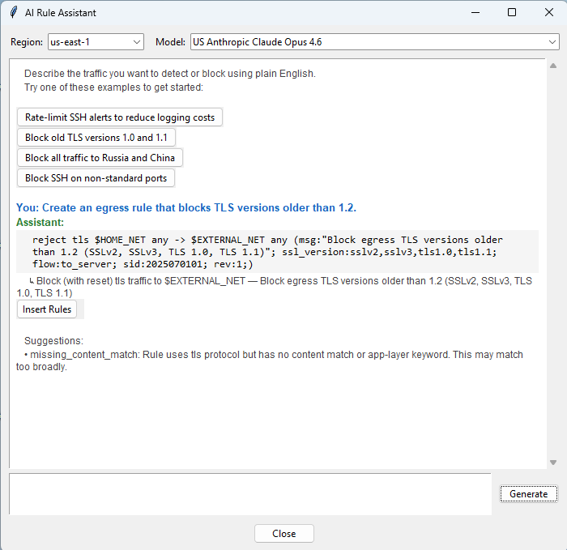

The AI Rule Assistant lets you describe network traffic to detect or block in natural language and generates valid, AWS Network Firewall-compatible Suricata rules. No deep knowledge of Suricata syntax is required.

### Accessing the Feature

- **Tools menu** → AI Rule Assistant
- **Keyboard shortcut** → Ctrl+I
- **Editor toolbar** → ✨ Insert AI Rule button

### How It Works

1. Describe what you want in plain English (e.g., "Block all traffic to Russia and China")
2. The AI generates one or more Suricata rules with proper syntax, keywords, and AWS NFW compatibility
3. Each rule includes a plain-English summary explaining what it does
4. Click "Insert Rules" to add them to your rule list with proper SID assignment

### Example Prompts

- "Block all traffic to Russia and China"
- "Allow only HTTPS to *.amazonaws.com"
- "Detect DNS tunneling"
- "Create a default deny egress policy"
- "Block SSH on non-standard ports"
- "Detect brute force SSH login attempts"
- "Detect lateral movement via SMB admin shares"

### Validation Pipeline

Generated rules pass through multiple validation layers before insertion:

1. **34 auto-fix patches** — Correct common LLM mistakes (keyword ordering, unsupported keywords, forbidden patterns)
2. **Syntax validation** — Verify rule parses correctly
3. **Best practice checks** — AWS Network Firewall-specific patterns
4. **Self-correction loop** — Up to 3 retries with error feedback if validation fails
5. **Insertion guardrails** — Rule length (8,192 char AWS limit), protocol/category compatibility, SID uniqueness

### Features

- **Chat interface** with persistent history across window close/reopen
- **Model and region selection** — Choose from available Bedrock models
- **Clickable example prompts** — Randomly selected suggestions for new users
- **Plain-English summaries** — Human-readable description below each generated rule
- **Copy support** — Ctrl+C / Cmd+C to copy text from the chat area
- **Change tracking integration** — AI-inserted rules create baseline snapshots for revision history
- **Session disclaimer** — One-time informational notice per session

### Prerequisites

- Amazon Bedrock model access enabled in your AWS account
- IAM permissions: `bedrock:InvokeModel`, `bedrock:ListFoundationModels`, `bedrock:ListInferenceProfiles`
- See **Help > AWS Setup** for complete setup instructions and connectivity testing

---

## Test Rules with PCAP

> ⭐ **NEW in v2.2.0** — Validate Suricata rules against captured network traffic.

Test whether a rule's detection logic actually triggers on real network packets by running it through the Suricata engine against a PCAP file.

### Accessing the Feature

- **Tools menu** → Test Rules with PCAP

### How It Works

1. Select a rule from your rule list
2. Choose a PCAP file (.pcap or .pcapng)
3. The tool runs the Suricata engine locally against the PCAP with your rule
4. Results show whether the rule triggered and on which packets (source/dest IPs, ports, alert details)

### Use Cases

- Confirm a rule detects what you intended
- Debug rules that aren't firing in production — replay traffic locally
- Validate AI-generated rules against sample traffic before deployment
- Test content matches, PCRE patterns, and sticky buffer logic

### Prerequisites

- **Optional** — Suricata must be installed locally (this is NOT an AWS requirement)
- Install: `brew install suricata` (macOS), `sudo apt install suricata` (Linux)
- All other program features work without Suricata installed
- The feature gracefully shows an install message if Suricata is not found

---

## Rule Templates

> 🎯 **Quick rule generation** from pre-built security patterns - new in v1.24.0!

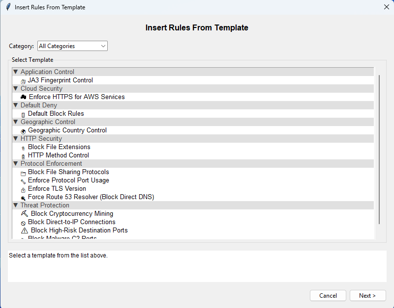

Rule Templates provide pre-configured security patterns that generate complete Suricata rules with minimal input. Templates range from simple one-click policies to complex parameterized patterns.

### Accessing Templates
- **File > Insert Rules From Template**
- **Organized by Category**: Protocol Enforcement, Cloud Security, Threat Protection, Geographic Control, Application Control, HTTP Security, Default Deny
- **Complexity Indicators**: Beginner, Intermediate, Advanced labels
- **14 Built-in Templates**: Ready to use immediately

### Available Templates

**Protocol Enforcement:**
- 🔍 Force Route 53 Resolver (Block Direct DNS)
- 🔒 Enforce TLS Version (parameterized)
- 🔧 Enforce Protocol Port Usage (parameterized)
- 📁 Block File Sharing Protocols (parameterized)

**Cloud Security:**
- ☁️ Enforce HTTPS for AWS Services

**Threat Protection:**
- ⛏️ Block Cryptocurrency Mining
- 🦠 Block Malware C2 Ports
- 🚫 Block Direct-to-IP Connections
- ⚠️ Block High-Risk Destination Ports (parameterized)

**Geographic Control:**
- 🌍 Geographic Country Control (parameterized - 180+ countries)

**Application Control:**
- 🔐 JA3 Fingerprint Control (parameterized)

**HTTP Security:**
- 📎 Block File Extensions (parameterized)
- 🚦 HTTP Method Control (parameterized)

**Default Deny:**
- 🚪 Default Block Rules (comprehensive egress/ingress deny)

### Using Templates

**Basic Workflow:**
1. **Select**: Browse templates by category
2. **Configure**: Fill in parameters (if required)
3. **Preview**: Review generated rules with SID suggestions
4. **Test Mode**: Optional - converts all actions to 'alert'
5. **Apply**: Rules inserted with automatic variable detection

**Parameter Types:**
- **Radio Buttons**: Select one option (e.g., TLS version, geographic mode)
- **Checkboxes**: Boolean options (e.g., bidirectional enforcement)
- **Text Input**: Free-form with validation (e.g., JA3 hash)
- **Multi-Select Port**: Choose multiple ports from list
- **Multi-Select Protocol**: Choose multiple protocols
- **Multi-Select Country**: Regional country selection (180+ countries)

### Template Features

**Smart SID Assignment:**
- Auto-suggests next available SID
- Default Block rules use predefined high SIDs (999991-9999915)
- Conflict detection with automatic resolution

**Test Mode:**
- Available for all templates
- Converts actions to 'alert' for safe testing
- Adds [TEST] prefix to messages

**Special Templates:**

**Default Block Rules** - Comprehensive deny ruleset
- **Dual Insertion**: Rules inserted at both TOP and BOTTOM of file
- **Top Rules**: Allow TCP handshake setup (critical for established connections)
- **Bottom Rules**: Default deny for all protocols (egress and ingress)
- **Predefined SIDs**: Uses specific SIDs (202501021-25, 999991-997, 999999, 9999910-15)
- **Flowbits Coordination**: Advanced Suricata features for efficient processing

**Geographic Country Control** - GeoIP filtering
- **Block Mode**: Deny-list selected countries (1 rule per country)
- **Allow Mode**: Allow-list selected countries (1 combined rule)
- **Direction Control**: Egress, ingress, or both
- **Regional Selection**: Browse countries by region (Asia, Americas, Africa, Middle East, Europe, Oceania)

### Benefits
- ⚡ **Rapid Deployment**: Generate multiple rules in seconds
- 📚 **Best Practices**: Templates embody security standards
- 🎯 **Consistency**: Standardized patterns across teams
- 🔧 **Customizable**: Parameters adapt to specific needs
- 📖 **Educational**: Learn from working examples

---

## URL and Domain Category Filtering

> 🔗 **Block traffic by AWS-maintained content categories** - No manual domain lists needed! - NEW in v1.30.0

AWS Network Firewall now supports category-based filtering using AWS's automatically-updated category database. Block entire threat categories (malware, phishing, C2) or productivity categories (social media, shopping, entertainment) without maintaining domain lists manually.

### Two AWS Keywords

**aws_url_category** (HTTP only)
- Evaluates complete URLs and domains in HTTP/HTTPS traffic
- Requires TLS inspection for HTTPS effectiveness
- Best for: Content filtering, security policies requiring URL path inspection

**aws_domain_category** (TLS and HTTP)
- Evaluates domain-level information from TLS SNI or HTTP host headers
- Works without TLS inspection (inspects SNI field)
- Best for: Threat protection, works in all TLS configurations

### 51 Categories Across 6 Groups

**Security Threats (10):** Malware, Phishing, Command and Control, Hacking, Malicious, Spam, Parked Domains, Private IP Address, Proxy Avoidance, Criminal and Illegal Activities

**Restricted Content (8):** Child Abuse, Adult and Mature Content, Violence and Hate Speech, Abortion, Dating, Gambling, Marijuana, Redirect

**Productivity (9):** Social Networking, Entertainment, Shopping, Email, News, Online Ads, Search Engines and Portals, Sports and Recreation, Translation

**Lifestyle (14):** Health, Travel, Pets, Food and Dining, Fashion, Religion, Arts and Culture, Family and Parenting, Hobbies and Interest, Home and Garden, Real Estate, For Kids, Science, Vehicles

**Business/Professional (8):** AI and Machine Learning, Education, Government and Legal, Military, Technology and Internet, Business and Economy, Career and Job Search, Science

**Financial (2):** Cryptocurrency, Financial Services

### Three Access Methods

#### Method 1: Rule Templates (Primary - Bulk Operations)
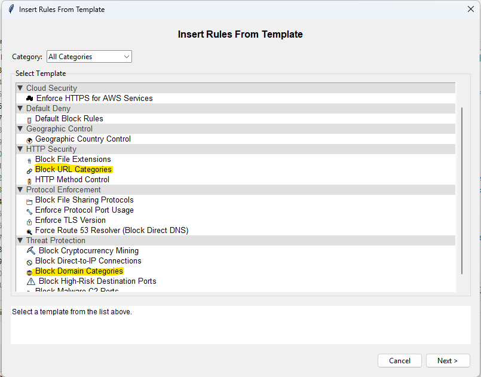

**File > Insert Rules From Template:**
1. Select template:
   - **Block URL Categories** (HTTP Security category) - Requires TLS inspection for HTTPS
   - **Block Domain Categories** (Threat Protection category) - Works without TLS inspection
2. **Two-Panel Selection UI:**
   - Left: Categories organized by group with search
   - Right: Selected categories summary
3. **Configure Options:**
   - Protocol selection (TLS or HTTP for domain categories)
   - Test mode available
4. **Apply**: Generates 1 rule with comma-separated categories

**Example Generated Rule:**
```
drop tls $HOME_NET any -> any any (msg:"Block Malware, Phishing, and 1 more"; flow:to_server; aws_domain_category:Malware,Phishing,Command and Control; sid:100; rev:1;)
```

#### Method 2: Insert Category Button (Secondary - Quick Additions)
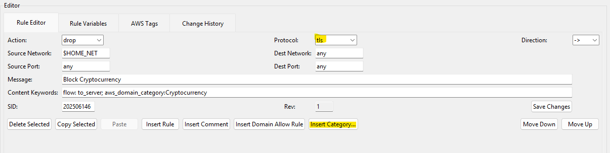

**In Main Program Editor:**
1. Set protocol to HTTP or TLS (button auto-enables)
2. Click "Insert Category..." button (next to 'Insert Domain Allow Rule' button)
3. **Category Picker Dialog:**
   - **HTTP protocol:** Choose between URL or Domain category via radio buttons
   - **TLS protocol:** Automatically uses Domain category
   - Multi-select support (Ctrl+click for multiple)
   - Real-time preview showing generated syntax
4. Click "Insert" - content and message fields auto-populate

**Features:**
- **Smart Content Insertion:** Auto-adds `flow:to_server` if Content field empty
- **Message Auto-Population:** Generates descriptive messages automatically
- **Multi-Select:** Select multiple categories with comma-separated syntax

#### Method 3: Advanced Editor (Tertiary - Power Users)
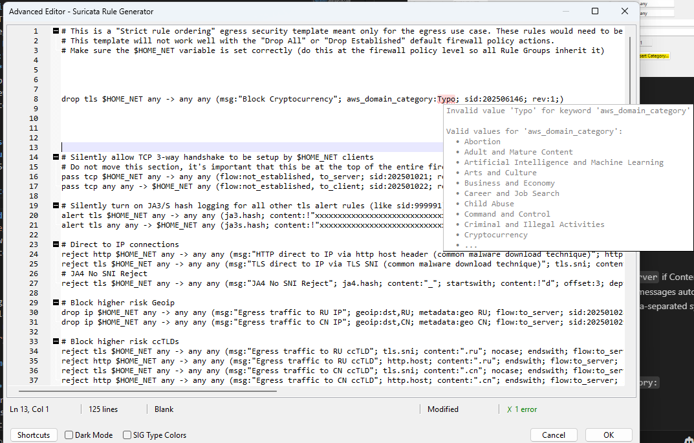

**Tools > Advanced Editor (Ctrl+E):**
1. Type `aws_url_category:` or `aws_domain_category:`
2. Auto-complete shows all 51 categories
3. Type to filter categories
4. Select and insert

**Validation:**
- Real-time red squiggles for protocol mismatches
- Hover tooltips explain errors
- `aws_url_category` requires HTTP protocol
- `aws_domain_category` requires TLS or HTTP

### Protocol Requirements

**aws_url_category:**
- ✅ HTTP protocol only
- ⚠️ Requires TLS decryption for HTTPS traffic effectiveness
- Without TLS decryption: Only inspects ~5% of web traffic (unencrypted HTTP)

**aws_domain_category:**
- ✅ TLS protocol (inspects SNI field - works without TLS decryption)
- ✅ HTTP protocol (inspects host header)
- More versatile for threat protection

### Multi-Category Support

**Efficient Syntax:**
```
# Multiple categories in one rule (comma-separated)
aws_domain_category:Malware,Phishing,Command and Control

# More efficient than separate rules:
aws_domain_category:Malware
aws_domain_category:Phishing
aws_domain_category:Command and Control
```

### Validation and Error Prevention

**Save Validation:**
- Prevents saving rules with invalid protocol/category combinations
- Clear error messages with remediation steps
- Example: "aws_url_category only supports HTTP protocol"

**Advanced Editor Validation:**
- Real-time red squiggles under invalid combinations
- Protocol mismatch detection as you type
- Hover tooltips explain requirements

### Benefits

**Simplified Security Management:**
- 📦 **No Manual Lists**: AWS maintains and updates category database automatically
- 🎯 **Threat Protection**: Block entire threat categories (malware, phishing, C2)
- 📊 **Productivity Control**: Block time-wasting categories (social media, entertainment)
- 🔒 **Compliance**: Block restricted content for legal/HR requirements
- ⚡ **Fast Deployment**: Generate category rules in seconds
- 🔄 **Automatic Updates**: Categories evolve with threat landscape

**Business Value:**
- **Better Coverage:** AWS's database provides broader protection than manual lists
- **Reduced Maintenance:** No more researching and entering domains manually
- **Multiple Workflows:** Choose template, editor button, or advanced editor
- **Clear Organization:** 6 category groups make selection intuitive

### Use Cases

**Threat Protection:**
```
# Block security threat categories
drop tls $HOME_NET any -> any any (msg:"Block Malware and Phishing"; flow:to_server; aws_domain_category:Malware,Phishing; sid:100; rev:1;)
```

**Productivity Policy:**
```
# Block social media and entertainment
drop http $HOME_NET any -> any any (msg:"Block Social Networking and Entertainment"; flow:to_server; aws_url_category:Social Networking,Entertainment; sid:101; rev:1;)
```

**Compliance:**
```
# Block restricted content
drop tls $HOME_NET any -> any any (msg:"Block Child Abuse, Adult and Mature Content, and 1 more"; flow:to_server; aws_domain_category:Child Abuse,Adult and Mature Content,Violence and Hate Speech; sid:102; rev:1;)
```

### TLS Decryption Considerations

**For Maximum Effectiveness:**
- Configure AWS Network Firewall TLS decryption for HTTPS traffic
- Without TLS decryption: `aws_url_category` only inspects unencrypted HTTP (~5% of Internet traffic)
- With TLS decryption: Both keywords inspect HTTPS traffic effectively
- `aws_domain_category` works without TLS decryption (SNI field inspection)

**Documentation:**
- [AWS Network Firewall TLS Inspection](https://docs.aws.amazon.com/network-firewall/latest/developerguide/tls-inspection-configurations.html)

### Important Constraints

- ❌ **Cannot combine with geoip:** Category keywords cannot be used with `geoip` keyword in same rule
- ✅ **Test Mode Support:** Templates support test mode (converts to alert actions)
- ✅ **Change Tracking:** All category rule operations tracked when enabled
- ✅ **Export Support:** Category rules export correctly to Terraform, CloudFormation, and AWS

> 💡 **Pro Tip**: Use templates for initial security baseline (select all security threats), then use Insert Category button for one-off additions.

---

## AWS Profile Support

> 🔑 **Switch between AWS accounts and regions** directly within the program — no more reconfiguring AWS CLI! - NEW in v1.32.0

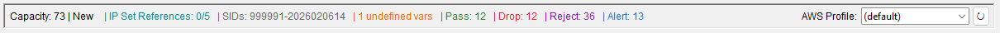

The AWS Profile Support feature adds a centralized session manager and status bar profile selector, enabling seamless multi-account workflows without leaving the application.

### Profile Selector

**Location:** Right side of status bar
```
AWS Profile: [(default) ▼] [↻]
```

**Dropdown Contents:**
- `(default)` — Uses the standard AWS credential chain (environment variables, `~/.aws/credentials` default profile, IAM role)
- All named profiles from `~/.aws/credentials` and `~/.aws/config`
- `↻` Refresh button re-reads config files to pick up newly added profiles

**States:**
- **Profiles available:** Dropdown populated and active
- **No profiles found:** Dropdown shows `(no profiles found)` — disabled (refresh still enabled)
- **boto3 not installed:** Dropdown shows `(boto3 not installed)` — disabled

### Behavior

**Session-Only Selection:**
- Profile resets to `(default)` on every program launch (similar to previous behavior)
- Not persisted to disk — predictable startup behavior
- Eliminates risk of accidentally connecting to the wrong account

**Lazy Validation:**
- Selecting a profile does NOT trigger any AWS API call
- Credentials are only validated when you perform an explicit AWS action (deploy, import, analysis, etc.)
- Non-AWS features completely unaffected by profile selection

**Default Region Integration:**
- Each profile can define a default region in `~/.aws/config`
- Selecting a profile automatically sets the default region for all region selectors
- You can still override the region in any dialog (existing behavior preserved)

### Affected AWS Features

Profile selection applies to all AWS operations:
- ✅ Export > AWS Network Firewall (Direct Deploy)
- ✅ Import Stateful Rule Group from AWS
- ✅ Import Domain List from AWS
- ✅ Traffic Analysis (CloudWatch queries)
- ✅ Rule Usage Analysis (CloudWatch queries)
- ✅ Help > AWS Setup credential verification

### Profile-Aware Error Messages

When AWS operations fail, error dialogs include the active profile name:
```
AWS credentials are not configured for profile 'dev-account'.

To configure this profile:
• Run: aws configure --profile dev-account

Or select a different profile from the status bar dropdown.
```

### Graceful Degradation

- **boto3 not installed:** Dropdown disabled. All non-AWS features work normally.
- **No AWS config files:** Dropdown shows `(default)` only. AWS features still work with environment variables or IAM roles.
- **Invalid/expired credentials:** Error surfaced only when an AWS action is attempted — never on startup or profile selection.

### AssumeRole and SSO Support

Profiles configured with `role_arn`/`source_profile` or SSO settings work transparently — boto3 handles role assumption and SSO credential resolution natively when the profile name is provided.

### Typical Multi-Account Workflow

1. Launch program → status bar shows `AWS Profile: (default)`
2. Select `prod-account` from dropdown → status bar updates
3. Import rule group from AWS → connects to production account
4. Edit rules
5. Select `staging-account` from dropdown
6. Export/deploy to AWS → deploys to staging account
7. Close and reopen program → profile resets to `(default)`

### Cross-Platform

Works on Windows, macOS, and Linux. All file path resolution for AWS config files is delegated to boto3/botocore which handles platform differences natively.

---

## Category-Based Domain Analysis

> 📊 **See which domains triggered each category rule** — compliance reporting, threat intelligence, and policy validation!

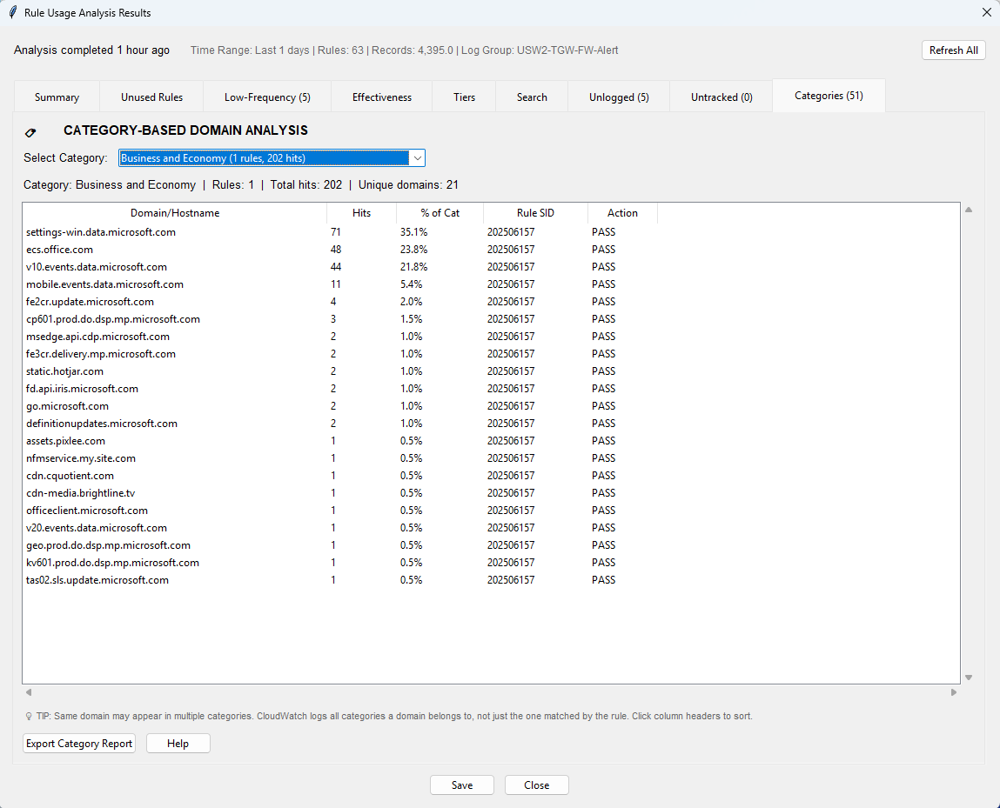

After deploying category rules and running **Tools > Analyze Rule Usage**, the new **Categories tab** (Tab 9) in the results window shows which specific domains were seen in CloudWatch alert logs for each URL/domain category.

### What You Get

**Category Dropdown:**
- Browse all categories with rule counts and hit totals
- Rule-defined categories always appear (even with 0 hits)
- Discovered categories from CloudWatch added automatically
- Format: `Category Name (N rules, M hits)`

**Domain Table:**
- Sortable columns: Domain/Hostname, Hits, % of Category, Rule SID, Action
- **Direct domains** (normal text): A rule targeting this category matched the domain — real hits, SIDs, and actions displayed
- **Indirect domains** (greyed out, n/a): Domain belongs to this category per AWS's database, but a different category's rule fired first due to strict rule ordering

### Use Cases

**Compliance Reporting:**
- "Show me all Command & Control domains we detected this month"
- "Which Malware domains did we block?"

**Threat Intelligence:**
- Understand attack patterns by category with per-domain hit counts
- Identify frequently-seen threat domains

**Policy Validation:**
- Verify category-based rules catch expected traffic
- Spot domains appearing in unexpected categories
- Identify categories with 0 direct hits (rules may be shadowed by earlier rules)

### Features

- **Separate CloudWatch Query**: Independent query that doesn't affect other analysis tabs
- **Truncation Warning**: Banner displayed if results hit the 10,000 record limit
- **Export Category Report**: Export all categories with domain tables to a text report
- **Help Button**: In-tab documentation explaining direct vs indirect domains, dropdown labels, and strict rule ordering effects
- **Persistent Cache**: Category data saved in `.stats` files for instant access without re-querying CloudWatch
- **Empty State Guidance**: Clear instructions when no category data exists

### How It Works

1. Create rules using `aws_domain_category` or `aws_url_category` keywords
2. Deploy rules to AWS Network Firewall
3. Run **Tools > Analyze Rule Usage** — the category query runs automatically
4. Open the **Categories** tab in the results window
5. Select a category from the dropdown to view its domains

> 💡 **Direct vs Indirect**: With strict rule ordering, an earlier rule may fire before a rule targeting the selected category. Those domains appear greyed out with "n/a" values — they belong to the category per AWS's database, but no rule targeting that specific category matched them.

---

## Bulk Domain Import

> 📦 **Import hundreds of domains** and automatically generate rules for each one - now with AWS Domain List import in v1.27.7!

### Two Import Methods

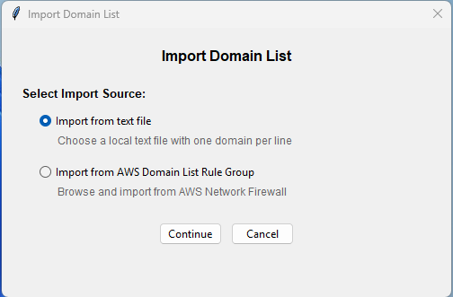

**Method 1: AWS Domain List Import** 
- Browse and import Domain List rule groups directly from AWS
- No CLI commands or file exports needed
- Visual search and protocol customization
- Multi-select support to combine multiple rule groups in one import

**Method 2: Text File Import** (Original Method)
- Import domains from local text files
- One domain per line format
- Useful for custom domain lists

### Method 1: AWS Domain List Import (New)

**Requirements:**
- boto3 installed: `pip install boto3`
- AWS credentials configured
- IAM permissions for Network Firewall

**Workflow:**
1. **File > Import Domain List**
2. **Select "Import from AWS Domain List Rule Group"**
3. **Browse Domain Lists:**
   - Search and filter by rule group name
   - Select AWS region from dropdown
   - Expand to see capacity, domain count, target types, action
   - Only Domain List types selectable (5-tuple/Suricata grayed out)
   - **Select one or more Domain List rule groups:**
     - Single-click to select one rule group
     - Ctrl+Click to add/remove additional rule groups
     - Shift+Click to select range of rule groups
     - Non-Domain List types automatically deselected if selected
4. **Click Import** (with or without expanding)
5. **Review Preview:**
   - **Single Selection**: Shows standard preview with rule group metadata
   - **Multiple Selection**: Shows combined preview with:
     - Total rule groups being combined
     - Total domains across all groups
     - Combined target types (union of HTTP_HOST/TLS_SNI)
     - Mixed action warning (if ALLOWLIST + DENYLIST selected)
     - List of all rule groups with details
6. **Configure Bulk Import:**
   - **Protocol Selection**: HTTP and/or TLS (pre-checked based on combined AWS TargetTypes)
   - Action defaults to first rule group's action (with warning if mixed)
   - All existing bulk import options available
   - Source description shows number of combined groups
7. **Import**: Rules generated with metadata comments listing all sources

**AWS Configuration Mapping:**
- **ALLOWLIST** → pass action (default)
- **DENYLIST** → drop action (default)
- **HTTP_HOST** → Pre-checks HTTP rules checkbox
- **TLS_SNI** → Pre-checks TLS rules checkbox
- **Both targets** → Both checkboxes pre-checked

**Domain Normalization:**
- AWS wildcard format (`.example.com`) automatically normalized to `example.com`
- Generated rules use `dotprefix; content:".example.com"` to preserve wildcard behavior
- Critical for consolidation algorithm to work correctly

**Benefits:**
- ⚡ **Streamlined Workflow**: Import Domain Lists in seconds
- 🔍 **Visual Discovery**: Browse and search Domain Lists
- 🎯 **Protocol Flexibility**: Choose which protocols to generate (HTTP, TLS, or both)
- 🔗 **Multi-Select Support**: Combine multiple Domain List rule groups in one import
- 📊 **Full Integration**: Works with consolidation, SID management, change tracking
- 🌐 **Multi-Region**: Select AWS region in browser dialog
- 🔄 **Automatic Deduplication**: Consolidation removes duplicates across combined groups

### Method 2: Text File Import

**Basic Usage:**
1. **File > Import Domain List**
2. **Select "Import from text file"**
3. Choose text file (one domain per line)
4. **Configure Bulk Import:**
   - **Action**: pass, drop, or reject
   - **Starting SID**: First SID to use
   - **Message Template**: Use {domain} as placeholder
   - **Alert on Pass**: Control logging for pass rules
   - **Strict Domain List**: Exact match vs wildcard matching
   - **Protocol Selection**: HTTP and/or TLS checkboxes (both checked by default)
     - Uncheck to generate only HTTP or only TLS rules
     - Validation prevents importing with zero protocols selected
     - Rule count preview updates based on selection
5. **Import**: Click to generate rules

**Protocol Defaults (Text File):**
- Both HTTP and TLS checkboxes pre-checked by default
- User can customize to generate single-protocol rules if desired
- Same consolidation and preview features as AWS import

### Domain Consolidation *(Automatic)*

> ⚡ **Smart grouping** reduces rule count by finding optimal parent domains.

**How It Works:**
- Analyzes domain relationships
- Finds most specific common parents
- Groups related subdomains automatically

**Example:**
```
Input domains:
- mail.server.com
- web.server.com  
- api.server.com
- server.com

Result: 1 rule for *.server.com (instead of 4 rules)
Savings: 8 rules → 2 rules (75% reduction)
```

**Benefits:**
- 📊 Significantly reduced rule count
- 🎯 Automatic optimization
- 👁️ Real-time preview shows savings
- 🔧 Enabled by default (disable with "Strict domain list")

### Rule Generation Logic

**All Actions:**
- Creates 2 rules per domain (TLS + HTTP) when both selected
- Matches both encrypted and unencrypted traffic

**Pass Action with Alert on Pass** *(default)*:
- Includes embedded alert keyword
- Provides logging without separate alert rules

**Pass Action without Alert on Pass:**
- Separate rules for pass and alert actions

---

## Palo Alto Configuration Import

> 🔥 **Migrate from Palo Alto Networks to AWS Network Firewall** — convert PA security policies to Suricata rules automatically! (Beta)

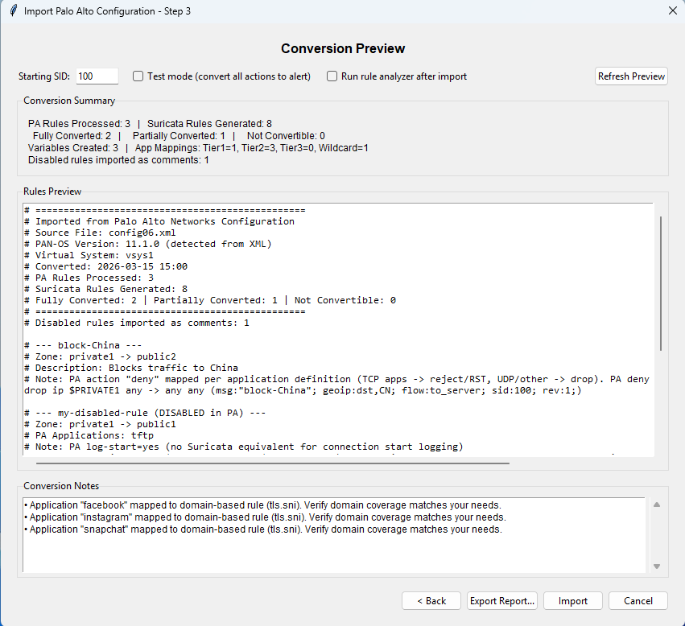

### Overview

The Palo Alto Configuration Import feature converts Palo Alto Networks firewall security policy rules from XML configuration exports into Suricata rules for AWS Network Firewall. It handles application mapping, address/service object resolution, zone conversion, GeoIP rules, URL categories, and FQDN domain matching.

### Accessing the Feature

**File > Import Palo Alto Configuration**

### Multi-Step Import Wizard

**Step 1: File Selection**
- Browse for PA XML configuration export file
- Options: Import disabled rules, include descriptions/zone info/conversion notes

**Step 1.5: Zone Mapping** *(shown if zones found)*
- Define network CIDRs for each PA zone (or leave blank for later)
- Zone variables created in the Variables tab

**Step 2: Scope Selection**
- Review configuration summary (rules, objects, zones, applications)
- Select virtual system (if multiple vsys)
- Choose all rules or select specific rules to import

**Step 3: Conversion Preview**
- Summary statistics (fully converted, partially converted, not convertible)
- Scrollable rules preview with conversion notes
- Configurable starting SID
- Test mode option (convert all actions to alert)
- Optional post-import rule analyzer
- Export Report button (text or HTML)

### Application Mapping (App-ID Conversion)

PA's App-ID is converted using a tiered approach:

| Tier | Confidence | Description | Examples |
|------|-----------|-------------|----------|
| **Tier 1** | High | Direct protocol mapping | ssl→tls, web-browsing→http, dns→dns, ssh→ssh |
| **Tier 2** | Medium | Domain-based TLS SNI matching | facebook→.facebook.com, slack→.slack.com |
| **Tier 3** | — | Unmappable (commented out) | bittorrent, skype (behavioral signatures) |
| **Tier 5** | — | Wildcard (app: any) | Uses service/port to determine protocol |

- **24 Tier 1 applications** with direct protocol mappings
- **50+ Tier 2 applications** with domain-based matching
- Multiple applications per rule expand to separate Suricata rules

### Key Conversion Features

**Address Object Resolution:**
- ip-netmask → Suricata IP Set variables
- ip-range → Variables with conversion note
- FQDN → TLS SNI + HTTP host rule pairs
- Address groups → Expanded variables (supports nested groups)
- Inline IP/CIDR → Used directly in rules

**Zone Handling:**
- PA zones → Suricata IP Set variables ($TRUST, $DMZ, etc.)
- Zone used as network field when source/destination is `any`
- Zone info preserved in comments above each rule

**GeoIP Support:**
- Country codes (CN, RU, etc.) → `geoip:dst,CODE` or `geoip:src,CODE`
- Multiple country codes combined into single geoip keyword
- Detects country codes in source/destination member fields

**URL Category Mapping:**
- Built-in PA categories → `aws_domain_category` keywords
- Custom URL category lists → Domain-matching rule pairs
- Category disambiguation (built-in → custom → unresolved)

**Deny Action Mapping:**
- TCP-based applications → Suricata `reject` (sends RST, matching PA behavior)
- UDP-based applications → Suricata `drop` (silent drop)
- Configurable per-application via `deny_action` field in `palo_alto_app_map.json`

**Disabled Rules:**
- Imported as commented-out rules with `# [DISABLED]` prefix
- Unique SIDs assigned for easy re-enabling

### Data-Driven Design

All mappings stored in user-editable `palo_alto_app_map.json`:
- Protocol mappings (Tier 1)
- Domain mappings (Tier 2)
- URL category mappings (PA → AWS)
- Application default ports
- Built-in PAN-OS service definitions
- ISO 3166-1 country codes for GeoIP

See `docs/palo_alto_app_map_json.md` for complete documentation.

### Conversion Report

Export detailed reports documenting every mapping decision:
- **Text format**: Plain text with 9 sections
- **HTML format**: Professional styled report with stat cards and color-coded tables
- Per-rule conversion details with status indicators
- Application mapping results by tier
- Variable mappings and URL category mappings
- Recommendations for post-import actions

### Supported PAN-OS Versions

- **Target**: PAN-OS 10.1, 10.2, 11.0, 11.1, 11.2
- **Compatible**: PAN-OS 8.x and 9.x (core XML schema unchanged)

### Limitations

- **App-ID fidelity**: Proprietary behavioral signatures cannot be replicated
- **Zone semantics**: Must be replaced with explicit network addresses
- **Rule expansion**: One PA rule may generate multiple Suricata rules
- **Session vs packet**: Some behavioral differences are unavoidable
- **Beta status**: Review all converted rules before production deployment

> 📖 **Full Documentation**: See `new_features/FEATURE_SPEC_palo_alto_import.md` for complete specification.

---

## AWS Rule Group Import

> 📥 **Import existing AWS Network Firewall rule groups** for editing and enhancement - Direct AWS connectivity in v1.27.3!

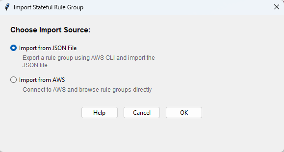

### Two Import Methods

**Method 1: Direct AWS Import** - **NEW in v1.27.3**
- Browse and import directly from your AWS account
- No CLI commands needed
- Visual search and selection
- Instant preview before importing

**Method 2: JSON File Import** (Original Method)
- Export rule group using AWS CLI
- Import the JSON file
- Useful for offline workflows

### Method 1: Direct AWS Import (Recommended)

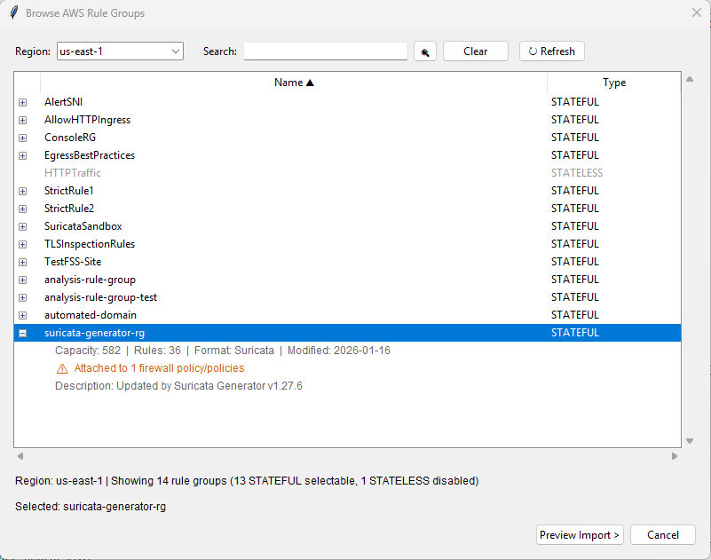

**Requirements:**
- boto3 installed: `pip install boto3`
- AWS credentials configured
- IAM permissions for Network Firewall (see Help > AWS Setup)

**Workflow:**
1. **File > Import Stateful Rule Group**
2. **Select "Import from AWS"** in the import options dialog
3. **Browse Rule Groups:**
   - Search and filter by name
   - Sort by name or type
   - Click ▶ to expand and view details (capacity, rule count, description)
   - STATEFUL rule groups are selectable
   - STATELESS rule groups shown grayed out (not supported)
4. **Select Rule Group** and click "Preview Import"
5. **Review Preview:**
   - Complete metadata (ARN, capacity, description, region)
   - Rules count and first 10 rules preview
   - Variables count and preview
   - Import summary
6. **Click "Import"** to complete

**Benefits:**
- ⚡ **Faster:** No CLI commands or file management
- 🔍 **Visual:** Browse and search all rule groups
- 📊 **Informed:** Preview details before importing
- 🎯 **Direct:** Single-menu workflow
- 🌐 **Multi-Region:** Select region from dropdown

### Method 2: JSON File Import

**When to Use:**
- Working offline without AWS connectivity
- Importing rule groups from shared JSON files
- Scripted/automated workflows

**Generating the JSON Export:**

```bash
# Using ARN
aws network-firewall describe-rule-group \
  --rule-group-arn arn:aws:network-firewall:us-east-1:123456789012:stateful-rulegroup/MyRuleGroup \
  > my_rule_group.json

# Or using name
aws network-firewall describe-rule-group \
  --rule-group-name MyRuleGroup \
  --type STATEFUL \
  > my_rule_group.json
```

**Importing the JSON File:**

1. **File > Import Stateful Rule Group**
2. **Select "Import from JSON File"** in the import options dialog
3. Browse and select the JSON file
4. Review preview
5. Click "Import"

### Import Features (Both Methods)

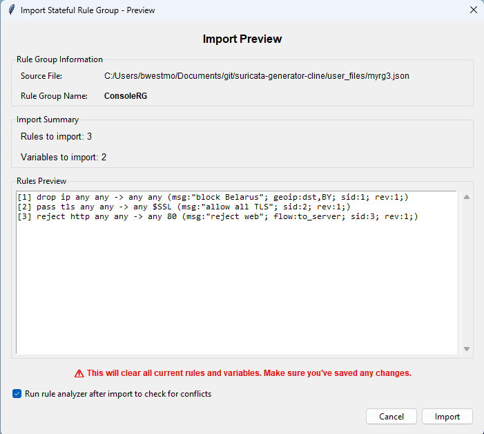

**Complete Data Import:**
- ✅ Rules converted from AWS 5-tuple to Suricata format
- ✅ IPSets imported as IP Set variables ($HOME_NET)
- ✅ PortSets imported as Port Set variables ($WEB_PORTS)
- ✅ Metadata preserved in comment header
- ✅ ReferenceSets (@variables) imported correctly

**Smart Processing:**
- Auto-renumbers duplicate SIDs within import
- Forces new file (prompts to save current work first)
- Type validation (only STATEFUL rule groups)
- Variable prefix conversion (HOME_NET → $HOME_NET)
- Format detection (Standard 5-tuple vs Suricata)

**Region Selection:** *(Direct AWS Import only)*
- Dropdown selector in browse dialog
- Choose from 11 common regions
- Remembers last selected region during session

### Use Cases
- 🔧 Edit existing AWS rules in GUI
- 🔄 Round-trip workflow (AWS → Edit → AWS)
- 📝 Add organization and comments
- 🎯 Quickly begin using Suricata-formatted rules
- 🔨 Apply bulk modifications to AWS rule groups
- 🌍 Multi-region rule management

### Setup for Direct AWS Import

**Prerequisites:**
1. Install boto3: `pip install boto3`
2. Configure AWS credentials (one of):
   - AWS CLI: `aws configure`
   - Environment variables
   - IAM role (if on AWS)
3. Verify connection: Help > AWS Setup > Testing tab

**Required IAM Permissions:**
```json
{
  "Version": "2012-10-17",
  "Statement": [{
    "Effect": "Allow",
    "Action": [
      "network-firewall:ListRuleGroups",
      "network-firewall:DescribeRuleGroup"
    ],
    "Resource": "arn:aws:network-firewall:*:*:*"
  }]
}
```

> 💡 **Help Available:** Click Help button in import dialog or visit Help > AWS Setup for complete setup guide.

---

## Rule Filtering

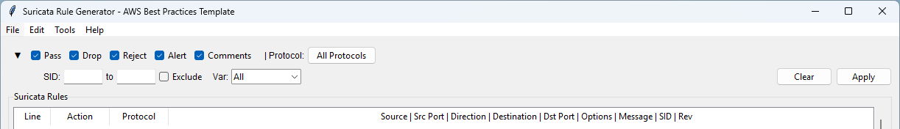

> 🎯 **Focus on relevant rules** by temporarily hiding others - essential for large rule sets!

The rule filtering feature provides non-destructive filtering to temporarily hide rules from view based on multiple criteria. Filtered rules remain in the file and are saved/exported normally.

### Accessing Filters
- **Filter Bar**: Appears above rules table (collapsed by default)
- **Click to Expand**: Access all filtering controls
- **Instant Updates**: Most filters apply immediately

### Filter Options

**By Action:**
- Individual checkboxes for Pass, Drop, Reject, Alert, Comments
- Toggle to show/hide specific action types
- Instant filtering as checkboxes change

**By Protocol:**
- Multi-select dropdown with all 26 protocols
- Select multiple protocols to display
- Shows count when multiple selected

**By SID Range:**
- Enter "From" and "To" SID values
- **Exclude Mode**: Invert filter to hide range
- Click "Apply" to activate

**By Variable:**
- Dropdown shows variables used in current file
- Filter rules using specific variables
- Click "Apply" to activate

### Filter Status

- **Status Bar**: Shows "Showing X of Y rules" when active
- **Filter Description**: Displays active criteria
- **Original Line Numbers**: Preserved for reference
- **Clear All**: Reset all filters to show all rules

### Smart Features

- **Auto-Clear on Edit**: Filters clear when edited rules don't match criteria
- **Visual Feedback**: Filter bar highlighted when active
- **Non-Destructive**: Filtered rules remain in file

### Use Cases
- 📊 Manage large rule sets (100+ rules)
- 🎯 Focus on specific rule types
- 🔍 Troubleshoot issues by isolation
- 💡 Review specific sections

---

## Bulk SID Management

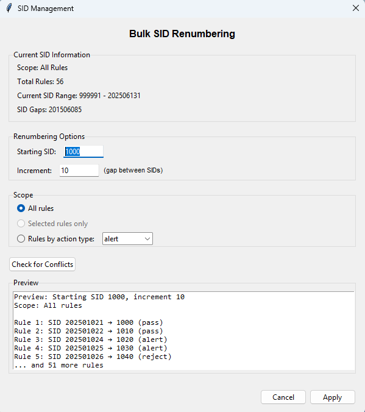

> 🔢 **Bulk renumber SIDs** for better organization and conflict resolution.

### Accessing SID Management
- **Tools > SID Management**
- Available when rules exist
- Works on all rules or selected rules

### Features

**Scope Options:**
- All rules in file
- Selected rules only
- Rules by action type (pass, drop, reject, alert)

**Renumbering Controls:**
- **Starting SID**: First SID to use
- **Increment**: Gap between SIDs (default: 10)
- **Preview**: See changes before applying

**Conflict Detection:**
- Check for SID conflicts before applying
- Visual conflict report with line numbers
- Resolution strategies available

**Resolution Strategies:**
1. **Skip Conflicts**: Find next available SID
2. **Restart with Safe SID**: Begin at max SID + 10
3. **Overwrite**: Replace conflicting SIDs (⚠️ modifies other rules)

### Use Cases
- 🔄 Reorganize SIDs by rule type
- 🔧 Fix SID gaps and inconsistencies
- 📦 Prepare rules for merging with other files
- 🎯 Group rules by SID range

> ↩️ **Undo Support**: All SID changes can be reverted with Ctrl+Z.

---

## Advanced Editor

> 💻 **Professional code editing** with IDE-like features - new in v1.19.0, enhanced with Scintilla in v1.23.0!

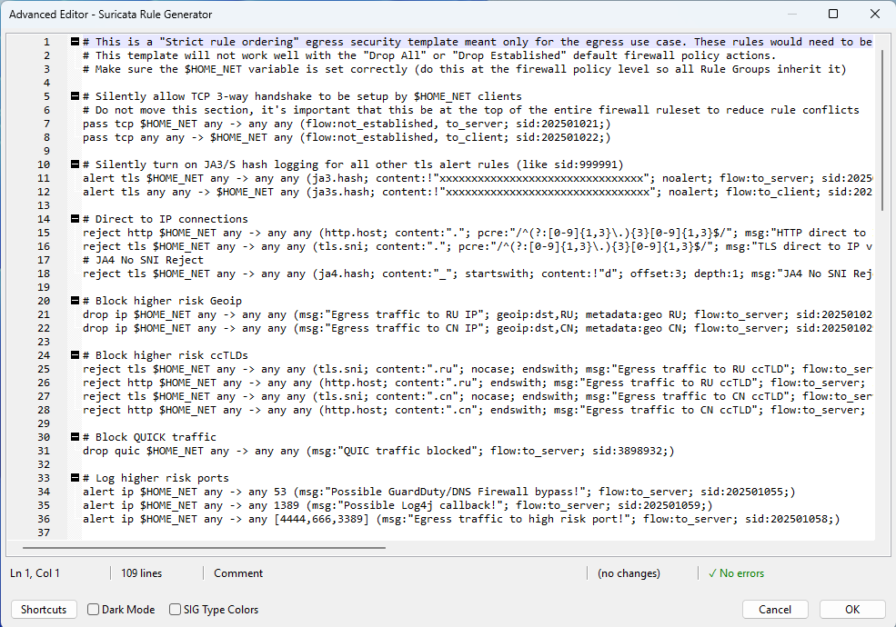

The Advanced Editor provides a powerful text-based interface with native code folding, auto-complete, and real-time validation.

### Accessing Advanced Editor
- **Tools > Advanced Editor** or Ctrl+E
- **Requirements**: wxPython (optional - prompts to install if missing)
- **Modal Window**: 1000x700 resizable with professional layout

### Code Folding *(Scintilla Feature)*

**Fold by Blank Lines:**
- Blank lines separate rules into collapsible groups
- Click +/- icons in fold margin
- Essential for organizing large rule sets

**Comment Blocks:**
- Consecutive comments (2+) fold together
- Keep related documentation collapsed
- Expand when needed

**Box-Style Markers:**
- Visual +/- icons in left margin
- Intuitive expand/collapse interface
- Standard editor convention

### Real-Time Validation

**Error Detection (Red Underlines):**
- Invalid actions, protocols, networks, ports
- Malformed syntax and missing required fields
- Direction indicator errors

**Warning Detection (Orange Underlines):**
- Unknown keywords (forward compatibility)
- Undefined variables (prompts to define)
- Duplicate SIDs within file

**Hover Tooltips:**
- Detailed error information
- Suggestions for fixes
- Shows expected values

**Status Bar:**
- Error and warning counts
- Line and column position
- Current rule number
- Modification status

### Smart Auto-Complete

**Context-Aware Suggestions:**
- **Actions**: alert, pass, drop, reject, # (comment)
- **Protocols**: All 26 supported protocols
- **Networks/Ports**: "any", CIDRs, port ranges, variables
- **Content Keywords**: 50+ Suricata keywords from content_keywords.json

**Trigger Methods:**
- Auto-appears while typing
- Manual trigger with Ctrl+Space
- Navigate with Up/Down arrows
- Accept with Tab or Enter

### Advanced Editing Features

**Smart Typing:**
- **Auto-Close**: `(` `[` `"` auto-insert matching closing character
- **Smart Tab**: Jump to next semicolon in options
- **Smart Backspace**: Delete matching bracket/quote pairs

**Code Manipulation:**
- **Comment Toggle**: Ctrl+/ to comment/uncomment lines
- **Clipboard**: Ctrl+X/C/V with system integration
- **Undo/Redo**: Multi-level Ctrl+Z and Ctrl+Y
- **Go to Line**: Ctrl+G for quick navigation

### Find and Replace

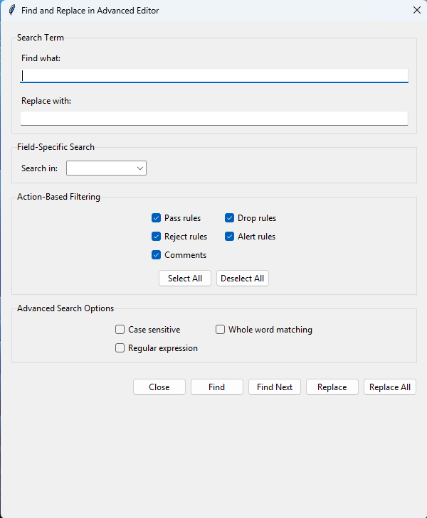

**Unified Dialog:**
- Ctrl+F opens comprehensive find/replace
- Field-specific search (message, content, networks, ports, SID, protocol, all)
- Action filtering (include/exclude by action type)
- Replace current or Replace All with confirmation

**Search Options:**
- Case-sensitive matching
- Whole word only
- Regular expression support

**Visual Highlights:**
- Current match in yellow
- Other matches in gray
- F3 for next, Shift+F3 for previous

### Save and Validation

**Comprehensive Validation:**
- All rules validated on save
- Errors auto-commented with `# [SYNTAX ERROR]` prefix
- Warnings preserved (unknown keywords allowed)
- Confirmation dialog with detailed summary

**Auto-Create Variables:**
- Undefined variables automatically created
- Added to Variables tab with empty definitions
- Prompts to define before analysis/export

### Benefits
- 💼 **Professional Workflow**: Text-based editing for power users
- 📁 **Code Folding**: Essential for large files
- ✅ **Real-Time Validation**: Catch errors as you type
- 🚀 **Fast Editing**: Auto-complete and smart typing
- 🔒 **Safety Net**: Comprehensive validation prevents invalid rules

> 💡 **Optional Feature**: Main application works fully without wxPython. Install only if you want the Advanced Editor.

---

## CloudWatch Rule Usage Analysis

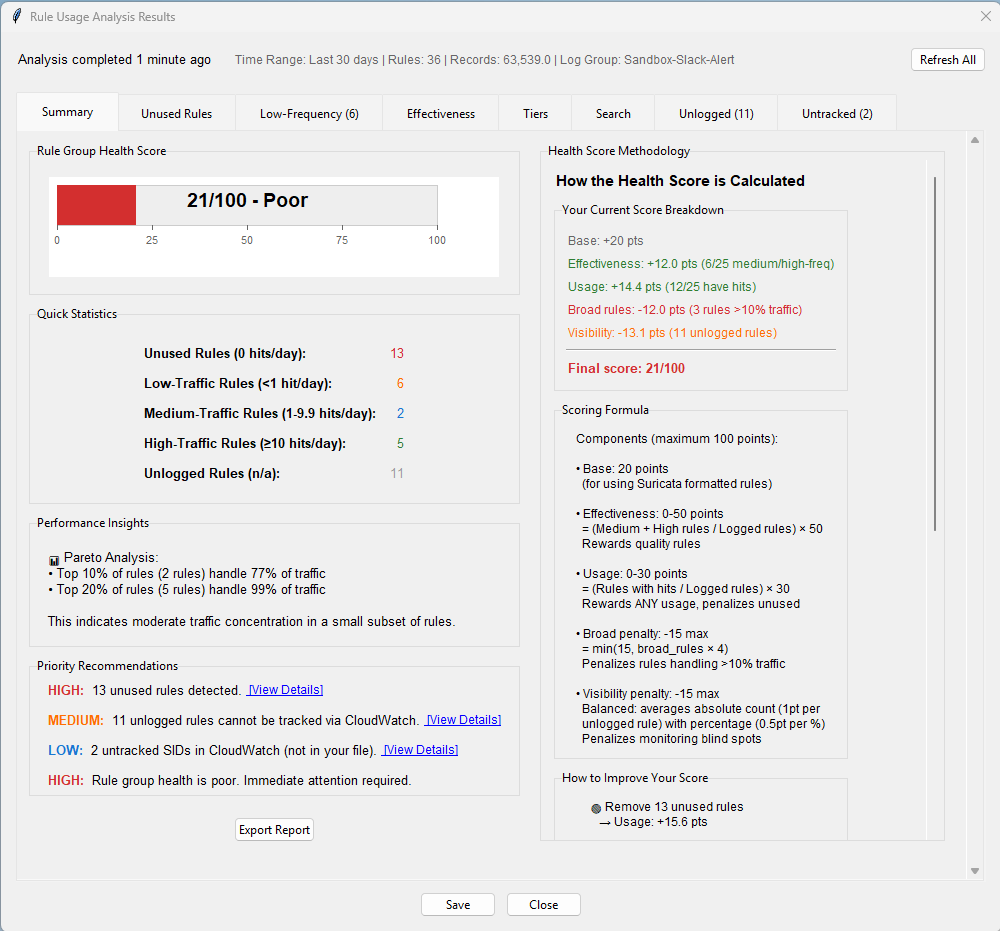

> 📊 **Discover which rules are actually being used in production** - AWS integration new in v1.27.0!

### The Problem This Solves

**Extending AWS Network Firewall Observability** While the AWS Dashboard provides excellent traffic volume and basic statistics, network security teams need deeper insights into individual rule performance. This feature extends AWS monitoring capabilities by:
- ✅ Identifying which specific rules are triggering in your traffic
- ✅ Discovering rules that have never matched any traffic
- ✅ Detecting rules that might be shadowed by earlier rules based on hit patterns
- ✅ Revealing which rules are handling the majority of your traffic

**This feature accomplishes this** by directly querying AWS CloudWatch Logs to provide comprehensive per-rule usage analytics that complement your existing AWS monitoring.

### What You Get

The CloudWatch Rule Usage Analyzer provides **eight comprehensive analytical views** from a single query:

**1. Summary Dashboard**
- Rule group health score (0-100) with visual gauge
- Quick statistics (unused, low-frequency, high-traffic, unlogged rules)
- Performance insights (Pareto analysis showing top performers)
- Priority recommendations ranked by impact

**2. Unused Rules Tab - Confirmed Unused**
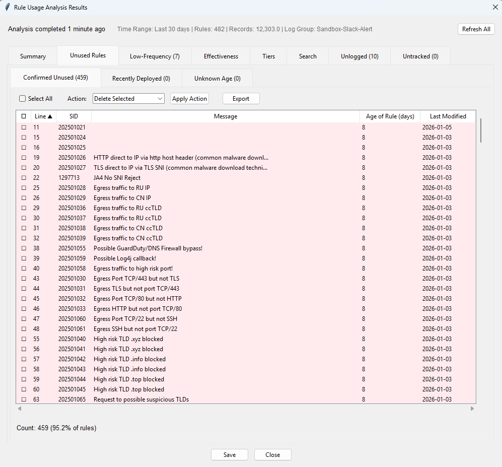
- Rules ≥14 days old with 0 hits - safe to remove
- **Bulk Actions**: Delete or comment out selected rules
- **Color Coding**: Green background for confirmed unused status
- Shows line number, SID, age, message, and rule preview

**3. Unused Rules Tab - Recently Deployed**
- Rules <14 days old with 0 hits - too new to judge
- **Warning Status**: Recommends waiting before removal
- **Color Coding**: Light yellow background for recent status
- Shows same columns as Confirmed Unused

**4. Unused Rules Tab - Never Observed**
- Unknown age with 0 hits - manual review recommended
- **Information Status**: Deployment date unavailable
- **Color Coding**: Light gray background for unknown status
- Suggests enabling change tracking for future accuracy

**5. Low-Frequency Rules Tab**
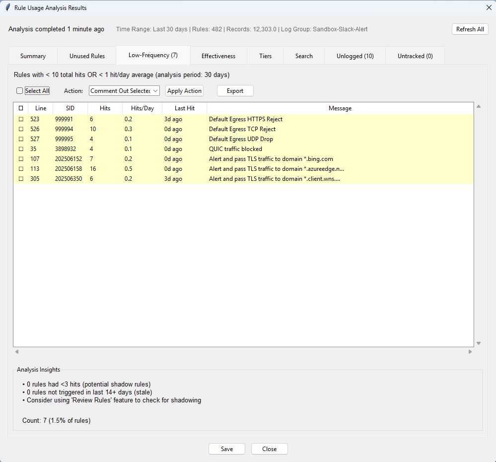
- Identifies rules with <10 hits in the analysis period
- **Staleness Indicators**: Color-coded by last hit timestamp
  - Very light yellow: <7 days ago
  - Light yellow: 7-14 days ago
  - Yellow-orange: 14-21 days ago
  - Orange: >21 days ago
- **Shadow Detection Hints**: May indicate rules blocked by earlier rules

**6. Rule Effectiveness Tab**
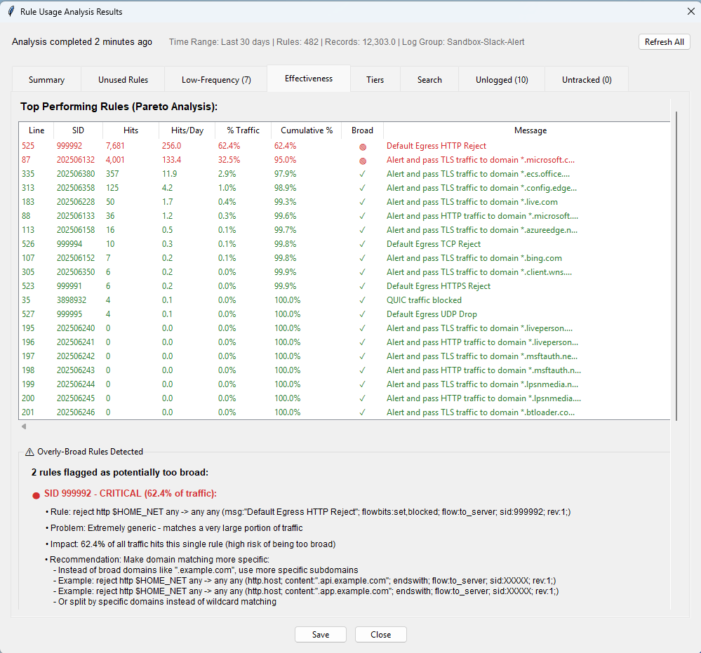
- **Pareto Analysis**: Shows which rules handle most traffic
- **Top 20 Performers**: Rules sorted by hit count
- **Overly-Broad Detection**: Flags rules handling excessive traffic (>10%, >15%, >30%)
  - Critical (>30%): Immediate review recommended
  - High (>15%): Review soon
  - Medium (>10%): Consider reviewing
- **Actionable Recommendations**: Suggests splitting broad rules into specific ones

**7. Efficiency Tiers Tab**
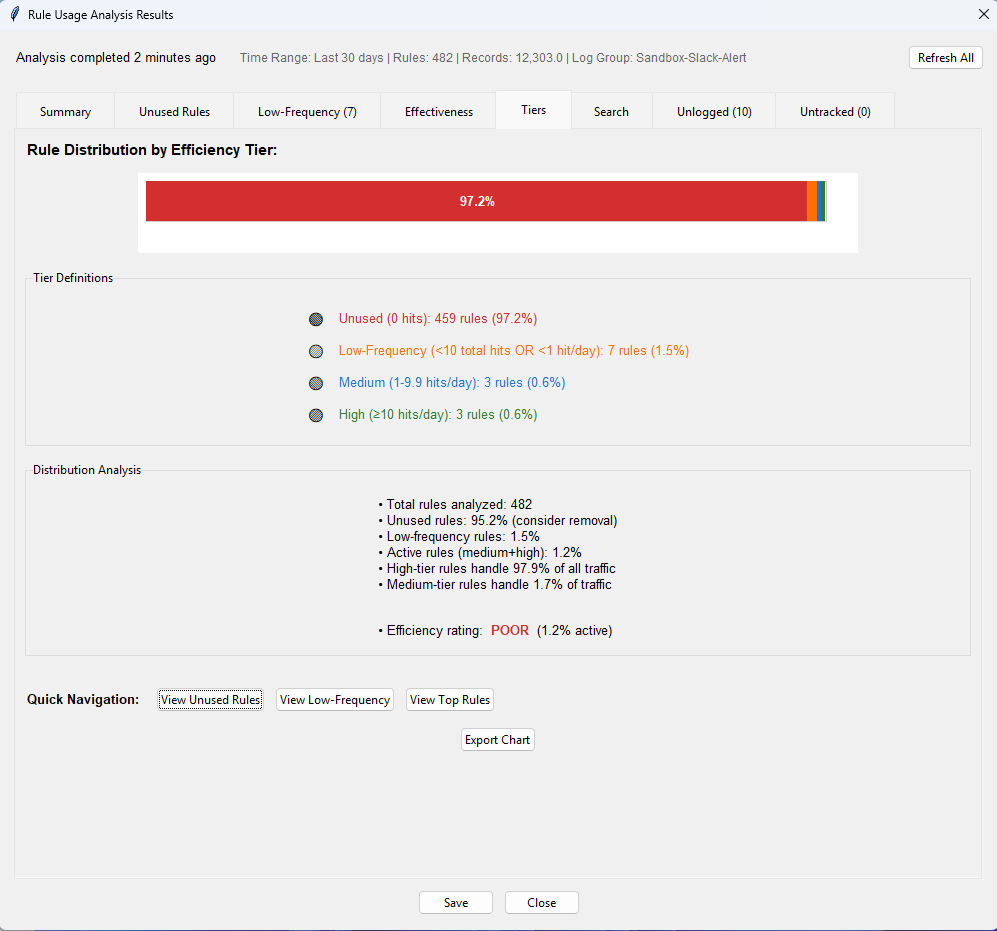
- Visual distribution of rules by usage level
- **Five Tiers**: Critical, High, Medium, Low, Unused
- **Bar Chart Visualization**: Color-coded bars showing rule distribution
- **Health Benchmarks**: Indicates healthy vs. problematic distributions
- **Tier Navigation**: Click to view rules in each category

**8. Search Tab**
- Quick SID lookup with detailed statistics
- Shows hits, percentage of traffic, last hit timestamp, rule age
- Recent searches for quick access
- Full rule display with contextual analysis

**9. Unlogged Rules Tab**
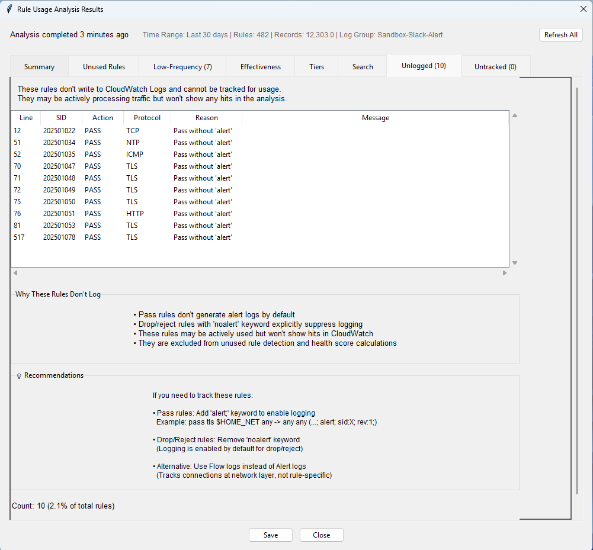
- Shows rules that don't write to CloudWatch Logs
- **Pass rules without 'alert' keyword**: Cannot be tracked via CloudWatch
- **Drop/reject with 'noalert' keyword**: Logging explicitly suppressed
- May be actively processing traffic but won't show hits
- Excluded from health score calculations and unused detection
- Provides recommendations for enabling logging if needed

**10. Untracked Rules Tab**
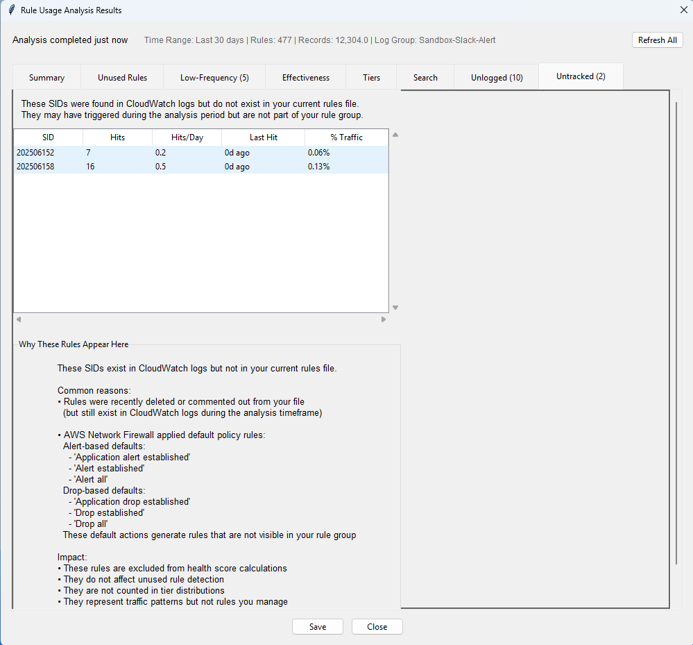
- Shows SIDs found in CloudWatch logs but not in your current file
- **Recently deleted/commented rules**: Still in logs during analysis timeframe
- **AWS default policy rules**: Alert/drop defaults not in your rule group
- Excluded from all analysis calculations
- Helps identify rules removed from file or applied by AWS policy

### AWS Managed Rule Group Analysis ⭐ NEW in v2.1.0

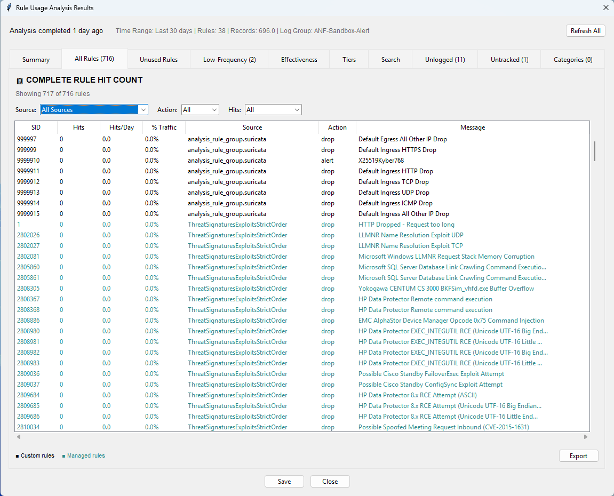

> 🔭 **Complete firewall visibility** — analyze hit counts for ALL rules in your firewall policy, not just your custom rule group!

When your AWS Network Firewall policy includes AWS managed rule groups (e.g., ThreatSignaturesPhishingActionOrder, MalwareDomainListActionOrder, BotNetCommandAndControlActionOrder), the analyzer can now include those managed rule SIDs alongside your custom rules — giving you a complete picture of your firewall's effectiveness.

**Adding Managed Rule Groups to Analysis:**
1. Open **Tools > Analyze Rule Usage**
2. Configure region, log group, and time range as usual
3. Click **"Browse Managed Rule Groups..."** in the new optional section
4. Browse all AWS managed rule groups available in your region
5. Check the managed rule groups attached to your firewall policy
6. Click **OK** — selected groups are fetched and SIDs extracted
7. Click **Analyze** — the analysis now includes both custom and managed SIDs

**Managed Rule Group Browser:**
- Multi-select checkbox interface for selecting multiple groups
- Displays rule count per group (e.g., ThreatSignaturesPhishing: 4,050 rules)
- Client-side search filtering by name
- Region inherited from the configuration dialog
- Selections remembered during the session for easy re-analysis

**New "All Rules" Tab (Tab 10):**
- Complete inventory of every rule (custom + managed) with hit counts
- Sortable columns: SID, Hits, Hits/Day, % Traffic, Last Hit, Source, Action, Message
- Filter by Source (custom file or specific managed rule group), Action, or Hits
- Color-coded: custom rules in black, managed rules in teal
- Export to text or HTML format

**Enhanced Summary Tab:**
- New "Analysis Scope" section showing custom rule count + managed rule group breakdown
- Per-group effectiveness summary: total rules, rules with hits, total hits
- Color legend explaining teal (managed) vs black (custom) distinction

**Search Tab Integration:**
- Searching for a managed rule SID shows the managed rule group name as the source

**Key Benefits:**
- **Complete Visibility**: See hit counts for ALL rules in your firewall policy
- **Managed Rule Group Effectiveness**: Determine which managed rule groups are actively triggering
- **Cost Optimization**: Identify managed rule groups with zero hits that could be removed to save capacity
- **Reduced Untracked Noise**: Managed SIDs no longer appear in the Untracked tab
- **No Additional CloudWatch Cost**: Same query runs — only post-processing is expanded
- **Persistent Cache**: Managed rule group data saved in `.stats` files for offline access

**Health Score:**
- Remains custom-rules-only to avoid distortion (users don't control managed rule content)
- Managed rule group effectiveness shown separately in the Summary tab

**IAM Permissions:**
- Requires `network-firewall:ListRuleGroups` and `network-firewall:DescribeRuleGroup` (read-only)
- Most users already have these from the Import feature

### Right-Click Quick Lookup
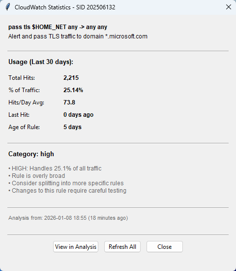

After running analysis once, right-click any rule in the main table:
- **Context Menu**: "View CloudWatch Statistics"
- **Instant Results**: Shows cached stats without re-querying CloudWatch
- **Comprehensive Data**: Hits, percentage, last hit, rule age, category
- **Quick Refresh**: Option to re-run analysis if needed

### Deployment-Aware Intelligence

The analyzer integrates with your existing change tracking to provide **confidence-based recommendations**:

**With Change Tracking Enabled:**
- Knows exact age of each rule from revision history
- Separates recently deployed rules (< X days) from confirmed unused rules
- Avoids false recommendations to remove rules still being tested

**Without Change Tracking:**
- All unused rules categorized as "Unknown Age"
- Recommends manual review before removal
- Still provides accurate hit counts and percentages

### Setup Requirements

**One-Time Setup:**
1. **Install boto3**: `pip install boto3` (AWS SDK for Python)
2. **Configure AWS Credentials**: Use AWS CLI (`aws configure`) or environment variables
3. **IAM Permissions**: Requires read-only CloudWatch Logs access
   ```json
   {
     "Version": "2012-10-17",
     "Statement": [{
       "Effect": "Allow",
       "Action": ["logs:StartQuery", "logs:GetQueryResults"],
       "Resource": "arn:aws:logs:*:*:log-group:/aws/network-firewall/*"
     }]
   }
   ```
4. **Enable CloudWatch Logging**: Your AWS Network Firewall must log to CloudWatch

**In-App Help:**
- **Help > Rule Usage Analyzer Setup**: Complete setup guide
- **Four Tabs**: Prerequisites, IAM Permissions, Credentials, Testing
- **Copy-Paste Ready**: IAM policy included for easy setup
- **Connection Test**: Built-in testing before running analysis

### Running Analysis

1. **Tools > Analyze Rule Usage**
2. **Configure Parameters**:
   - **Log Group Name**: Your CloudWatch log group path
   - **Time Range**: 7, 30, 60, or 90 days
   - **Low-Frequency Threshold**: Hit count defining "low-frequency" threshold
   - **Minimum Days in Production**: Days before considering rules unused
3. **Click Analyze**
4. **Wait**: ~10-60 seconds for CloudWatch query (progress shown)
5. **Review Results**: Six-tab window with comprehensive analytics

### Key Features

**Efficient CloudWatch Querying:**
- **Server-Side Aggregation**: Processes millions of logs in AWS
- **Minimal Data Transfer**: Returns ~200KB for 10,000 rules
- **Single Query**: All tabs populated from one query
- **Cached Results**: Instant right-click lookups after initial analysis

**Smart Analysis:**
- **Unused Detection**: Set difference logic (100% accurate)
- **Percentage Calculations**: Shows each rule's share of total traffic
- **Hits Per Day**: Normalized metrics across time ranges
- **Broadness Detection**: Identifies rules handling excessive traffic

**Persistent Statistics:**
- **Save Button**: Save analysis results to `.stats` file for offline access
- **Auto-Load**: Statistics automatically loaded when opening rule files
- **Session Caching**: Loaded stats persist until new analysis run
- **Cached Prompt**: Shows "view cached or run new" dialog with saved data

**Export and Sharing:**
- **HTML Reports**: Professional formatted with color coding
- **Plain Text Reports**: Simple format for any text editor
- **Complete Data**: Includes all tabs and recommendations

### Real-World Benefits

**Capacity Optimization:**
```
Before: 10,150 rules consuming capacity
Analysis Results:
  - 275 confirmed unused rules (2.7%)
  - 89 low-frequency rules (<10 hits/30 days)
  
Actions Taken:
  - Removed 180 confirmed unused rules
  - Capacity freed: 1.8%
  - Monitoring remaining 95 for additional optimization
```

**Security Improvement:**
```
Effectiveness Tab Finding:
  - SID 100 handles 45% of total traffic
  - Rule: pass tcp $HOME_NET any -> any any (flow:established; ...)
  - Too broad - matches ALL established TCP
  
Recommendation:
  - Split into specific rules for known services
  - Improved security posture
  - Better visibility per service
```

**Shadow Rule Detection:**
```
Low-Frequency Tab Finding:
  - SID 5500: 3 hits in 30 days
  - Last hit: 18 days ago
  - Likely shadowed by earlier rule
  
Action:
  - Use Review Rules to find shadowing rule
  - Reorder or refine rules for better coverage
```

### Why This Is Invaluable

**Extending AWS Network Firewall Monitoring:**

This feature builds upon AWS Network Firewall's robust monitoring foundation by adding rule-level analytics:

**What This Feature Adds to Your AWS Monitoring:**
- **Data-Driven Decisions**: Remove rules confidently with evidence
- **Capacity Management**: Free up capacity by removing unused rules
- **Performance Insights**: Understand which rules do the heavy lifting
- **Security Validation**: Identify overly-broad rules needing refinement
- **Shadow Detection**: Find rules that may be blocked by earlier rules
- **Deployment Awareness**: Won't flag recently deployed rules as unused

### Use Cases

**Ongoing Optimization:**
- Run monthly to identify unused rules
- Monitor rule effectiveness over time
- Track impact of rule changes

**Pre-Deployment Validation:**
- Export rule group IaC with Test Mode enabled (v1.26.0)
- Deploy and run usage analysis
- Identify false positives before enforcing
- Export production version rule group IaC with confidence

**Capacity Planning:**
- Identify low-value rules for removal
- Make room for new rules without hitting 30,000 limit
- Prioritize most effective rules

**Security Audits:**
- Document which rules are actually protecting you
- Identify gaps in coverage
- Demonstrate compliance with usage data

### Technical Details

**CloudWatch Logs Insights Query:**
- Aggregates SID hit counts server-side
- Returns total hits and last hit timestamp per SID
- Efficient pagination for large rule groups (>10,000 rules)
- Typical query time: 10-60 seconds depending on time range

**Analysis Window:**
- 7 days: Fast analysis, recent trends
- 30 days: Balanced view (recommended default)
- 60 days: Longer-term patterns
- 90 days: Comprehensive historical view

**Privacy and Security:**
- **Read-Only**: Only queries logs, never modifies anything
- **Standard AWS Auth**: Uses same credentials as AWS CLI
- **No Stored Credentials**: Application never stores AWS credentials
- **Minimal Permissions**: Only CloudWatch Logs read access required

### Benefits Summary

- 🎯 **Actionable Insights**: Priority-ranked recommendations with expected impact
- 📊 **Visual Analytics**: Health scores, charts, color-coded tables
- 🔍 **Deep Visibility**: Understand your rule group performance
- 💰 **Cost Optimization**: Remove unnecessary rules, improve efficiency
- 🔒 **Security Enhancement**: Identify and refine overly-broad rules
- ⏱️ **Time Savings**: Automated analysis vs. manual CloudWatch queries
- 📈 **Continuous Improvement**: Regular monitoring for ongoing optimization

> 🌟 **Game Changer**: This feature complements the AWS Network Firewall [**Monitoring and Observability**](https://docs.aws.amazon.com/network-firewall/latest/developerguide/nwfw-using-dashboard.html) dashboard by providing invaluable insights into your Network Firewall's rule behavior vs. traffic behavior.

---

## Analyze Traffic Costs

> 💰 **Identify where your firewall costs are coming from** and discover VPC endpoint opportunities for cost savings! - NEW in v1.29.0

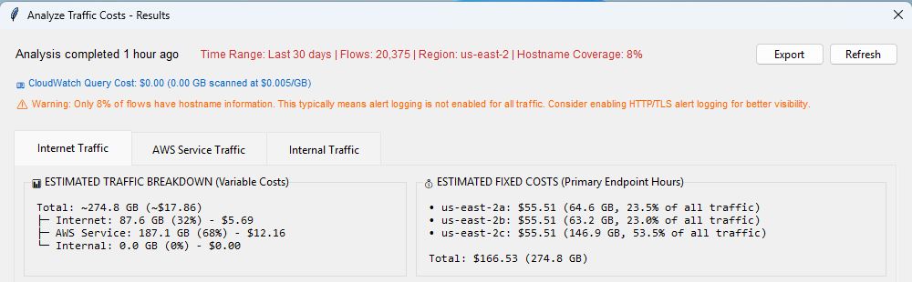

The Traffic Cost Analyzer provides comprehensive analysis of your AWS Network Firewall data processing costs by correlating CloudWatch Logs to show exactly where bandwidth is going and which AWS services could benefit from VPC endpoints.

### What This Feature Does

**Cost Visibility:**
- Analyze traffic patterns to understand firewall data processing costs
- See bandwidth breakdown by destination (internet vs AWS services vs internal)
- Identify high-cost traffic destinations with HTTP/TLS hostname resolution
- Calculate regional pricing for accurate cost estimates

**VPC Endpoint Recommendations:**
- Smart cost-benefit analysis determines when VPC endpoints are worth deploying
- Break-even calculations show exact traffic thresholds
- Gateway endpoints (FREE) always recommended for S3/DynamoDB
- Interface endpoints only recommended when cost-effective

### Three-Tab Dashboard

**Tab 1: Internet Traffic**
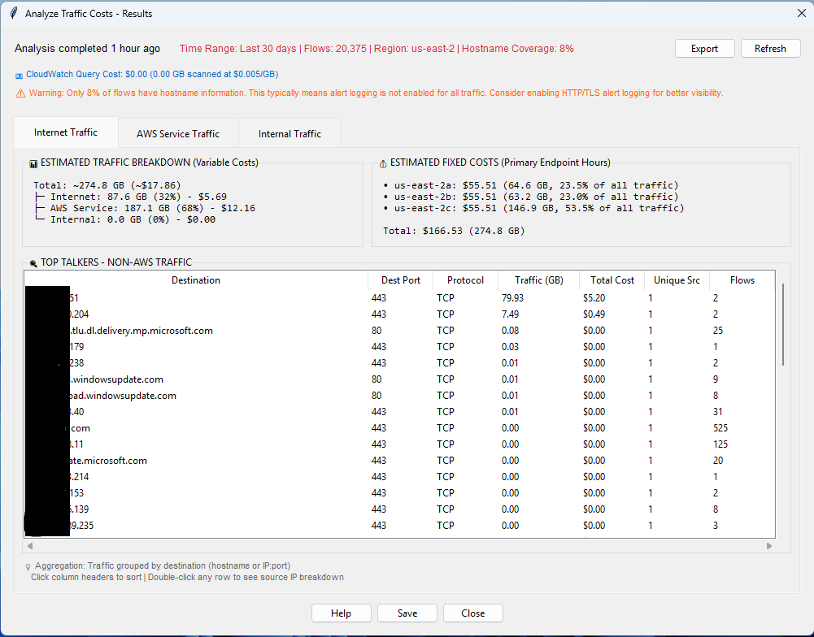
- Non-AWS traffic with hostnames/domains (HTTP, TLS SNI)
- Cost breakdown per destination
- Source IP drill-down to see which hosts generate traffic
- Identifies optimization opportunities (Windows Update, CDNs, package registries)

**Tab 2: AWS Service Traffic**
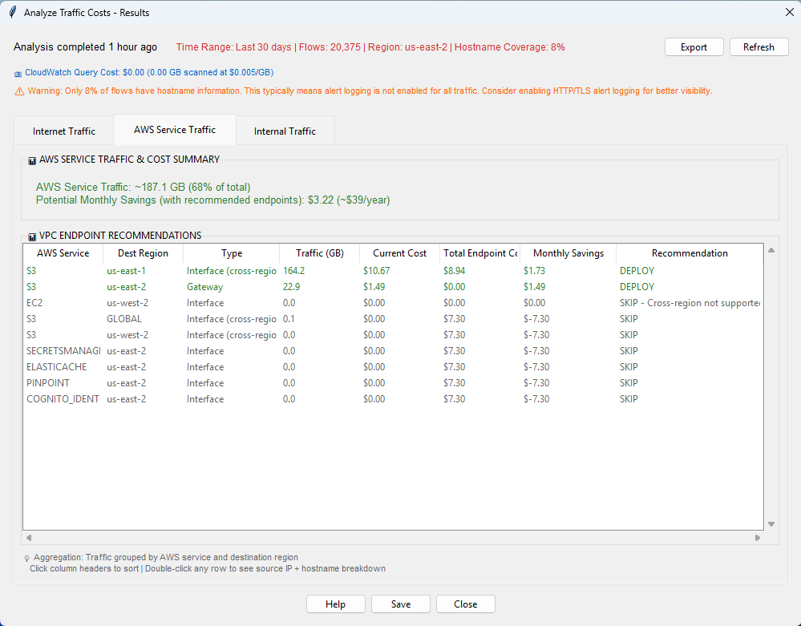
- AWS services with traffic volumes and costs
- VPC endpoint recommendations with monthly savings projections
- Regional pricing accuracy
- Cross-region traffic identification with alternative suggestions

**Tab 3: Internal Traffic**
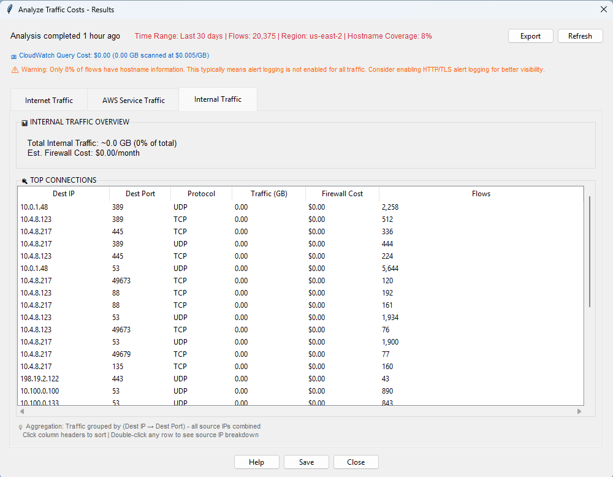
- VPC-to-VPC communication patterns
- Internal traffic costs
- Source-to-destination flow analysis

### Intelligent VPC Endpoint Recommendations

**Gateway Endpoints (Always FREE):**
- S3 and DynamoDB gateway endpoints cost $0
- Always recommended when same-region traffic detected
- Eliminate firewall data processing charges completely
- Example: 245 GB/month to S3 → Save $15.93/month ($191/year)

**Interface Endpoints (Cost-Benefit Analysis):**
- Break-even threshold: 112 GB/month for same-region (us-east-1: $7.30/month endpoint cost ÷ $0.065/GB)
- Only recommended when traffic exceeds break-even
- Example: 85 GB/month to SSM → Skip (not cost-effective)
- Example: 180 GB/month to Lambda → Deploy (saves $4.40/month)

**Regional Pricing:**
- Accurate cost calculations using regional firewall data processing rates
- Interface endpoint costs vary by region
- Break-even thresholds adjusted per region automatically

**Cross-Region Guidance:**
- Identifies cross-region AWS service traffic
- Suggests alternatives (S3 CRR, DynamoDB Global Tables)
- Interface endpoint support varies by service

### CloudWatch Logs Integration

**Correlation Engine:**
- Combines FLOW logs (traffic volumes) with ALERT logs (hostnames/SNI)
- Correlates via flow_id for complete traffic picture
- Handles millions of log entries efficiently

**Pagination Support:**
- Automatic chunking for queries exceeding 10K flows
- Progress tracking with cancellation support
- Handles very large datasets gracefully

**AWS Service Detection:**
- Downloads AWS IP ranges for service identification
- Interval tree for O(log n) lookups (100,000x faster than naive approach)
- Identifies S3, DynamoDB, Lambda, EC2, and 20+ other services

### Data Caching

**Save Results:**
- Save analysis results to .stats file (same format as Rule Usage stats)
- Unified v2.0 format supports both Rule Usage and Traffic Analysis data
- Avoid CloudWatch Logs query charges on repeat views

**Auto-Load:**
- Cached data detected when rule file is opened
- Prompt to load cached (instant) or run fresh analysis
- Shows data age for informed decision

**Instant Drill-Down:**
- Cached data supports all three main tabs
- Individual flow data not cached (keeps file size reasonable)
- Drill-down features work with fresh analysis only

### Expandable Drill-Down
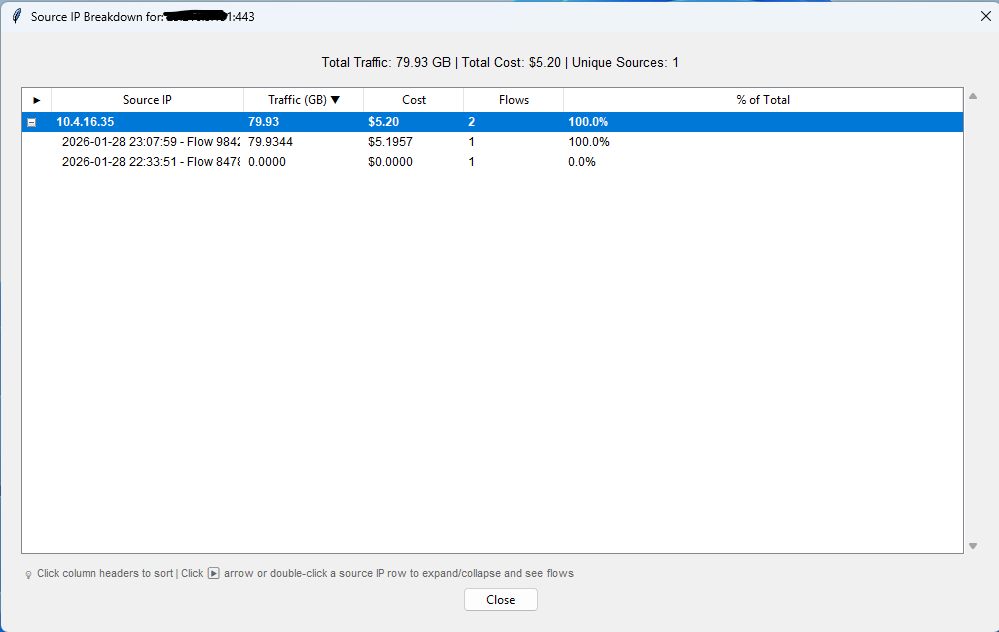

**Double Click Any Row:**
- See source IP breakdown showing which internal hosts generate traffic
- Expand source IPs to see individual flows with timestamps
- Sort by any column (traffic volume, cost, flow count)

**Timestamp Sorting:**
- Click "Source IP" column to sort flows by timestamp
- See most recent activity first
- Useful for identifying current vs historical patterns

### Custom Date Ranges

**Flexible Time Periods:**
- Preset ranges: 7, 15, 30, 60, 90 days
- Custom date range picker
- Analysis metadata shows exact date range used

### Requirements

**One-Time Setup:**
1. Install boto3 and dependencies: `pip install boto3 intervaltree requests`
2. Configure AWS credentials (AWS CLI or environment variables)
3. AWS Network Firewall must log to CloudWatch:
   - FLOW logs (traffic volumes) - Required
   - ALERT logs (hostnames/SNI) - Required for hostname visibility
4. IAM permissions for CloudWatch Logs

**CloudWatch Query Costs:**
- CloudWatch Logs Insights charges $0.005 per GB scanned
- Typical 30-day analysis: $0.50 - $2.00
- Cost warning shown before running analysis
- Cached results avoid repeated charges

### Running Analysis

1. **Tools > Analyze Traffic Costs**
2. **Configure:**
   - Flow log group (required)
   - Alert log group (optional but recommended)
   - AWS region
   - Time range (7-90 days or custom)
3. **Click Analyze**
4. **Wait**: ~60-120 seconds for CloudWatch queries
5. **Review**: Three-tab dashboard with comprehensive insights

### Benefits

**Cost Optimization:**
- Potential VPC endpoint savings: $50-200/month
- Gateway endpoints (FREE) eliminate costs for S3/DynamoDB traffic
- Interface endpoints only recommended when ROI is positive
- Regional pricing ensures accurate projections

**Traffic Visibility:**
- See exactly where bandwidth is going
- HTTP/TLS hostname resolution shows application-level detail (when available)
- Multiple destination IPs per hostname consolidated (CDN load balancing)
- Source IP drill-down shows which hosts consume bandwidth

**Smart Recommendations:**
- Break-even analysis prevents wasteful endpoint deployments
- Alternative suggestions for sub-threshold traffic
- Regional considerations for cross-region traffic
- Data-driven decisions backed by actual traffic analysis

**Easy to Use:**
- Works with existing CloudWatch logs
- No additional AWS configuration needed
- Caching reduces CloudWatch charges
- CSV export for offline analysis and reporting

### Use Cases

**Monthly Cost Review:**
- Identify new VPC endpoint opportunities
- Track traffic pattern changes
- Verify existing endpoints still cost-effective
- Report savings to management

**Architecture Optimization:**
- Discover cross-region traffic patterns
- Identify candidates for S3 Cross-Region Replication
- Find opportunities for DynamoDB Global Tables
- Optimize service placement decisions

**Troubleshooting High Bills:**
- See which destinations consume most bandwidth
- Identify unexpected traffic patterns
- Correlate costs with specific applications
- Drill down to source IPs for accountability

> 💰 **ROI**: Analysis costs $0.50-$2.00 but identifies $50-200/month in potential savings. The query cost is recovered quickly!

---

## Rule Group Analysis

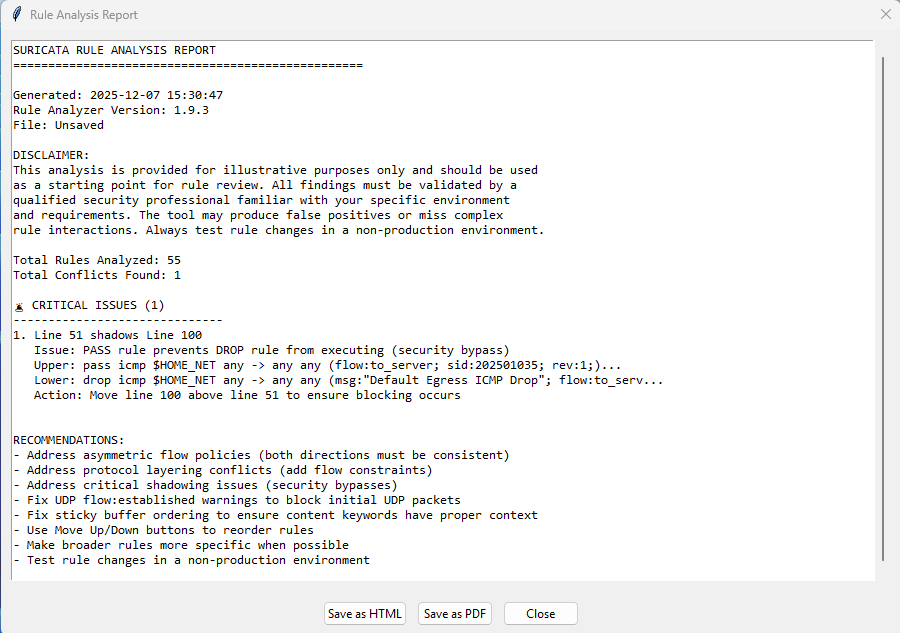

> 🔍 **Detect shadowing and conflicts** before deployment to AWS.

The analysis engine detects common rule issues that can cause unexpected behavior in production.

### Running Analysis
- **Tools > Review Rules**
- Define variable CIDRs if prompted
- Progress dialog shows analysis status
- Comprehensive report when complete

### Analysis Features

**Complete Shadow Detection:**
- Identifies when upper rules ALWAYS prevent lower rule execution
- Protocol layering awareness
- Flow state analysis
- Geographic specificity recognition

**Conflict Categories:**
- 🔴 **Critical**: Security bypasses (pass shadowing drop/reject)
- 🟠 **Warning**: Missing alerts, unreachable rules
- 🔵 **Informational**: Redundant rules with same actions

**AWS Compliance:**
- Validates rule structure for AWS Network Firewall
- Checks variable usage and formats
- Verifies protocol/port combinations

### Report Features

**Detailed Findings:**
- Line numbers for both conflicting rules
- Conflict type and severity
- Recommendations for resolution
- Example corrections

**Export Options:**
- 📄 **HTML**: Professional formatted report
- 📑 **PDF**: Browser-based PDF generation
- 📋 **Copy**: Right-click to copy results

### Benefits
- 🛡️ **Prevent Security Gaps**: Find bypasses before deployment
- 📊 **Understand Rule Interaction**: Learn why rules conflict
- 🎓 **Educational**: Detailed explanations of each issue
- 💾 **Documentation**: Export reports for team review

---

## Infrastructure Export

> 🏗️ **Deploy to AWS** with infrastructure as code templates or direct deployment.

Generate AWS Network Firewall resources for deployment in multiple formats:

### Export Formats
- **Terraform (.tf)**: Complete resource definition for Terraform workflows
- **CloudFormation (.cft)**: JSON template for CloudFormation stacks
- **AWS Network Firewall (Direct Deploy)**: Deploy directly to AWS - **NEW in v1.27.2**

### AWS Network Firewall Direct Deploy

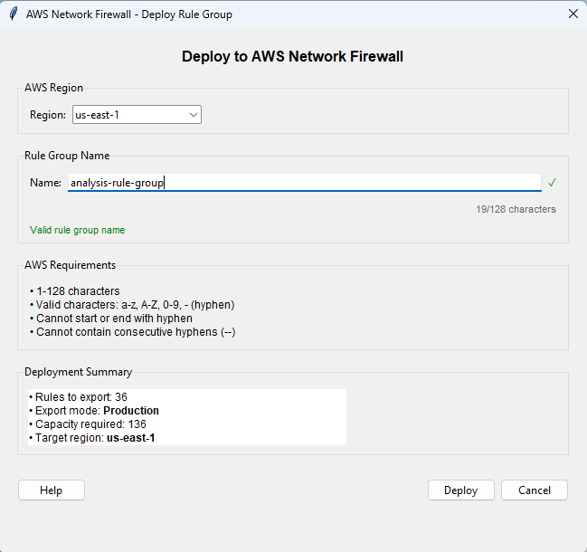

> 🚀 **Deploy rule groups directly to AWS** without intermediate IaC files!

**How to Use:**
1. **File > Export** - Export Options dialog appears
2. **Select "AWS Network Firewall (Direct Deploy)"**
3. **Optional: Enable Test Mode** - Convert all actions to 'alert' for safe testing
4. **Optional: Run Analyzer** - Pre-validate rules before deployment
5. **Click Continue** - Configure deployment settings
6. **AWS Configuration Dialog:**
   - Rule group name (auto-sanitized from filename)
   - Real-time validation (AWS naming requirements)
   - Deployment summary (rules count, capacity, mode, region)
7. **Click Deploy** - Direct deployment to AWS Network Firewall

**Features:**

**Smart Name Handling:**
- Auto-sanitizes current filename for AWS compliance
- Real-time validation with visual feedback (✓/✗)
- Character counter (128 char limit)
- AWS naming rules enforced:
  - Valid: a-z, A-Z, 0-9, - (hyphen)
  - Cannot start/end with hyphen
  - No consecutive hyphens (--)

**Overwrite Protection:**
- Detects existing rule groups before deployment
- Shows comprehensive confirmation dialog:
  - Existing capacity and rule count
  - Format detection (Standard 5-tuple vs Suricata)
  - Firewall associations (⚠️ CRITICAL if attached)
  - Format conversion notice (if converting to Suricata)
- User must confirm before overwriting

**Pre-Deployment Options:**
- **Test Mode:** Convert all actions to 'alert' (same as other exports)
- **Analyze Before Export:** Run rule analyzer first
  - Shows summary (critical/warnings/info counts)
  - Option to view full report or continue
  - Helps catch issues before deployment

**Deployment Details:**
- Automatically calculated capacity
- Shows target AWS region
- Preserves all variables (IPSets, PortSets, ReferenceSets)
- Uses STRICT_ORDER rule evaluation
- Adds version metadata to description

**Success Confirmation:**
- Shows deployed rule group details
- Displays ARN and status
- Clickable link to AWS Console
- Integrated with change tracking

**Benefits:**
- ⚡ **Instant Deployment:** No intermediate files needed
- 🔄 **Round-Trip Workflow:** Import → Edit → Deploy seamlessly
- 🛡️ **Safe Overwrites:** Clear warnings for live firewalls
- 🎯 **Format Conversion:** Automatically handles Standard to Suricata conversion
- ✅ **Pre-Validation:** Optional analyzer check before deployment
- 📊 **Full Integration:** Works with test mode and change tracking

**Requirements:**
- boto3 installed: `pip install boto3`
- AWS credentials configured
- IAM permissions: `CreateRuleGroup`, `UpdateRuleGroup`, `DescribeRuleGroup`
- See Help > AWS Setup for complete setup guide

### Alert-Only Test Mode *(Works with ALL export formats)* 🧪

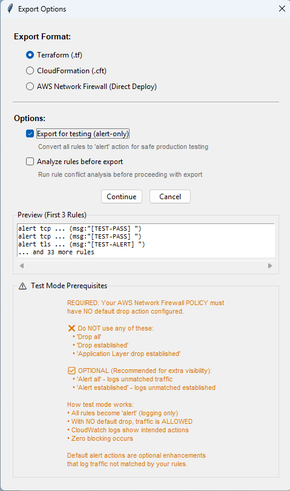

> 🧪 **Test rules safely in production** without risk of service disruption!

Export rules with all actions converted to 'alert' for safe testing while preserving original action information in CloudWatch logs.

**How to Use:**
1. **File > Export** - Export Options dialog appears
2. **Select Format** - Choose Terraform, CloudFormation, or AWS Direct Deploy
3. **Check Test Mode** - ☑️ "Export for testing (alert-only)"
4. **Review Preview** - See first 3 converted rules with [TEST-ACTION] prefixes (Terraform/CloudFormation only)
5. **Read Prerequisites** - Review AWS policy configuration requirements
6. **Export/Deploy** - Save file or deploy directly to AWS

**Action Preservation:**
- **[TEST-PASS]** → Would have allowed traffic
- **[TEST-DROP]** → Would have blocked traffic silently
- **[TEST-REJECT]** → Would have blocked with TCP reset
- **[TEST-ALERT]** → Was already alert (no change)

**AWS Policy Prerequisites (CRITICAL):**

For test mode to work, your AWS Network Firewall **POLICY** must be configured:
- ✅ **REQUIRED**: NO default drop action
- ❌ Do NOT use 'Drop all', 'Drop established', or 'Application Layer drop established'
- ✅ **OPTIONAL**: Add 'Alert all' or 'Alert established' for enhanced visibility

**Why This Matters:**
- Alert rules only log traffic (don't control it)
- With no default drop action, traffic flows normally
- CloudWatch logs show what would have happened
- If policy has default drop, all traffic gets blocked

**CloudWatch Log Analysis:**
```
[TEST-PASS] Allow HTTPS to AWS services     ← Would have allowed
[TEST-DROP] Block SSH from internet         ← Would have blocked  
[TEST-REJECT] Reject HTTP to direct IPs     ← Would have rejected
[TEST-ALERT] Monitor DNS tunneling          ← No change (already alert)
```

**Benefits:**
- 🛡️ **Zero Risk**: Source file never modified
- ⚡ **Fast Iteration**: No manual rule editing needed
- 📊 **Clear Visibility**: See intended actions in CloudWatch
- ✅ **Confidence**: Validate before enforcing
- 📝 **Compliance**: Document testing phase

**Workflow:**
1. Export with test mode → Deploy to AWS
2. Monitor CloudWatch logs for [TEST-DROP], [TEST-PASS], etc.
3. Identify false positives from log analysis
4. Export without test mode → Deploy production rules

### Export Features

**File > Export**
- Export Options dialog with format selection (Terraform, CloudFormation, AWS Direct)
- Test mode option (applies to all formats)
- Optional pre-export rule analysis
- Generates complete infrastructure code or deploys directly

**What's Included (All Formats):**
- ⚙️ **Dynamic Capacity**: Auto-calculated from rule count
- 🔗 **Variable Integration**: IP sets, port sets, reference sets
- 📋 **STRICT_ORDER**: Configured automatically
- 📝 **Version Info**: Generator version in metadata
- 🔒 **Proper Escaping**: Handles special characters
- 🛡️ **Validation**: Checks for undefined variables before export

**Format-Specific Features:**

**Terraform (.tf):**
- Complete resource definition with variables
- No size limits
- Best for large rule sets (500+ rules)

**CloudFormation (.cft):**
- JSON template with validation
- **51.2 KB Limit**: Warns if requires S3 upload
- **1 MB Limit**: Blocks if exceeds absolute maximum
- **Size Guidance**: Shows remaining capacity

**AWS Direct Deploy:**
- Immediate deployment to AWS
- Smart name sanitization
- Overwrite detection and confirmation
- Format conversion support
- Success confirmation with AWS Console link

**Terraform Example:**
```hcl
resource "aws_networkfirewall_rule_group" "suricata_rules" {
  capacity = 150
  type     = "STATEFUL"
  name     = "suricata-generator-rg"
  
  rule_group {
    stateful_rule_options {
      rule_order = "STRICT_ORDER"
    }
    rules_source {
      rules_string = <<-EOT
        pass tcp any any -> any 80 (msg:"Allow HTTP"; sid:100; rev:1;)
      EOT
    }
  }
}
```

### Deployment Workflows

**IaC Workflow (Terraform/CloudFormation):**
1. Generate rules in GUI
2. Define variables in Variables tab
3. Export as Terraform or CloudFormation
4. Deploy to AWS using your IaC pipeline
5. Re-import from AWS for future edits

**Direct Deploy Workflow (AWS):**
1. Generate rules in GUI
2. Define variables in Variables tab
3. File > Export > AWS Network Firewall (Direct Deploy)
4. Configure name and options
5. Click Deploy - instant deployment to AWS
6. Re-import from AWS for future edits

**Round-Trip Workflow:**
1. Import from AWS (browse or JSON file)
2. Edit rules in Suricata Generator
3. Export back to AWS (direct deploy)
4. Repeat as needed

---

## Change Tracking

> 📝 **Comprehensive audit trail with per-rule rollback** - new in v1.16.0, enhanced with rollback in v1.25.0!

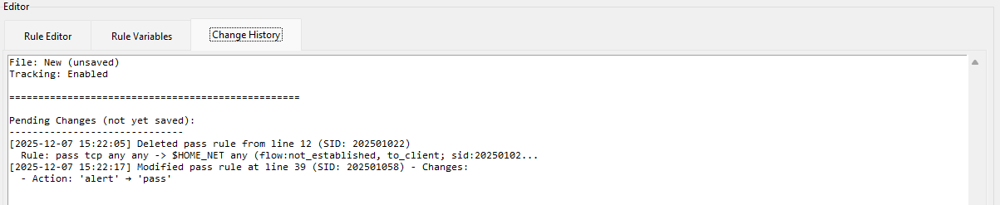

### Enabling Tracking
- **Tools > Enable Change Tracking**
- Toggles tracking on/off
- Adds header to file when enabled
- Auto-enables when opening files with existing history

### What Gets Tracked

**File Operations:**
- File creation with timestamp
- File saves with modification info

**Rule Operations:**
- Rules added, modified, deleted
- Bulk operations (paste, template application)
- SID renumbering operations
- **Rule rollbacks** *(v1.25.0)* - Rollback to previous revisions

**Advanced Operations:**
- Advanced Editor changes (with summary)
- Template applications with details
- Domain import operations

### Per-Rule Revision History & Rollback *(New in v1.25.0)*

**Rev Dropdown for Rollback:**
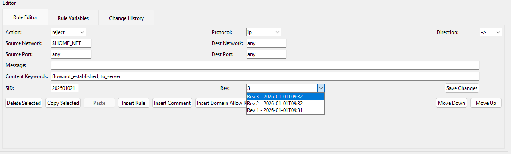
- When change tracking is enabled, the Rev field becomes an interactive dropdown
- Shows complete revision history for each rule (by SID)
- Displays timestamps for each revision: "Rev 3 - 2026-01-01 01T09:32"
- Click to select any previous revision to review or rollback

**Side-by-Side Comparison:**
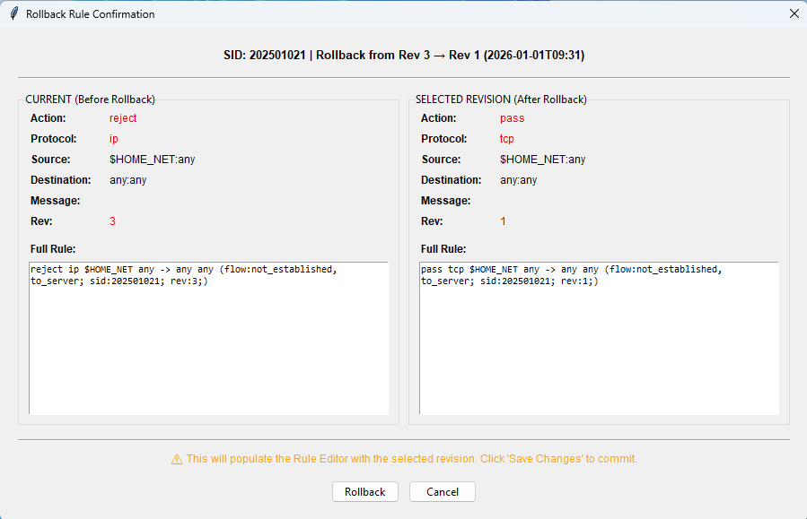
- Before rolling back, view detailed comparison of current vs selected revision
- Compare all rule fields with changed fields highlighted in red
- Review full rule syntax for both versions
- Make informed decision before proceeding

**Non-Destructive Rollback:**
- Selecting a revision populates the Rule Editor (doesn't immediately change the rule)
- Review rolled-back values before committing
- Click "Save Changes" to commit the rollback
- Cancel by selecting another rule or closing editor without saving
- Full Ctrl+Z undo support for all rollback operations (undos not tracked in history)

**Linear History:**
- All revisions preserved permanently - old versions never deleted
- E.g. Rolling back to Rev 2 creates a new Rev value (with Rev 2's content)
- Complete audit trail maintained for compliance
- Can rollback to any previous revision at any time

**Automatic Snapshots:**
- Rule snapshots automatically saved during all rule modifications (except message field)
- Works with rule edits, new rules, rule templates, and bulk operations
- Optimized storage (snapshots embedded inline with change entries)
- Typical file size: ~500KB for 100 rules × 10 revisions each

**Snapshots not supported for Advanced Editor changes:**
- Modifying a rule in the advanced editor does not create new rule snapshot
- Rule changes made in the advanced editor are summarized in Change History tab

**Legacy File Upgrade:**
- Existing .history files (v1.0) continue to work normally
- Optional upgrade prompt to enable rollback for current rules (v1.0 history)
- Upgrade creates baseline snapshots for all rules at current revision number
- Rollback capability enabled from upgrade point forward

### History Display

**History Tab:**
- Chronological list of all changes including rollbacks
- Timestamps in ISO format
- Version numbers for each operation
- Detailed change information
- Rollback entries show source and target revisions

### Storage

**Companion .history File:**
- JSON format for machine readability (v2.0 format with snapshots)
- Saves along with .suricata file
- Automatically loads on file open
- Backward compatible with legacy v1.0 format

### Benefits
- 📋 **Audit Trail**: Complete record of changes with revision snapshots
- 🔍 **Troubleshooting**: Track when issues were introduced and rollback if needed
- 📊 **Team Collaboration**: See who changed what and restore previous versions
- 🔄 **Safety Net**: Roll back individual rules that were modified incorrectly
- 🧪 **Experimentation**: Try changes knowing you can easily revert
- 📚 **Learning**: Review how specific rules evolved over time

---

## SIG Type Classification

> 🎓 **Understanding Rule Processing** - Learn how Suricata classifies rules - new in v1.20.0!

The application shows how Suricata internally classifies each rule into one of 10 SIG types, which determines processing order and performance characteristics.

### What are SIG Types?

Suricata internally classifies rules by their keywords and protocol:
- **Processing Order**: Rules process in type order (not just file order)
- **Performance**: Different types have different performance impacts  
- **Protocol Layering**: Explains why some rules shadow others unexpectedly

### Accessing SIG Type Information

**Main Application:**
- **Tools > Show SIG Type Classification**: Toggle SIG Type column
- **Abbreviated Labels**: IPONLY, PKT, APP_TX, etc.
- **Hidden by Default**: Column appears between Line and Action

**Advanced Editor:**
- **Status Bar**: Shows full SIG type name
- **Format**: "Rule 5/42 | SIG_TYPE_APP_TX | Modified"
- **Real-Time**: Updates as you move between rules
- **Always Visible**: Displayed automatically

**Educational Help:**
- **Help > About SIG Types**: Complete guide to all 10 types
- Processing order explanation
- Real-world examples
- Link to Suricata documentation

### The 10 SIG Types

1. **SIG_TYPE_DEONLY** - Decoder events (decode-event keyword)
2. **SIG_TYPE_IPONLY** - Basic IP/protocol rules
3. **SIG_TYPE_LIKE_IPONLY** - IP rules with negated addresses
4. **SIG_TYPE_PDONLY** - Protocol detection (app-layer-protocol)
5. **SIG_TYPE_PKT** - Flow keywords (flow:established, flowbits)
6. **SIG_TYPE_PKT_STREAM** - Anchored content (startswith, depth)
7. **SIG_TYPE_STREAM** - Unanchored content
8. **SIG_TYPE_APPLAYER** - Application protocol fields
9. **SIG_TYPE_APP_TX** - Sticky buffers (http.host, tls.sni, ja3.hash)
10. **SIG_TYPE_NOT_SET** - Error/unknown state

### Why It Matters

**Protocol Layering:**
- IP-only rules process before app-layer rules
- Can cause unexpected shadowing
- Understanding types helps diagnose conflicts

**Performance:**
- Sticky buffer rules (APP_TX) are most efficient
- IP-only rules are least specific
- Choose appropriate keywords for optimization

**Rule Development:**
- See how Suricata will process your rules
- Understand which keywords elevate rules
- Make informed keyword choices

---

# 📖 Reference

## Features List

### Core Features
- ✅ Visual rule management with color-coded table display
- ✅ Tabbed interface (Rule Editor and Rule Variables)
- ✅ Inline editing with bottom panel editor
- ✅ Variable auto-detection and management
- ✅ Copy/paste with intelligent dual-clipboard system
- ✅ File operations (new, open, save, save as)
- ✅ Comment support with formatting
- ✅ Undo functionality (Ctrl+Z)
- ✅ Rule movement (up/down controls)
- ✅ Click-to-insert workflow
- ✅ Keyboard navigation and shortcuts
- ✅ Toggle selection for workflow flexibility

### Advanced Features
- ✅ **URL and Domain Category Filtering** *(v1.30.0)*: AWS-maintained category blocking (51 categories)
- ✅ **Palo Alto Configuration Import** *(v1.33.0)*: Convert PA firewall policies to Suricata
- ✅ **AWS Profile Support** *(v1.32.0)*: Multi-account profile selector in status bar
- ✅ **Category-Based Domain Analysis** *(v1.31.0)*: See which domains triggered each category rule
- ✅ **AWS Managed Rule Group Analysis** *(v2.1.0)*: Complete firewall visibility with managed rule groups ⭐ NEW
- ✅ **CloudWatch Rule Usage Analysis** *(v1.27.0)*: Production rule effectiveness analytics
- ✅ **Analyze Traffic Costs** *(v1.29.0)*: VPC endpoint recommendations and cost analysis
- ✅ **AWS Direct Import** *(v1.27.3)*: Browse and import rule groups directly from AWS
- ✅ **AWS Direct Deploy** *(v1.27.2)*: Deploy rule groups directly to AWS Network Firewall
- ✅ **Rule Templates** *(v1.24.0)*: 16 pre-built security patterns (includes 2 category templates)
- ✅ **Rule Filtering** *(v1.22.0)*: Non-destructive rule hiding
- ✅ **Advanced Editor** *(v1.19.0, Scintilla v1.23.0)*: Code folding and IDE features
- ✅ **SIG Type Classification** *(v1.20.0)*: Educational rule type display
- ✅ **Common Ports Library** *(v1.24.1)*: 22 pre-configured port variables
- ✅ **AWS Rule Group Import** *(v1.18.7)*: Import from AWS CLI JSON
- ✅ **Change Tracking** *(v1.16.0)*: Comprehensive audit trail
- ✅ **Enhanced Search** *(v1.21.0)*: Field-specific search with find/replace
- ✅ **Rev Keyword Support** *(v1.9.0)*: Automatic rule versioning

### Analysis and Validation
- ✅ CloudWatch Logs integration for production usage analytics
- ✅ Per-rule hit counts and traffic percentages
- ✅ Unused rule detection with confidence levels
- ✅ Overly-broad rule identification
- ✅ Rule effectiveness and efficiency tier analysis
- ✅ Rule conflict analysis with shadow detection
- ✅ AWS Network Firewall compliance validation
- ✅ Protocol layering detection
- ✅ Network field validation
- ✅ SID uniqueness checking
- ✅ Variable definition validation
- ✅ HTML/PDF report export

### Import and Export
- ✅ Infrastructure as code export (Terraform, CloudFormation)
- ✅ AWS Network Firewall direct deploy
- ✅ Bulk domain import with consolidation
- ✅ AWS rule group direct import (browse AWS)
- ✅ AWS rule group import from CLI JSON
- ✅ AWS best practices template loading
- ✅ Test mode export (all formats)
- ✅ Pre-export rule analysis
- ✅ Change history export

### User Interface
- ✅ Real-time statistics (action counts, SID ranges)
- ✅ Status bar with capacity and warnings
- ✅ Undefined variables detection
- ✅ IP Set References counter (AWS quota tracking)
- ✅ Protocol/port combination warnings
- ✅ Placeholder row for new rule insertion
- ✅ Double-click editing
- ✅ Right-click context menus

---

## Content Keywords JSON

> 🔧 **Customize auto-complete** by editing content_keywords.json.

The `content_keywords.json` file defines all Suricata keywords for the Advanced Editor's auto-complete feature.

### File Structure

```json
{
  "version": "1.0",
  "description": "AWS Network Firewall Suricata Content Keywords",
  "keywords": [
    {
      "name": "keyword_name",
      "syntax": "keyword_name:<value>",
      "values": ["optional", "valid", "values"],
      "description": "Human-readable description",
      "category": "general|flow|http|tls|dns|protocol"
    }
  ]
}
```

### Adding Keywords

1. Open `content_keywords.json` in text editor
2. Add new keyword object to `keywords` array
3. Save file
4. Reopen Advanced Editor (auto-reloads JSON)

### Hot Reload
- File loaded each time Advanced Editor opens
- Edit JSON while main app is running
- No application restart needed
- Changes appear immediately

### Validation
- Unknown keywords generate warnings (not errors)
- Allows use of new Suricata features
- Forward compatibility maintained

> 📖 **Full Documentation**: See `docs/content_keywords_json.md` for complete reference.

---

## Common Ports JSON

> 🔧 **Extend the port library** by editing common_ports.json - new in v1.24.1!

The `common_ports.json` file defines pre-configured port variables for the Add Common Ports feature.

### File Structure

```json
{
  "version": "1.0.0",
  "description": "Common port definitions for Suricata rules",
  "categories": {
    "Category Name": [
      {
        "name": "$VARIABLE_NAME",
        "definition": "[80,443,8080]",
        "description": "Service description"
      }
    ]
  }
}
```

### Current Library

**7 Categories:**
- Infrastructure Services (7 variables)
- Windows/Active Directory (5 variables)
- Web Services (3 variables)
- Databases (7 variables)
- Email (3 variables)
- Security/Threat Detection (3 variables)
- Remote Access (4 variables)

**22 Pre-Configured Variables:**
- $DNS_PORTS, $DHCP_PORTS, $NTP_PORTS
- $ACTIVE_DIRECTORY_PORTS, $SMB_PORTS
- $WEB_PORTS, $DATABASE_PORTS
- And many more...

### Adding Custom Variables

1. Open `common_ports.json` in text editor
2. Add variable to existing category or create new category
3. Save file
4. Changes appear immediately in Add Common Ports dialog

### Benefits
- 📚 Team-standard port definitions
- 🔧 No code changes needed
- 🔄 Instant updates
- 📝 Documentation included

> 📖 **Full Documentation**: See `docs/common_ports_json.md` for complete reference and customization guide.

---

## Technical Architecture

The application follows a modular architecture organized into a `src/` package with categorized subdirectories *(restructured in v2.0.0)*:

### Directory Structure
```
suricata_generator.py          # Main entry point (root directory)
src/
  core/                        # Core data models and utilities
    suricata_rule.py           # Rule parsing, validation, and formatting
    constants.py               # Application constants and validation patterns
    version.py                 # Centralized version management
    security_validator.py      # Input validation and security protection
    rule_filter.py             # Rule filtering system
  analysis/                    # Rule analysis and testing
    rule_analyzer.py           # Conflict detection and reporting
    flow_tester.py             # Network traffic simulation
    rule_usage_analyzer.py     # CloudWatch usage analytics
  aws/                         # AWS integration
    aws_session_manager.py     # Centralized AWS credential and session management
    aws_service_detector.py    # AWS service identification from IP addresses
    traffic_analyzer.py        # Traffic cost analysis backend
    traffic_analyzer_ui.py     # Traffic cost analysis UI
  agent/                       # AI Rule Assistant (NEW in v2.2.0)
    agent_factory.py           # Pipeline construction and caching
    agent_loop.py              # Orchestrator with self-correction loop
    nl_parser.py               # Natural language to rule intent via Bedrock
    rule_builder.py            # Intent to Suricata rule string
    rule_validator.py          # Rule syntax and keyword validation
    best_practice_checker.py   # AWS Network Firewall best practice checks
    knowledge_base.py          # Data file loader for LLM grounding
    sid_allocator.py           # Unique SID assignment
    models.py                  # Data models (DetectionIntent, GenerationResult)
    pcap_tester.py             # PCAP-based rule testing via Suricata engine
  importers/                   # Import functionality
    domain_importer.py         # Bulk domain processing
    domain_list_importer.py    # AWS Domain List imports
    stateful_rule_importer.py  # AWS rule group imports
    palo_alto_importer.py      # Palo Alto Networks configuration import
  managers/                    # File, search, template, revision management
    file_manager.py            # File operations and exports
    search_manager.py          # Search functionality
    template_manager.py        # Rule template system
    revision_manager.py        # Per-rule revision history and rollback
  gui/                         # UI components
    ui_manager.py              # Complete user interface management
    ai_assistant_panel.py      # AI Rule Assistant chat UI (NEW in v2.2.0)
    advanced_editor.py         # IDE-style text editor (wxPython/Scintilla)
    advanced_editor_tkinter_backup.py  # Tkinter fallback editor
data/                          # Data and configuration files
  content_keywords.json        # Auto-complete keyword definitions
  rule_templates.json          # Pre-built security templates
  common_ports.json            # Port variable library
  palo_alto_app_map.json       # PA application/URL category/service mappings
  aws_rule_examples.json       # Curated AWS/Suricata rule examples for AI grounding
  suricata_rule_definitions.json  # Rule structure definitions for AI grounding
  suricata_rules_intro.md      # Suricata rules format reference for AI grounding
  suricata_rules_reference.md  # Complete Suricata keywords reference for AI grounding
  aws_network_firewall_best_practices.md  # AWS NFW best practices for AI grounding
```

### Security Features
- **Injection Protection**: Filters dangerous patterns
- **Path Traversal Prevention**: Validates file operations
- **Input Validation**: Length limits and character restrictions
- **File Security**: Size and permission checks
- **Domain Validation**: Format and safety checks

---

## Tips and Best Practices

> 💡 **Get the most** out of the Suricata Rule Generator.

### Getting Started
1. 🎯 **Start Simple**: Begin with basic pass/drop rules
2. 📚 **Use Templates**: Leverage Rule Templates for common patterns
3. 📝 **Organize Early**: Use comments to document sections

### Working with Rules
4. 🔤 **Define Variables**: Use Variables tab for reusable definitions
5. 🔢 **Smart SID Strategy**: Start at 100, reserve high SIDs for default deny
6. 📋 **Copy/Paste Workflow**: Use toggle selection for efficient copying
7. 🔍 **Filter Large Sets**: Use filtering for files with 100+ rules

### Quality Assurance
8. ✅ **Validate Early**: Run analysis before deploying
9. 🧪 **Test Mode**: Use template Test Mode for safe validation
10. 📊 **Monitor Status**: Watch status bar for warnings and statistics
11. ⚠️ **Check Warnings**: Review orange protocol/port warnings

### Advanced Techniques
12. 🏗️ **Export Early**: Generate infrastructure templates to validate requirements
13. 📈 **Enable Tracking**: Use change tracking for audit trails
14. 💻 **Power User**: Learn Advanced Editor for bulk operations
15. 🌍 **Geographic Control**: Use GeoIP templates for country-based filtering

### File Management
16. 💾 **Backup Files**: Save frequently and use version control
17. 📁 **Organize Files**: Use consistent naming for .suricata/.var pairs
18. 🔐 **Persistent Variables**: Variables automatically save with files

### AWS Integration
19. 🚀 **Import from AWS**: Use AWS Rule Group Import to edit existing rules
20. 🔄 **Round-Trip**: Import from AWS → Edit → Export → Deploy
21. 📦 **Capacity Planning**: Monitor capacity for AWS limits (30,000 max)
22. 📊 **Monitor Usage**: Run CloudWatch analysis monthly to identify unused rules
23. 🎯 **Optimize Performance**: Use Rule Effectiveness tab to refine overly-broad rules
24. 🔍 **Shadow Detection**: Combine low-frequency findings with Review Rules feature

---

## Support

For issues, questions, or to contribute to the project:

- 📚 **GitHub Repository**: [https://github.com/aws-samples/sample-suricata-generator](https://github.com/aws-samples/sample-suricata-generator)
- 🐛 **Issues**: Report bugs or request features via GitHub Issues
- 💬 **Help**: Use Help > About in application for version information
- 📖 **Documentation**: Review source code comments for implementation details
- 📝 **Release Notes**: See RELEASE_NOTES.md for complete version history

---

**Repository**: [aws-samples/sample-suricata-generator](https://github.com/aws-samples/sample-suricata-generator)
