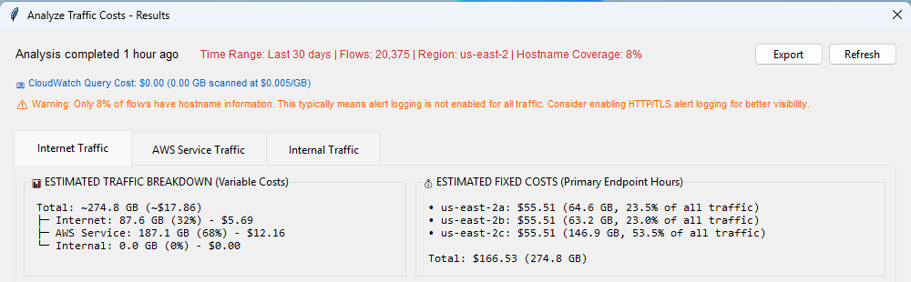
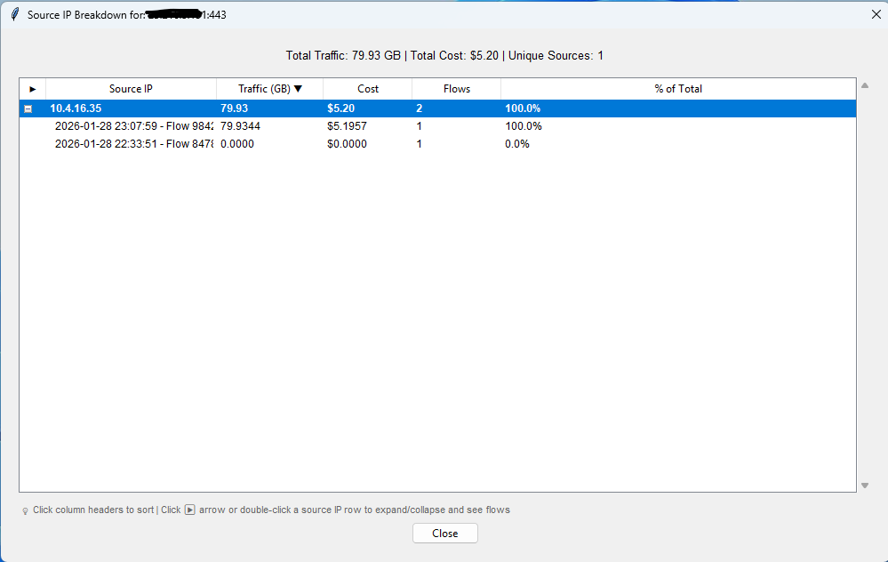

# Analyze Traffic Costs - Full Reference

> Part of the **Suricata Rule Generator for AWS Network Firewall**. This is the complete reference for the Analyze Traffic Costs feature. For the overview and quick-start steps, see the [Analyze Traffic Costs section in the README](../README.md#analyze-traffic-costs-new-in-v1290).

The Traffic Cost Analyzer correlates AWS Network Firewall CloudWatch Logs to show exactly where bandwidth is going and which AWS services could benefit from VPC endpoints.

## Intelligent VPC Endpoint Recommendations

**Gateway Endpoints (Always FREE):**
- S3 and DynamoDB gateway endpoints cost $0
- Always recommended when same-region traffic detected
- Eliminate firewall data processing charges completely
- Example: 245 GB/month to S3 -> Save $15.93/month ($191/year)

**Interface Endpoints (Cost-Benefit Analysis):**
- Break-even threshold: 112 GB/month for same-region (us-east-1: $7.30/month endpoint cost / $0.065/GB)
- Only recommended when traffic exceeds break-even
- Example: 85 GB/month to SSM -> Skip (not cost-effective)
- Example: 180 GB/month to Lambda -> Deploy (saves $4.40/month)

**Regional Pricing:**
- Accurate cost calculations using regional firewall data processing rates
- Interface endpoint costs vary by region
- Break-even thresholds adjusted per region automatically

**Cross-Region Guidance:**
- Identifies cross-region AWS service traffic
- Suggests alternatives (S3 CRR, DynamoDB Global Tables)
- Interface endpoint support varies by service

## CloudWatch Logs Integration

**Correlation Engine:**
- Combines FLOW logs (traffic volumes) with ALERT logs (hostnames/SNI)
- Correlates via flow_id for complete traffic picture
- Handles millions of log entries efficiently

**Pagination Support:**
- Automatic chunking for queries exceeding 10K flows
- Progress tracking with cancellation support
- Handles very large datasets gracefully

**AWS Service Detection:**
- Downloads AWS IP ranges for service identification
- Interval tree for O(log n) lookups (100,000x faster than naive approach)
- Identifies S3, DynamoDB, Lambda, EC2, and 20+ other services

## Data Caching

**Save Results:**
- Save analysis results to .stats file (same format as Rule Usage stats)
- Unified v2.0 format supports both Rule Usage and Traffic Analysis data
- Avoid CloudWatch Logs query charges on repeat views

**Auto-Load:**
- Cached data detected when rule file is opened
- Prompt to load cached (instant) or run fresh analysis
- Shows data age for informed decision

**Instant Drill-Down:**
- Cached data supports all three main tabs
- Individual flow data not cached (keeps file size reasonable)
- Drill-down features work with fresh analysis only

## Expandable Drill-Down

**Double Click Any Row:**
- See source IP breakdown showing which internal hosts generate traffic
- Expand source IPs to see individual flows with timestamps
- Sort by any column (traffic volume, cost, flow count)

**Timestamp Sorting:**
- Click "Source IP" column to sort flows by timestamp
- See most recent activity first
- Useful for identifying current vs historical patterns

## Custom Date Ranges

**Flexible Time Periods:**
- Preset ranges: 7, 15, 30, 60, 90 days
- Custom date range picker
- Analysis metadata shows exact date range used

## Benefits

**Cost Optimization:**
- Potential VPC endpoint savings: $50-200/month
- Gateway endpoints (FREE) eliminate costs for S3/DynamoDB traffic
- Interface endpoints only recommended when ROI is positive
- Regional pricing ensures accurate projections

**Traffic Visibility:**
- See exactly where bandwidth is going
- HTTP/TLS hostname resolution shows application-level detail (when available)
- Multiple destination IPs per hostname consolidated (CDN load balancing)
- Source IP drill-down shows which hosts consume bandwidth

**Smart Recommendations:**
- Break-even analysis prevents wasteful endpoint deployments
- Alternative suggestions for sub-threshold traffic
- Regional considerations for cross-region traffic
- Data-driven decisions backed by actual traffic analysis

**Easy to Use:**
- Works with existing CloudWatch logs
- No additional AWS configuration needed
- Caching reduces CloudWatch charges
- CSV export for offline analysis and reporting

## Use Cases

**Monthly Cost Review:**
- Identify new VPC endpoint opportunities
- Track traffic pattern changes
- Verify existing endpoints still cost-effective
- Report savings to management

**Architecture Optimization:**
- Discover cross-region traffic patterns
- Identify candidates for S3 Cross-Region Replication
- Find opportunities for DynamoDB Global Tables
- Optimize service placement decisions

**Troubleshooting High Bills:**
- See which destinations consume most bandwidth
- Identify unexpected traffic patterns
- Correlate costs with specific applications
- Drill down to source IPs for accountability

> **ROI**: Analysis costs $0.50-$2.00 but identifies $50-200/month in potential savings. The query cost is recovered quickly.
