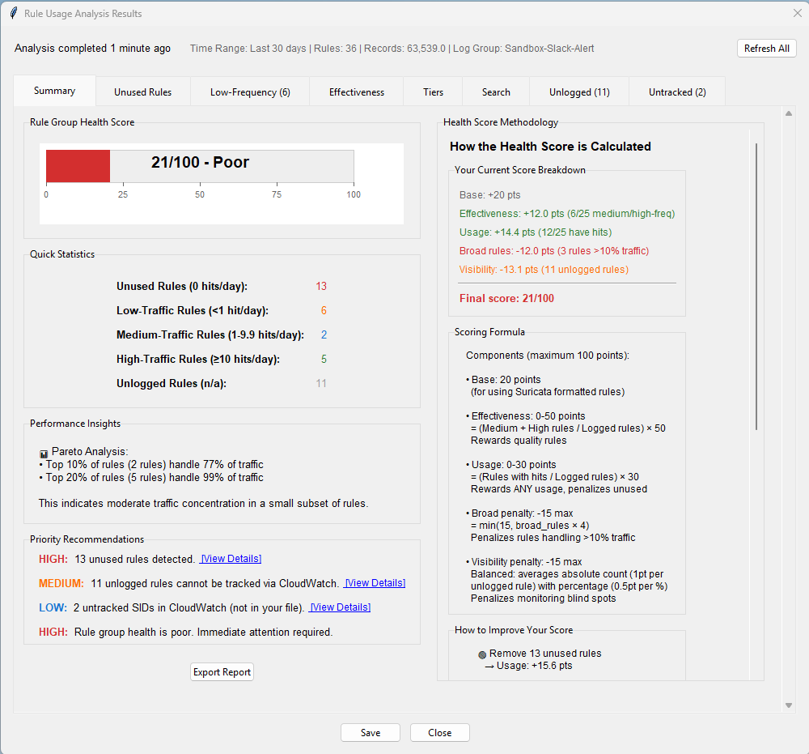
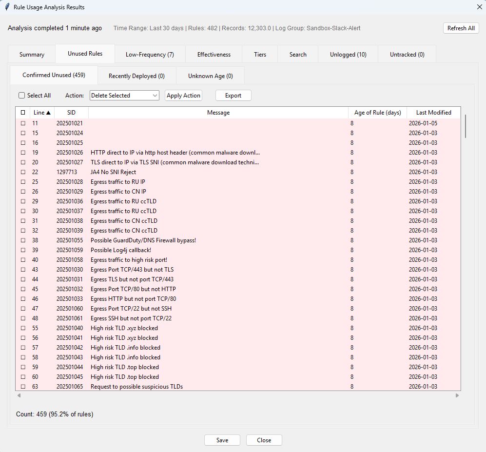
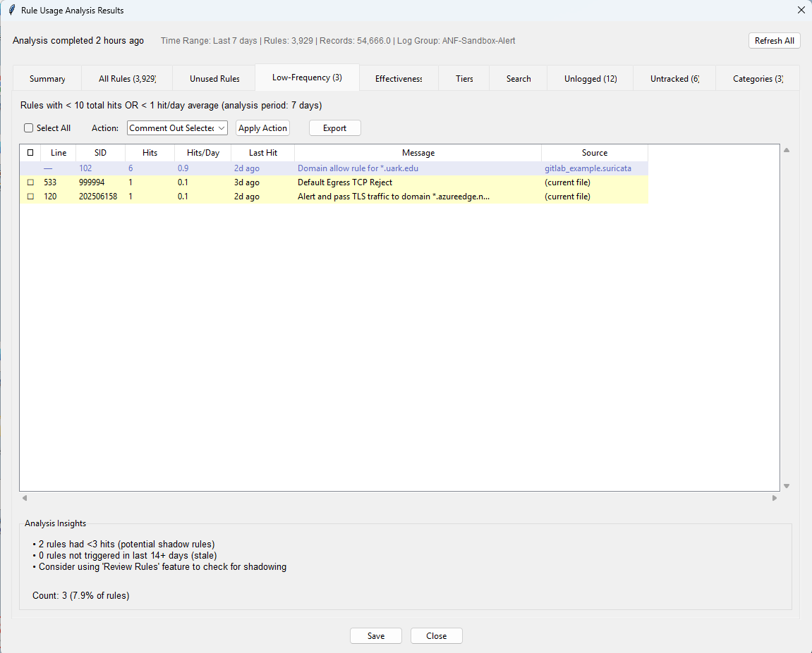
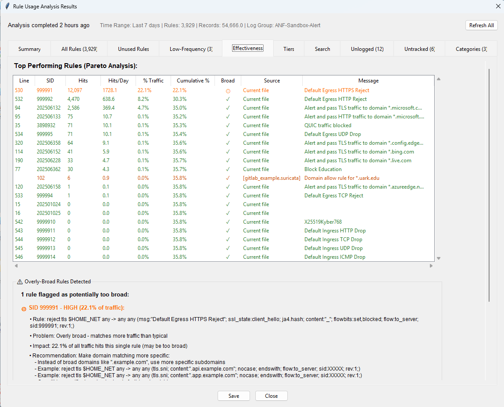
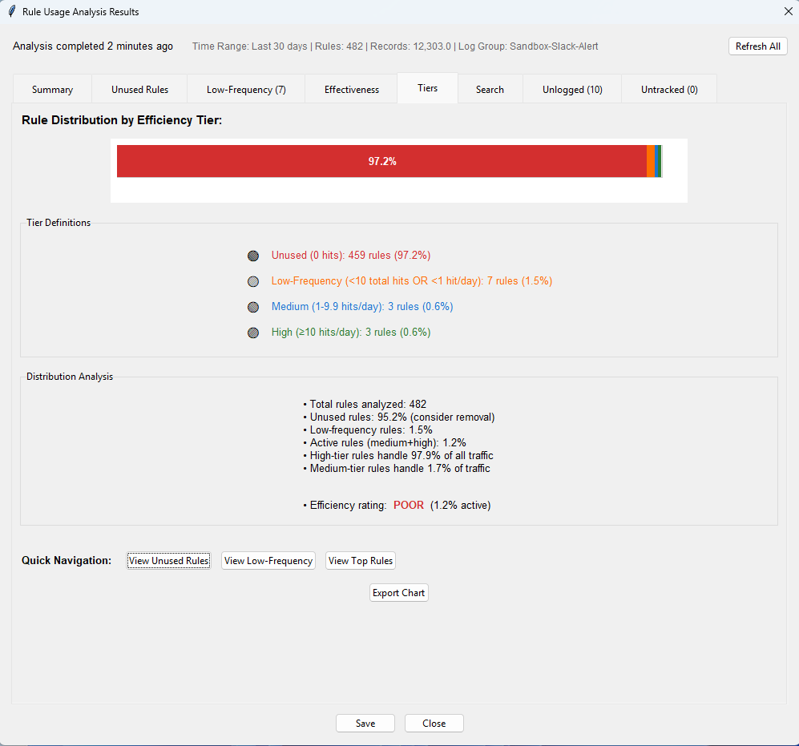
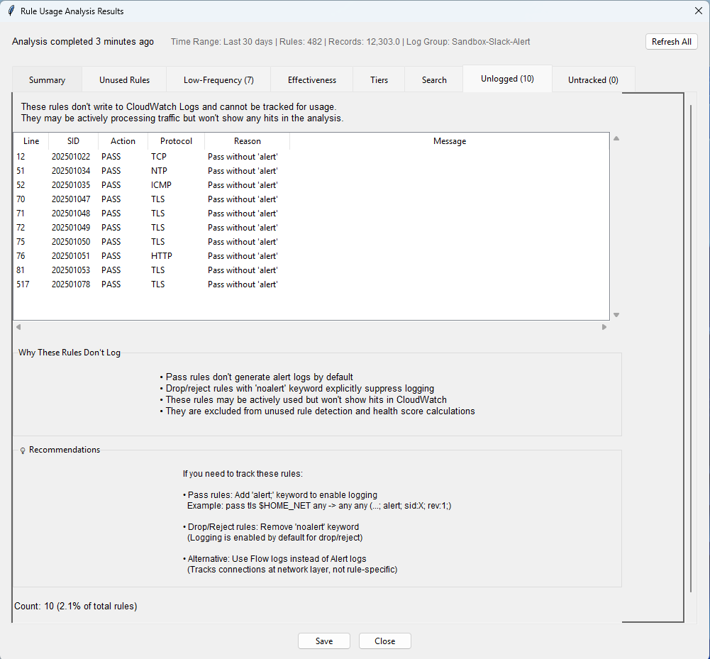
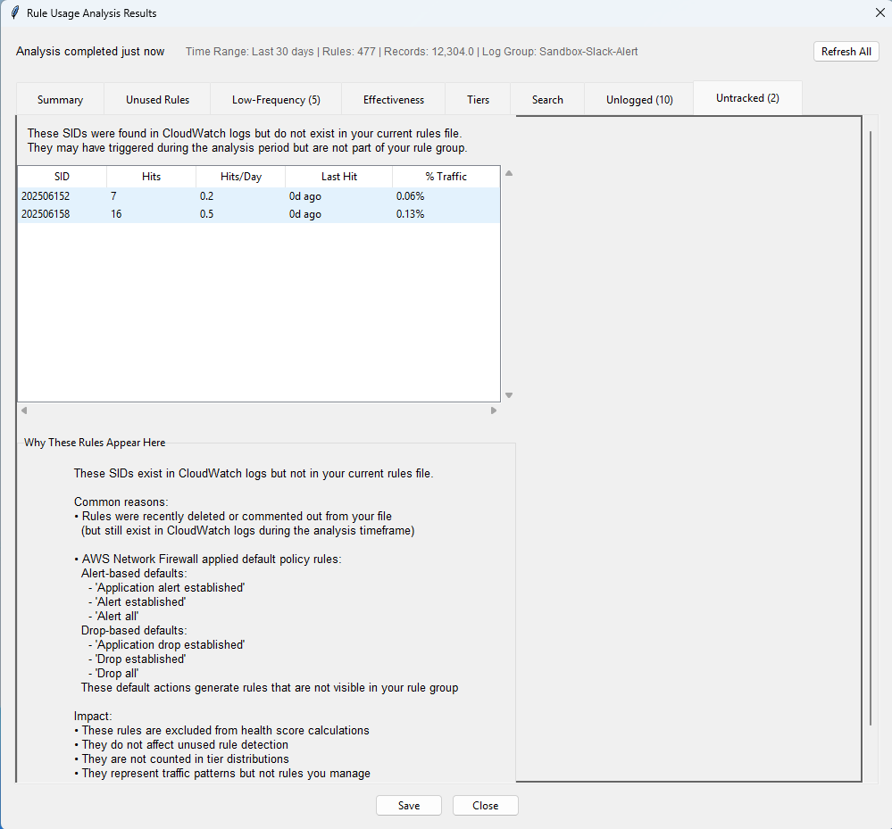
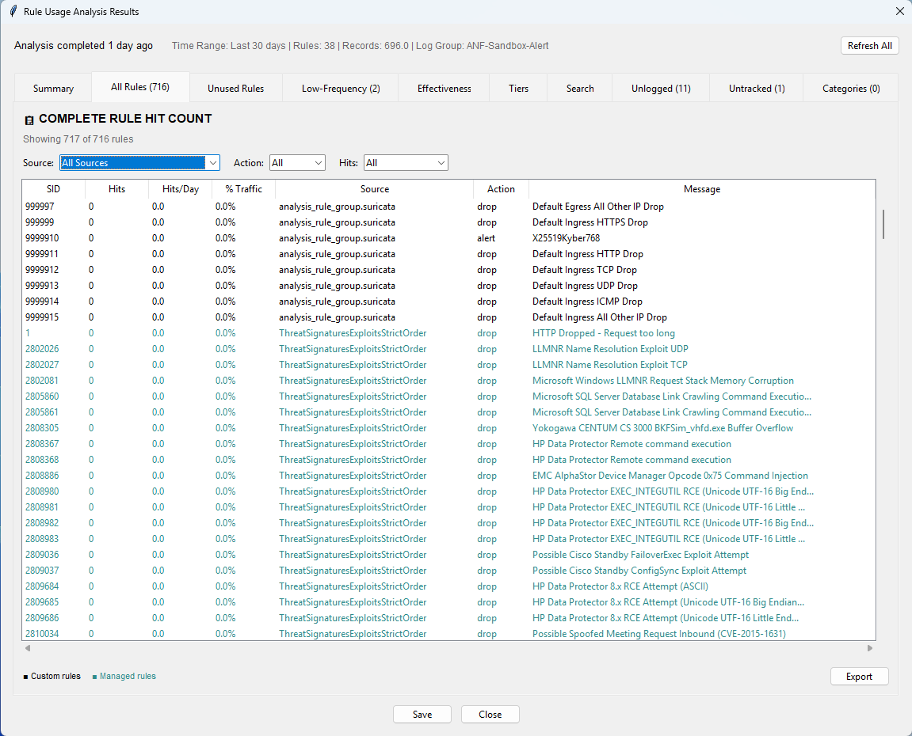
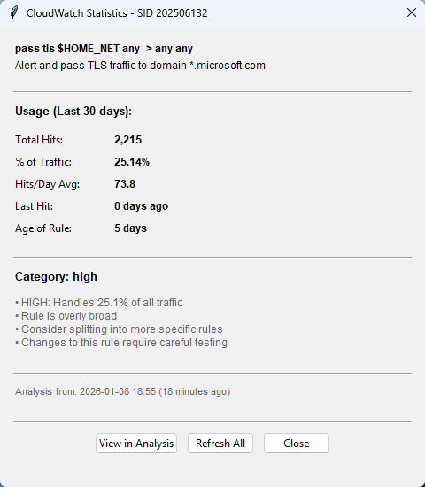

# CloudWatch Rule Usage Analysis - Full Reference

> Part of the **Suricata Rule Generator for AWS Network Firewall**. This is the complete reference for the CloudWatch Rule Usage Analysis feature. For the overview and quick-start steps, see the [Rule Usage Analysis section in the README](../README.md#cloudwatch-rule-usage-analysis---rule-hit-counter--more-new-in-v1270).

The CloudWatch Rule Usage Analyzer queries AWS CloudWatch Logs to provide per-rule usage analytics - hit counts, unused-rule detection, shadow-rule hints, effectiveness rankings, and category intelligence - that complement AWS Network Firewall's built-in monitoring.



## The Ten Analytical Views

**1. Summary Dashboard**
- Rule group health score (0-100) with visual gauge
- Quick statistics (unused, low-frequency, high-traffic, unlogged rules)
- Performance insights (Pareto analysis showing top performers)
- Priority recommendations ranked by impact

**2. Unused Rules Tab - Confirmed Unused**



- Rules >=14 days old with 0 hits - safe to remove
- **Bulk Actions**: Delete or comment out selected rules
- **Color Coding**: Green background for confirmed unused status
- Shows line number, SID, age, message, and rule preview

**3. Unused Rules Tab - Recently Deployed**
- Rules <14 days old with 0 hits - too new to judge
- **Warning Status**: Recommends waiting before removal
- **Color Coding**: Light yellow background for recent status
- Shows same columns as Confirmed Unused

**4. Unused Rules Tab - Never Observed**
- Unknown age with 0 hits - manual review recommended
- **Information Status**: Deployment date unavailable
- **Color Coding**: Light gray background for unknown status
- Suggests enabling change tracking for future accuracy

**5. Low-Frequency Rules Tab**



- Identifies rules with <10 hits in the analysis period
- **Staleness Indicators**: Color-coded by last hit timestamp
  - Very light yellow: <7 days ago
  - Light yellow: 7-14 days ago
  - Yellow-orange: 14-21 days ago
  - Orange: >21 days ago
- **Shadow Detection Hints**: May indicate rules blocked by earlier rules

**6. Rule Effectiveness Tab**



- **Pareto Analysis**: Shows which rules handle most traffic
- **Top 20 Performers**: Rules sorted by hit count
- **Overly-Broad Detection**: Flags rules handling excessive traffic (>10%, >15%, >30%)
  - Critical (>30%): Immediate review recommended
  - High (>15%): Review soon
  - Medium (>10%): Consider reviewing
- **Actionable Recommendations**: Suggests splitting broad rules into specific ones

**7. Efficiency Tiers Tab**



- Visual distribution of rules by usage level
- **Five Tiers**: Critical, High, Medium, Low, Unused
- **Bar Chart Visualization**: Color-coded bars showing rule distribution
- **Health Benchmarks**: Indicates healthy vs. problematic distributions
- **Tier Navigation**: Click to view rules in each category

**8. Search Tab**
- Quick SID lookup with detailed statistics
- Shows hits, percentage of traffic, last hit timestamp, rule age
- Recent searches for quick access
- Full rule display with contextual analysis

**9. Unlogged Rules Tab**



- Shows rules that don't write to CloudWatch Logs
- **Pass rules without 'alert' keyword**: Cannot be tracked via CloudWatch
- **Drop/reject with 'noalert' keyword**: Logging explicitly suppressed
- May be actively processing traffic but won't show hits
- Excluded from health score calculations and unused detection
- Provides recommendations for enabling logging if needed

**10. Untracked Rules Tab**



- Shows SIDs found in CloudWatch logs but not in your current file
- **Recently deleted/commented rules**: Still in logs during analysis timeframe
- **AWS default policy rules**: Alert/drop defaults not in your rule group
- Excluded from all analysis calculations
- Helps identify rules removed from file or applied by AWS policy

## AWS Managed Rule Group Analysis



> **Complete firewall visibility** - analyze hit counts for ALL rules in your firewall policy, not just your custom rule groups!

When your AWS Network Firewall policy includes AWS managed rule groups (e.g., ThreatSignaturesPhishingActionOrder, MalwareDomainListActionOrder, BotNetCommandAndControlActionOrder), the analyzer can now include those managed rule SIDs alongside your custom rules - giving you a complete picture of your firewall's effectiveness.

**Adding Managed Rule Groups to Analysis:**
1. Open **Tools > Analyze Rule Usage**
2. Configure region, log group, and time range as usual
3. Click **"Browse Managed Rule Groups..."** in the new optional section
4. Browse all AWS managed rule groups available in your region
5. Check the managed rule groups attached to your firewall policy
6. Click **OK** - selected groups are fetched and SIDs extracted
7. Click **Analyze** - the analysis now includes both custom and managed SIDs

**Managed Rule Group Browser:**
- Multi-select checkbox interface for selecting multiple groups
- Displays rule count per group (e.g., ThreatSignaturesPhishing: 4,050 rules)
- Client-side search filtering by name
- Region inherited from the configuration dialog
- Selections remembered during the session for easy re-analysis

**New "All Rules" Tab (Tab 10):**
- Complete inventory of every rule (custom + managed) with hit counts
- Sortable columns: SID, Hits, Hits/Day, % Traffic, Last Hit, Source, Action, Message
- Filter by Source (custom file or specific managed rule group), Action, or Hits
- Color-coded: custom rules in black, managed rules in teal
- Export to text or HTML format

**Enhanced Summary Tab:**
- New "Analysis Scope" section showing custom rule count + managed rule group breakdown
- Per-group effectiveness summary: total rules, rules with hits, total hits
- Color legend explaining teal (managed) vs black (custom) distinction

**Search Tab Integration:**
- Searching for a managed rule SID shows the managed rule group name as the source

**Key Benefits:**
- **Complete Visibility**: See hit counts for ALL rules in your firewall policy
- **Managed Rule Group Effectiveness**: Determine which managed rule groups are actively triggering
- **Cost Optimization**: Identify managed rule groups with zero hits that could be removed to save capacity
- **Reduced Untracked Noise**: Managed SIDs no longer appear in the Untracked tab
- **No Additional CloudWatch Cost**: Same query runs - only post-processing is expanded
- **Persistent Cache**: Managed rule group data saved in `.stats` files for offline access

**Health Score:**
- Remains custom-rules-only to avoid distortion (users don't control managed rule content)
- Managed rule group effectiveness shown separately in the Summary tab

**IAM Permissions:**
- Requires `network-firewall:ListRuleGroups` and `network-firewall:DescribeRuleGroup` (read-only)
- Most users already have these from the Import feature

## Right-Click Quick Lookup



After running analysis once, right-click any rule in the main table:
- **Context Menu**: "View CloudWatch Statistics"
- **Instant Results**: Shows cached stats without re-querying CloudWatch
- **Comprehensive Data**: Hits, percentage, last hit, rule age, category
- **Quick Refresh**: Option to re-run analysis if needed

## Deployment-Aware Intelligence

The analyzer integrates with your existing change tracking to provide **confidence-based recommendations**:

**With Change Tracking Enabled:**
- Knows exact age of each rule from revision history
- Separates recently deployed rules (< X days) from confirmed unused rules
- Avoids false recommendations to remove rules still being tested

**Without Change Tracking:**
- All unused rules categorized as "Unknown Age"
- Recommends manual review before removal
- Still provides accurate hit counts and percentages

## Key Features

**Efficient CloudWatch Querying:**
- **Server-Side Aggregation**: Processes millions of logs in AWS
- **Minimal Data Transfer**: Returns ~200KB for 10,000 rules
- **Two Queries**: Main SID aggregation query populates most tabs; a separate optimized category query powers the Categories tab
- **Cached Results**: Instant right-click lookups after initial analysis

**Smart Analysis:**
- **Unused Detection**: Set difference logic (100% accurate)
- **Percentage Calculations**: Shows each rule's share of total traffic
- **Hits Per Day**: Normalized metrics across time ranges
- **Broadness Detection**: Identifies rules handling excessive traffic

**Persistent Statistics:**
- **Save Button**: Save analysis results to `.stats` file for offline access
- **Auto-Load**: Statistics automatically loaded when opening rule files
- **Session Caching**: Loaded stats persist until new analysis run
- **Cached Prompt**: Shows "view cached or run new" dialog with saved data

**Export and Sharing:**
- **HTML Reports**: Professional formatted with color coding
- **Plain Text Reports**: Simple format for any text editor
- **Complete Data**: Includes all tabs and recommendations

## Real-World Benefits

**Capacity Optimization:**
```
Before: 10,150 rules consuming capacity
Analysis Results:
  - 275 confirmed unused rules (2.7%)
  - 89 low-frequency rules (<10 hits/30 days)

Actions Taken:
  - Removed 180 confirmed unused rules
  - Capacity freed: 1.8%
  - Monitoring remaining 95 for additional optimization
```

**Security Improvement:**
```
Effectiveness Tab Finding:
  - SID 100 handles 45% of total traffic
  - Rule: pass tcp $HOME_NET any -> any any (flow:established; ...)
  - Too broad - matches ALL established TCP

Recommendation:
  - Split into specific rules for known services
  - Improved security posture
  - Better visibility per service
```

**Shadow Rule Detection:**
```
Low-Frequency Tab Finding:
  - SID 5500: 3 hits in 30 days
  - Last hit: 18 days ago
  - Likely shadowed by earlier rule

Action:
  - Use Review Rules to find shadowing rule
  - Reorder or refine rules for better coverage
```

## Why This Is Invaluable

**Extending AWS Network Firewall Monitoring:**

This feature builds upon AWS Network Firewall's robust monitoring foundation by adding rule-level analytics:

**What This Feature Adds to Your AWS Monitoring:**
- **Data-Driven Decisions**: Remove rules confidently with evidence
- **Capacity Management**: Free up capacity by removing unused rules
- **Performance Insights**: Understand which rules do the heavy lifting
- **Security Validation**: Identify overly-broad rules needing refinement
- **Shadow Detection**: Find rules that may be blocked by earlier rules
- **Deployment Awareness**: Won't flag recently deployed rules as unused

## Use Cases

**Ongoing Optimization:**
- Run monthly to identify unused rules
- Monitor rule effectiveness over time
- Track impact of rule changes

**Pre-Deployment Validation:**
- Export rule group IaC with Test Mode enabled (v1.26.0)
- Deploy and run usage analysis
- Identify false positives before enforcing
- Export production version rule group IaC with confidence

**Capacity Planning:**
- Identify low-value rules for removal
- Make room for new rules without hitting 30,000 limit
- Prioritize most effective rules

**Security Audits:**
- Document which rules are actually protecting you
- Identify gaps in coverage
- Demonstrate compliance with usage data

## Technical Details

**CloudWatch Logs Insights Query:**
- Aggregates SID hit counts server-side
- Returns total hits and last hit timestamp per SID
- Efficient pagination for large rule groups (>10,000 rules)
- Typical query time: 10-60 seconds depending on time range

**Analysis Window:**
- 7 days: Fast analysis, recent trends
- 30 days: Balanced view (recommended default)
- 60 days: Longer-term patterns
- 90 days: Comprehensive historical view

**Privacy and Security:**
- **Read-Only**: Only queries logs, never modifies anything
- **Standard AWS Auth**: Uses same credentials as AWS CLI
- **No Stored Credentials**: Application never stores AWS credentials
- **Minimal Permissions**: Only CloudWatch Logs read access required

## Benefits Summary

- **Actionable Insights**: Priority-ranked recommendations with expected impact
- **Visual Analytics**: Health scores, charts, color-coded tables
- **Deep Visibility**: Understand your rule group performance
- **Cost Optimization**: Remove unnecessary rules, improve efficiency
- **Security Enhancement**: Identify and refine overly-broad rules
- **Time Savings**: Automated analysis vs. manual CloudWatch queries
- **Continuous Improvement**: Regular monitoring for ongoing optimization

> This feature complements the AWS Network Firewall [**Monitoring and Observability**](https://docs.aws.amazon.com/network-firewall/latest/developerguide/nwfw-using-dashboard.html) dashboard by providing insights into your Network Firewall's rule behavior vs. traffic behavior.
