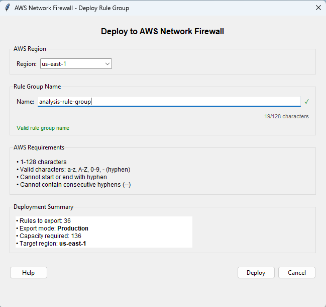
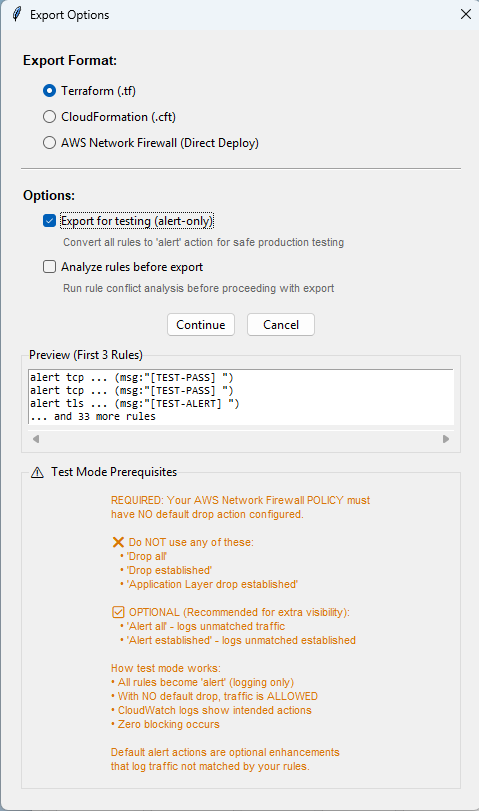

# Infrastructure Export - Full Reference

> Part of the **Suricata Rule Generator for AWS Network Firewall**. This is the complete reference for exporting and deploying rule groups. For the overview and quick-start steps, see the [Infrastructure Export section in the README](../README.md#infrastructure-export).

The tool generates AWS Network Firewall resources in three formats: **Terraform (.tf)**, **CloudFormation (.cft)**, and **AWS Network Firewall (Direct Deploy)**.

## AWS Network Firewall Direct Deploy



> Deploy rule groups directly to AWS without intermediate IaC files.

**How to Use:**
1. **File > Export** - Export Options dialog appears
2. **Select "AWS Network Firewall (Direct Deploy)"**
3. **Optional: Enable Test Mode** - Convert all actions to 'alert' for safe testing
4. **Optional: Run Analyzer** - Pre-validate rules before deployment
5. **Click Continue** - Configure deployment settings
6. **AWS Configuration Dialog:**
   - Rule group name (auto-sanitized from filename)
   - Real-time validation (AWS naming requirements)
   - Deployment summary (rules count, capacity, mode, region)
7. **Click Deploy** - Direct deployment to AWS Network Firewall

**Smart Name Handling:**
- Auto-sanitizes current filename for AWS compliance
- Real-time validation with visual feedback
- Character counter (128 char limit)
- AWS naming rules enforced:
  - Valid: a-z, A-Z, 0-9, - (hyphen)
  - Cannot start/end with hyphen
  - No consecutive hyphens (--)

**Overwrite Protection:**
- Detects existing rule groups before deployment
- Shows comprehensive confirmation dialog:
  - Existing capacity and rule count
  - Format detection (Standard 5-tuple vs Suricata)
  - Firewall associations (CRITICAL if attached)
  - Format conversion notice (if converting to Suricata)
- User must confirm before overwriting

**Pre-Deployment Options:**
- **Test Mode:** Convert all actions to 'alert' (same as other exports)
- **Analyze Before Export:** Run rule analyzer first
  - Shows summary (critical/warnings/info counts)
  - Option to view full report or continue
  - Helps catch issues before deployment

**Deployment Details:**
- Automatically calculated capacity
- Shows target AWS region
- Preserves all variables (IPSets, PortSets, ReferenceSets)
- Uses STRICT_ORDER rule evaluation
- Adds version metadata to description

**Success Confirmation:**
- Shows deployed rule group details
- Displays ARN and status
- Clickable link to AWS Console
- Integrated with change tracking

**Benefits:**
- **Instant Deployment:** No intermediate files needed
- **Round-Trip Workflow:** Import -> Edit -> Deploy seamlessly
- **Safe Overwrites:** Clear warnings for live firewalls
- **Format Conversion:** Automatically handles Standard to Suricata conversion
- **Pre-Validation:** Optional analyzer check before deployment
- **Full Integration:** Works with test mode and change tracking

**Requirements:**
- boto3 installed: `pip install boto3`
- AWS credentials configured
- IAM permissions: `CreateRuleGroup`, `UpdateRuleGroup`, `DescribeRuleGroup`
- See **Help > AWS Setup** for the complete setup guide

## Alert-Only Test Mode (Works with ALL export formats)



> Test rules safely in production without risk of service disruption.

Export rules with all actions converted to 'alert' for safe testing while preserving original action information in CloudWatch logs.

**How to Use:**
1. **File > Export** - Export Options dialog appears
2. **Select Format** - Choose Terraform, CloudFormation, or AWS Direct Deploy
3. **Check Test Mode** - "Export for testing (alert-only)"
4. **Review Preview** - See first 3 converted rules with [TEST-ACTION] prefixes (Terraform/CloudFormation only)
5. **Read Prerequisites** - Review AWS policy configuration requirements
6. **Export/Deploy** - Save file or deploy directly to AWS

**Action Preservation:**
- **[TEST-PASS]** -> Would have allowed traffic
- **[TEST-DROP]** -> Would have blocked traffic silently
- **[TEST-REJECT]** -> Would have blocked with TCP reset
- **[TEST-ALERT]** -> Was already alert (no change)

**How test mode interacts with your firewall policy:**

In test mode, every rule exported from *this* rule group is converted to `alert`, so this rule group only logs — it never passes, drops, or rejects. What happens to traffic then depends on your firewall **policy's stateful default action** and any *other* rule groups attached to the same policy.

A default drop action does **not** disable your alert rules or turn off logging. An alert is a reliable per-rule *match* signal:

- If a test-mode alert fires, the equivalent enforcing rule would also have matched the same traffic under the same policy.
- If no alert fires because the traffic was dropped upstream (for example by a default drop that acts before your rule is reached), the equivalent enforcing rule would not have matched that traffic either.

The caveat is that test mode is a faithful per-rule *match* indicator rather than a perfect whole-flow simulation. In strict order a real `pass` rule stops Suricata from scanning the rest of a flow once it matches, but its alert-mode equivalent does not — so later packets that a real `pass` would have shielded remain subject to a default drop during a test-mode run. Because of this, and because a broad **Drop all** default can drop the very packets you want to observe (AWS also notes that any default drop can trigger earlier than intended for rules matching application-layer data that spans multiple packets), the cleanest observation of "what would have happened" is obtained with **no default drop** (or an alert-only default such as **Alert all** / **Alert established**) during testing.

A default drop action is fully supported by AWS and does not break test mode — for strict order, AWS even recommends **Drop established** + **Alert established** for a default-deny posture. Use no default drop during a test-mode run only when you want the most faithful observation of normal traffic flow. For the current, complete list of strict-order default actions and their exact semantics, see the AWS documentation on [managing evaluation order for Suricata-compatible rules](https://docs.aws.amazon.com/network-firewall/latest/developerguide/suricata-rule-evaluation-order.html).

**CloudWatch Log Analysis:**
```
[TEST-PASS] Allow HTTPS to AWS services     <- Would have allowed
[TEST-DROP] Block SSH from internet         <- Would have blocked
[TEST-REJECT] Reject HTTP to direct IPs     <- Would have rejected
[TEST-ALERT] Monitor DNS tunneling          <- No change (already alert)
```

**Benefits:**
- **Zero Risk**: Source file never modified
- **Fast Iteration**: No manual rule editing needed
- **Clear Visibility**: See intended actions in CloudWatch
- **Confidence**: Validate before enforcing
- **Compliance**: Document testing phase

**Workflow:**
1. Export with test mode -> Deploy to AWS
2. Monitor CloudWatch logs for [TEST-DROP], [TEST-PASS], etc.
3. Identify false positives from log analysis
4. Export without test mode -> Deploy production rules

## Export Features

**What's Included (All Formats):**
- **Dynamic Capacity**: Auto-calculated from rule count
- **Variable Integration**: IP sets, port sets, reference sets
- **STRICT_ORDER**: Configured automatically
- **Version Info**: Generator version in metadata
- **Proper Escaping**: Handles special characters
- **Validation**: Checks for undefined variables before export

**Format-Specific Features:**

**Terraform (.tf):**
- Complete resource definition with variables
- No size limits
- Best for large rule sets (500+ rules)

**CloudFormation (.cft):**
- JSON template with validation
- **51.2 KB Limit**: Warns if requires S3 upload
- **1 MB Limit**: Blocks if exceeds absolute maximum
- **Size Guidance**: Shows remaining capacity

**AWS Direct Deploy:**
- Immediate deployment to AWS
- Smart name sanitization
- Overwrite detection and confirmation
- Format conversion support
- Success confirmation with AWS Console link

**Terraform Example:**
```hcl
resource "aws_networkfirewall_rule_group" "suricata_rules" {
  capacity = 150
  type     = "STATEFUL"
  name     = "suricata-generator-rg"

  rule_group {
    stateful_rule_options {
      rule_order = "STRICT_ORDER"
    }
    rules_source {
      rules_string = <<-EOT
        pass tcp any any -> any 80 (msg:"Allow HTTP"; sid:100; rev:1;)
      EOT
    }
  }
}
```

## Deployment Workflows

**IaC Workflow (Terraform/CloudFormation):**
1. Generate rules in GUI
2. Define variables in Variables tab
3. Export as Terraform or CloudFormation
4. Deploy to AWS using your IaC pipeline
5. Re-import from AWS for future edits

**Direct Deploy Workflow (AWS):**
1. Generate rules in GUI
2. Define variables in Variables tab
3. File > Export > AWS Network Firewall (Direct Deploy)
4. Configure name and options
5. Click Deploy - instant deployment to AWS
6. Re-import from AWS for future edits

**Round-Trip Workflow:**
1. Import from AWS (browse or JSON file)
2. Edit rules in Suricata Generator
3. Export back to AWS (direct deploy)
4. Repeat as needed
