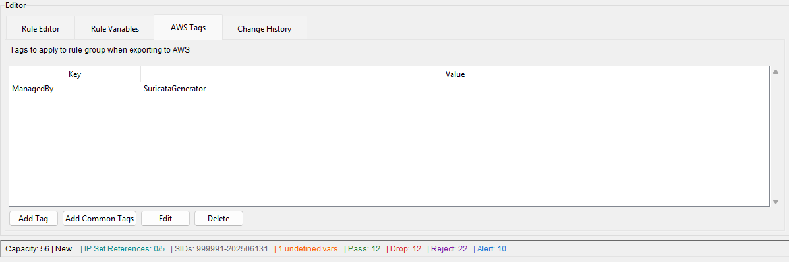

# Managing AWS Tags - Full Reference

> Part of the **Suricata Rule Generator for AWS Network Firewall**. This is the complete reference for AWS tag management. For the overview and quick-start steps, see the [Managing AWS Tags section in the README](../README.md#managing-aws-tags).

The AWS Tags tab manages tags applied to your rule group during export to AWS. Tags flow through every export path (Terraform, CloudFormation, and AWS Direct Deploy) automatically.



## Common Tag Examples

**Cost Allocation:**
```
Environment: Production
CostCenter: IT-Security
Project: NetworkFirewall
```

**Resource Organization:**
```
Owner: SecurityTeam
Team: CloudOps
Application: CoreNetworking
```

**Compliance:**
```
Compliance: PCI-DSS
DataClassification: Internal
CreatedBy: automation
```

## Export Integration

Tags are **automatically applied** during all export operations:
- **Terraform Export**: Tags added to resource tags block
- **CloudFormation Export**: Tags added to Tags array in template
- **AWS Direct Deploy**: Tags included in API call to Network Firewall

**Example Terraform Output:**
```hcl
resource "aws_networkfirewall_rule_group" "suricata_rule_group" {
  capacity = 150
  name     = "suricata-generator-rg"

  tags = {
    Name        = "suricata-generator-rg"
    Environment = "Production"
    ManagedBy   = "SuricataGenerator"
    Owner       = "SecurityTeam"
  }
}
```

## Import Integration

When importing rule groups from AWS:
- User-defined tags automatically imported
- AWS-managed tags (aws: prefix) filtered out
- Tags loaded into AWS Tags tab for editing

## Storage

**Persistent in .var File:**
- Tags saved in enhanced v2.0 .var file format
- Stored alongside variables in same companion file
- Format: `{"format_version": "2.0", "variables": {...}, "tags": {...}}`
- Backward compatible with v1.0 format (auto-upgrades on save)

## Benefits

**AWS Console:**
- **Filtering**: Filter rule groups by tag in AWS Console
- **Search**: Search for resources using tags
- **Organization**: Group related resources together

**Cost Management:**
- **Cost Explorer**: Track costs by CostCenter or Project tags
- **Billing Reports**: Allocate rule group costs to teams
- **Chargeback**: Enable showback/chargeback by tag

**Compliance:**
- **Ownership**: Document resource ownership
- **Security**: Tag-based IAM policies for access control
- **Auditing**: Track compliance requirements

**Automation:**
- **Policy Enforcement**: Identify tool-managed resources
- **Lifecycle Management**: Automate based on tags
- **Inventory**: Track resource metadata programmatically

## AWS Tag Limits

- **Maximum tags per resource**: 200
- **Tag key length**: 1-128 characters
- **Tag value length**: 0-256 characters
- **Reserved prefix**: aws: (case-insensitive)
